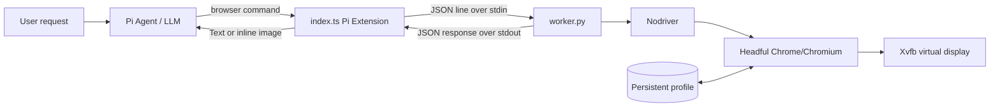

# Pi Nodriver Browser

A global [Pi coding agent](https://github.com/badlogic/pi-mono) extension that registers a persistent `browser` tool backed by **Nodriver**, a real headful **Chrome/Chromium** instance, and **Xvfb**.

This project is intended for Linux Pi installations that need interactive browser automation—opening pages, inspecting interactive elements, clicking, typing, selecting options, scrolling, and returning screenshots to the model—without using Chrome's headless mode.

> The extension reduces obvious headless-browser fingerprints, but it does **not** guarantee bypassing CAPTCHA, bot detection, authentication, or a site's terms of service.

## Features

- Registers the standard Pi tool name `browser`
- Persistent Chrome process within a Pi session
- Headful Chrome rendered on an Xvfb virtual display
- Persistent browser profile for cookies and local state
- Stable `@e1`, `@e2`, … references generated by `snapshot -i`
- Click, fill, type, select, keyboard, scroll, wait, text extraction, and screenshots
- Supports new tabs opened by clicks
- Serializes tool calls so one browser session is mutated safely
- Terminates the complete worker/Xvfb/Chrome process group on session shutdown
- Replaces the conflicting `npm:pi-agent-browser` package during installation

## Requirements

| Dependency | Purpose | Required |
|---|---|---|
| Linux | Current supported platform | Yes |
| Pi coding agent | Loads `index.ts` and exposes the tool | Yes |
| Python 3.10+ | Runs the Nodriver worker | Yes |
| `venv` + `pip` | Creates the isolated Python environment | Yes |
| Nodriver 0.50.3 | Controls Chrome through the DevTools protocol | Yes; installed automatically |
| Google Chrome or Chromium | Browser engine | Yes |
| Xvfb / `xvfb-run` | Virtual X11 display for headful Chrome | Yes |

### Ubuntu/Debian prerequisites

```bash
sudo apt update
sudo apt install -y python3 python3-venv xvfb
```

Install Google Chrome separately, or use an available Chromium package. The worker searches for:

1. `$PI_NODRIVER_CHROME`
2. `google-chrome`
3. `google-chrome-stable`
4. `chromium`
5. `chromium-browser`

Example custom browser path:

```bash
export PI_NODRIVER_CHROME=/opt/google/chrome/google-chrome
```

Some restricted containers cannot use Chrome's sandbox. Only in such an isolated environment, opt out explicitly:

```bash
export PI_NODRIVER_NO_SANDBOX=1
```

Do not disable the sandbox on a normal workstation or server.

Override the persistent profile directory when running concurrent or isolated sessions:

```bash
export PI_NODRIVER_PROFILE=/tmp/pi-browser-profile-$USER
```

## Architecture



### Components

- **`index.ts`** — Pi extension entry point. Registers `browser`, starts the worker lazily, queues requests, returns screenshots as image tool results, truncates oversized text output, and cleans up the process group.
- **`worker.py`** — Owns the Nodriver browser session and implements browser commands.
- **`browser_logic.py`** — Pure parsing, browser discovery, and snapshot formatting functions.
- **`.venv/`** — Isolated Nodriver runtime created inside the installed extension.
- **`~/.pi/agent/nodriver-profile/`** — Persistent Chrome profile containing cookies and site data.

## Extension workflow

A typical agent interaction is:

```text
open https://example.com
snapshot -i
click @e2
snapshot -i
fill @e1 "search phrase"
press Enter
wait 1500
screenshot --full
```

1. Pi loads `index.ts` from its global extension directory.
2. `pi.registerTool({ name: "browser" })` exposes the tool to the model.
3. The first command lazily starts `xvfb-run → worker.py → Nodriver → Chrome`.
4. `snapshot -i` marks visible interactive DOM nodes with `data-pi-ref` attributes and returns model-friendly references.
5. Commands such as `click @e2` resolve those references in the live DOM.
6. A navigation or major DOM change invalidates old references; the model should run `snapshot -i` again.
7. Pi session shutdown terminates the worker, Xvfb, and Chrome process group.

## Browser command reference

| Command | Description |
|---|---|
| `open <url>` | Navigate to a URL |
| `snapshot -i` | List visible interactive elements with `@eN` references |
| `click <@ref>` | Scroll to and click an element |
| `fill <@ref> <text>` | Clear an input and type text |
| `type <@ref> <text>` | Type without clearing |
| `select <@ref> <value>` | Select a dropdown option by value or visible text |
| `press <key>` | Send Enter, Tab, Space, Backspace, or text |
| `scroll <direction> [px]` | Scroll up, down, left, or right |
| `get text [@ref]` | Get page or element text |
| `get url` / `get title` | Get current page metadata |
| `wait <@ref>` / `wait <ms>` | Wait for an element or duration |
| `screenshot [--full]` | Return a PNG screenshot inline |
| `close` | Close Chrome while keeping the worker reusable |

Use quotes around arguments containing spaces:

```text
fill @e1 "鼎泰豐 101 店"
```

## Deployment

### Automated installation

```bash
git clone git@github.com:AyaSakura-comp/pi-nodriver-browser.git
cd pi-nodriver-browser
./install.sh
```

The installer:

1. Verifies Python, Xvfb, and Chrome/Chromium.
2. Copies the extension to `~/.pi/agent/extensions/nodriver-browser/`.
3. Creates `.venv` and installs `requirements.txt`.
4. Backs up Pi settings as `~/.pi/agent/settings.json.pi-nodriver-browser.bak`.
5. Removes `npm:pi-agent-browser` from `settings.json` to avoid a duplicate `browser` registration.

Then start a new Pi session or run:

```text
/reload
```

To install into a non-default Pi directory:

```bash
PI_AGENT_DIR=/custom/pi/agent ./install.sh
```

### Manual installation

```bash
TARGET="$HOME/.pi/agent/extensions/nodriver-browser"
mkdir -p "$TARGET"
cp index.ts worker.py browser_logic.py requirements.txt "$TARGET/"
python3 -m venv "$TARGET/.venv"
"$TARGET/.venv/bin/pip" install -r "$TARGET/requirements.txt"
```

Remove `npm:pi-agent-browser` from `~/.pi/agent/settings.json` if present, then reload Pi.

### Upgrade

```bash
cd pi-nodriver-browser
git pull --ff-only
./install.sh
```

The persistent Chrome profile is outside the extension directory and survives upgrades.

### Uninstall

```bash
./uninstall.sh
```

If desired, restore the old settings backup manually and reload Pi:

```bash
cp ~/.pi/agent/settings.json.pi-nodriver-browser.bak ~/.pi/agent/settings.json
```

## Usage from Pi

Ask Pi naturally:

> Use the browser tool to open `https://example.com`, run `snapshot -i`, click the documentation link, and take a full-page screenshot.

The model decides when to invoke the tool. There is no separate slash command.

## Testing

Run pure unit and installer tests:

```bash
python3 -m unittest discover -s tests -v
```

Run the real Chrome/Xvfb integration test after installing dependencies:

```bash
python3 -m venv .venv
.venv/bin/pip install -r requirements.txt
RUN_BROWSER_INTEGRATION=1 NODRIVER_PYTHON="$PWD/.venv/bin/python" \
  python3 -m unittest discover -s tests -v
```

The integration test opens a local HTML fixture, snapshots its controls, clicks a button, and verifies the resulting DOM text.

## Security and operational notes

- The browser accepts arbitrary URLs requested by the model. Apply normal SSRF and network-access precautions in sensitive environments.
- The persistent profile may contain authenticated cookies. Protect `~/.pi/agent/nodriver-profile/` and never commit it.
- Screenshots and page text can contain private information and are returned to the active model session.
- `snapshot -i` references are page-state dependent; re-snapshot after navigation.
- Only one command runs at a time within an extension instance.
- The current implementation targets Linux/Xvfb. Native macOS and Windows display backends are not implemented.
- `PI_NODRIVER_NO_SANDBOX=1` weakens Chrome process isolation and should only be used inside an already-isolated CI/container environment.

## License

MIT
