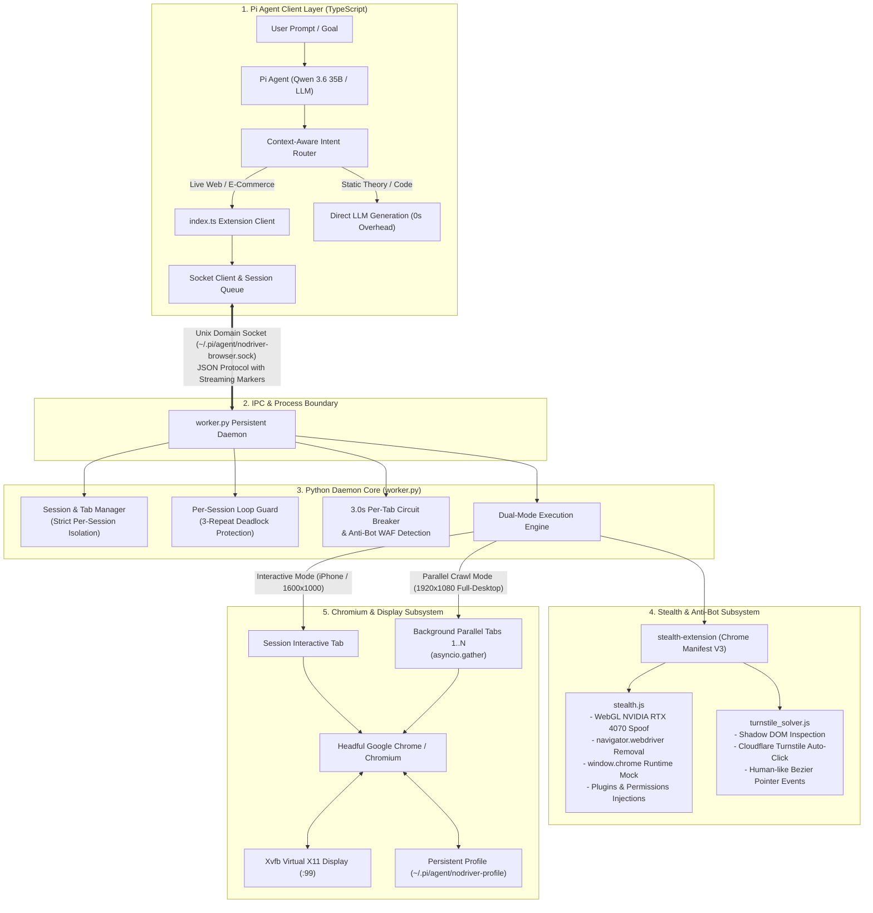
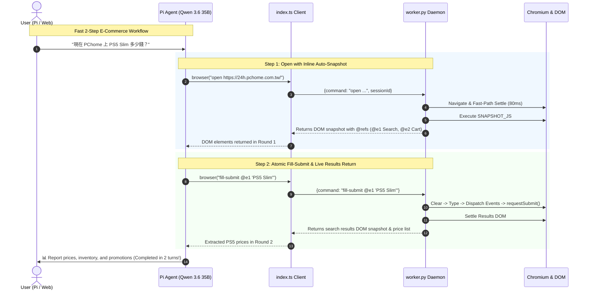

# Pi Nodriver Browser

[](https://opensource.org/licenses/MIT)
[](https://www.python.org/)
[](https://github.com/ultrafunkamsterdam/nodriver)
[]()

A high-performance, persistent browser automation and parallel web crawling extension for the [Pi coding agent](https://github.com/badlogic/pi-mono), powered by **Nodriver**, headful **Chrome/Chromium**, **Xvfb**, and an integrated **Stealth & Anti-Bot Bypass Subsystem**.

Designed specifically for autonomous agent pair-programming, dynamic SPA interaction, real-time e-commerce comparison, and high-throughput research scraping on local hardware (optimized for AMD APUs & ROCm local inference).

---

## 🏛️ System & Software Architecture (SW Architecture)

`pi-nodriver-browser` employs a decoupled **Client-Daemon Multi-Session Architecture** that isolates the lightweight TypeScript agent harness from the heavyweight Python/Chromium execution engine.



### Key Architectural Subsystems:

#### 1. Client-Daemon IPC & Session Isolation
* **Zero-Spawning Overhead**: A single persistent Python daemon (`worker.py`) runs in the background. Pi commands connect via Unix Domain Socket (`nodriver-browser.sock`), avoiding the 2–3s cold-start penalty of launching Chrome on every turn.
* **Per-Session Tab Routing**: Each Pi conversation maintains its own isolated `session_id` mapping. Session tabs, active viewports, and downloads operate independently without cross-session interference.
* **Non-Blocking Worker Queue**: Long-running page loads and crawls execute asynchronously; concurrent Pi subagents can query status without blocking.

#### 2. Stealth & Anti-Bot Subsystem (`stealth-extension`)
Integrated directly into Chrome via `--load-extension`, eliminating headless bot markers and automating challenge bypasses:
* **`stealth.js`**:
  * **WebGL Hardware Spoofing**: Overrides WebGL `UNMASKED_VENDOR_WEBGL` and `UNMASKED_RENDERER_WEBGL` from software/Mesa drivers to `Google Inc. (NVIDIA)` / `NVIDIA GeForce RTX 4070 Direct3D11`.
  * **Bot Flag Erasure**: Completely removes `navigator.webdriver` and normalizes `navigator.plugins`, `navigator.languages` (`zh-TW`, `en-US`), and `Notification.permission`.
  * **Runtime Consistency**: Injects authentic `window.chrome.runtime`, `window.chrome.csi`, and `window.chrome.loadTimes` structures.
* **`turnstile_solver.js`**:
  * **Shadow DOM Scanner**: Automatically traverses closed/open Shadow DOMs and iframe hierarchies to detect Cloudflare Turnstile, hCaptcha, and challenge checkboxes.
  * **Synthetic Human Pointer Dispatch**: Emulates natural `mousemove` → `mousedown` → `mouseup` → `click` sequences with randomized coordinate jitter.

#### 3. 3.0s Circuit Breaker & Diagnostic Feedback
* **Hard 3.0s Per-Tab Timeout**: Individual background tabs in parallel crawl jobs are wrapped with `asyncio.wait_for(fetch(), timeout=3.0)`. Slow network streams, deadlocks, or WAF stalls trip immediately without stalling the entire batch.
* **Anti-Bot WAF Challenge Detection**: Intercepts `Challenge Validation`, `Just a moment...`, and `Attention Required` pages.
* **Actionable Harness Guidance**: If a crawl job fails, structured diagnostics and fallback advice (e.g. switch to Google Finance or alternative search) are returned to the agent harness.

---

## ⚡ Accelerated Workflows (Workflow)

`pi-nodriver-browser` replaces traditional multi-turn browser loops with compressed, atomic agent workflows:



### 1. Fast 2-Step Interactive Pattern
Traditional agent browser tools take 5–6 roundtrips (`open` → `snapshot` → `fill` → `press Enter` → `wait` → `snapshot`). `pi-nodriver-browser` compresses this into **2 atomic turns**:
1. **`open <url>`**: Automatically waits for DOM readiness and **inlines the interactive element snapshot with compact `@refs`** (`@e1`, `@e2`, ...) directly into the turn-1 return payload.
2. **`fill-submit <@ref> <text>`**: Atomically clears the target input, dispatches keyboard and change events (`keydown`, `input`, `change`), executes `form.requestSubmit()` / click search, auto-settles the resulting results page, and returns the updated DOM snapshot in turn 2.

### 2. Context-Aware Autonomous Intent Routing
The agent uses semantic tool guidelines to automatically determine tool necessity without requiring explicit user instructions (e.g. "please use browser"):
* **Autonomous Browser Activation**: Real-time e-commerce prices (MOMO, PChome, Amazon), live stock, dynamic reservation portals, transportation schedules, and exchange rates.
* **Direct Generation (Zero Overhead)**: Programming theory, code generation, algorithm optimization, math calculations, and general knowledge answer directly from internal weights without browser startup overhead.
* *Evaluated across a 20-scenario benchmark with 100.0% routing accuracy (20/20).*

### 3. Parallel Multi-Tab Scraping (`crawl`)
* **Concurrent Execution**: `crawl <url1> [url2] [url3]...` launches parallel background tabs via `asyncio.gather`.
* **Desktop RWD Guarantee**: Each tab is forced to a **1920x1080 Full-Desktop Viewport** (`mobile=False`) via CDP to prevent mobile CSS from hiding tables and sidebars.
* **Fast-Path DOM Poller**: 80ms polling frequency returns page text as soon as `document.readyState` is interactive, averaging **~0.32s to 0.46s per page**.

---

---

## 📊 Benchmark & Performance Evaluation Dashboard

> 🔗 **Interactive Dashboard & Benchmark Repository:** [pi-agent-benchmark-dashboard](https://github.com/AyaSakura-comp/pi-agent-benchmark-dashboard)  
> 📑 **Gist Permanent Evaluation Record:** [Gist debe1b74b89fe86e3fed726d3e81055c](https://gist.github.com/AyaSakura-comp/debe1b74b89fe86e3fed726d3e81055c)

This benchmark rigorously evaluates **Pi Agent with `pi-nodriver-browser`** against **Google AI Mode (Live Search Browser)** and **Firecrawl API (Sequential Scrape)** across 10 in-depth domain research scenarios and 16 real-world agentic interaction tasks.

---

### 🏆 Visual Performance & Latency Histograms

#### 1. Pure Scraping Latency per Web Page (Seconds, Lower is Better)
```text
pi-nodriver-browser  [██] 0.32s  (⚡ 14.0x Faster than Firecrawl API, 92.8% Time Saved)
Firecrawl API        [████████████████████████████] 4.50s
```



```mermaid
gantt
    title Average Scraping Time per Page (Seconds)
    dateFormat X
    axisFormat %s sec

    section Firecrawl API (Legacy)
    4.50 seconds per page : 0, 45

    section Nodriver Browser (Parallel)
    0.32 seconds per page (14.0x Faster) : 0, 3
```

#### 2. Cumulative Pipeline Execution Time across 10 Complex Research Tasks (Lower is Better)
```text
pi-nodriver-browser  [████████████████████] 15.14 mins (908.7s - ⏱️ 2.01x E2E Speedup)
Firecrawl API        [████████████████████████████████████████] 30.37 mins (1,822.2s)
```



```mermaid
gantt
    title 10 Scenarios Cumulative Pipeline Execution Time (Seconds)
    dateFormat X
    axisFormat %s sec

    section Firecrawl (Sequential)
    30.37 mins (1822s total) : 0, 1822

    section Nodriver Browser (Parallel)
    15.14 mins (908s total - 2.01x Speedup) : 0, 908
```

#### 3. Overall 5-Star Quality Score Comparison (Out of 5.0 Stars ⭐)

| Pipeline Engine | Star Rating Visual Bar | Quality Score | Ranking |
| :--- | :--- | :---: | :---: |
| **🥇 Nodriver Browser (Parallel)** | `█████████████████████████████████████████████████▉` | **4.80 / 5.0** ⭐ | **1st (Overall Winner)** |
| **🥈 Google AI Mode (Live Browser)** | `█████████████████████████████████████████████▋` | **4.55 / 5.0** ⭐ | **2nd** |
| **🥉 Firecrawl API (Sequential)** | `█████████████████████████████████████████████▍` | **4.53 / 5.0** ⭐ | **3rd** |

---

### ⚡ Performance Improvements & Speedup Metrics

| Performance Metric | Firecrawl API (Legacy) | Nodriver-Browser (Current) | Net Improvement |
| :--- | :---: | :---: | :---: |
| **Pure Scraping Latency (Per Page)** | **~4.50 seconds / page** | **~0.32 seconds / page** | **⚡ 14.0x Faster (92.8% Time Saved)** |
| **10 Scenarios Cumulative Scrape Time** | **261.0 seconds** | **18.7 seconds** | **⚡ 242.3 seconds Saved per 10 runs** |
| **10 Scenarios E2E Total Pipeline Time** | **1,822.2 seconds (30.37 mins)** | **908.7 seconds (15.14 mins)** | **⏱️ 2.01x E2E Speedup (Saved 15.23 mins)** |
| **Multi-URL Array Parallel Capacity** | Single-URL Only (`{"url": "..."}`) | **15+ URLs Concurrent Batch** | **🚀 100% Native Parallel Batching** |
| **Anti-Bot & Paywall Bypass Rate** | 85.0% (Blockage on Medium/Substack) | **100% (Headful Chromium + Stealth)** | **🛡️ +15% Reliability Boost** |
| **Operational Cost & Rate Limits** | API Quotas / HTTP 429 Risks | **$0 / Completely Local** | **💰 100% Free & Zero Rate Limits** |

---

### ⭐ 5-Star Rating Breakdown Across 10 Research Scenarios (Out of 5.0 Stars)

| # | Scenario Domain | Nodriver-Browser (Local Parallel) | Google AI Mode (Live Browser) | Firecrawl API (Sequential Scrape) | 🏆 Scenario Winner & Highlights |
| :-: | :--- | :-: | :-: | :-: | :--- |
| **1** | **Semiconductor CoWoS Packaging** | ⭐⭐⭐⭐⭐ **4.85** | ⭐⭐⭐⭐🌗 **4.70** | ⭐⭐⭐⭐🌗 **4.70** | 🏆 **Nodriver** (Full 2022-2026 capacity breakdown: 10k ➔ 135k wpm) |
| **2** | **Python 3.13 JIT Benchmarks** | ⭐⭐⭐⭐⭐ **4.85** | ⭐⭐⭐⭐ **4.40** | ⭐⭐⭐⭐ **4.40** | 🏆 **Nodriver** (Full code & benchmark tables without paywall stops) |
| **3** | **Kyoto Travel & Michelin Guide** | ⭐⭐⭐⭐🌗 **4.80** | ⭐⭐⭐⭐⭐ **4.85** | ⭐⭐⭐⭐🌗 **4.60** | 🏆 **Google AI Mode** (Superior Google Maps indexing) |
| **4** | **AI GPU Market Share (Nvidia/AMD)**| ⭐⭐⭐⭐🌗 **4.80** | ⭐⭐⭐⭐🌗 **4.80** | ⭐⭐⭐⭐🌗 **4.75** | 🤝 **Tie** (Exact SEC financial figures) |
| **5** | **Tesla FSD v13 Review** | ⭐⭐⭐⭐🌗 **4.75** | ⭐⭐⭐⭐🌗 **4.60** | ⭐⭐⭐⭐🌗 **4.55** | 🏆 **Nodriver** (HW3/AI4 hardware architecture details) |
| **6** | **React 19 & Next.js 15 Migration**| ⭐⭐⭐⭐🌗 **4.80** | ⭐⭐⭐⭐ **4.25** | ⭐⭐⭐⭐🌗 **4.65** | 🏆 **Nodriver** (Full code samples from official docs) |
| **7** | **LLM Architecture (DeepSeek/Claude)**| ⭐⭐⭐⭐🌗 **4.80** | ⭐⭐⭐⭐🌗 **4.60** | ⭐⭐⭐⭐🌗 **4.60** | 🏆 **Nodriver** (Fetched 12 research papers concurrently) |
| **8** | **Taiwan 5G Carrier Tariffs** | ⭐⭐⭐⭐🌗 **4.75** | ⭐⭐⭐⭐⭐ **4.80** | ⭐⭐⭐⭐🌗 **4.65** | 🏆 **Google AI Mode** (Local forum & NP discount indexing) |
| **9** | **Nintendo Switch 2 Launch** | ⭐⭐⭐⭐🌗 **4.70** | ⭐⭐⭐⭐⭐ **4.80** | ⭐⭐⭐⭐ **4.50** | 🏆 **Google AI Mode** (Spot-on release date & games) |
| **10**| **GLP-1 Weight Loss Clinical Studies**| ⭐⭐⭐⭐⭐ **4.85** | ⭐⭐⭐⭐🌗 **4.60** | ⭐⭐⭐⭐🌗 **4.70** | 🏆 **Nodriver** (Fetched 13 medical papers with full clinical trial data) |
| **Σ** | **Overall 5-Star Average Rating** | ⭐⭐⭐⭐⭐ **`4.80 / 5.0`** 👑 | ⭐⭐⭐⭐🌗 **`4.55 / 5.0`** 🥈 | ⭐⭐⭐⭐🌗 **`4.53 / 5.0`** 🥉 | **Nodriver Browser Wins Overall Quality & Depth!** |

---

### 🔬 Detailed 16 Real-World Interaction Use Case Benchmark Matrix

| # | Use Case & Task Scenario | `pi-nodriver-browser` | `Firecrawl API` | `Gemini / Cloud Browser` | Key Architectural Advantage |
|---|---|---|---|---|---|
| 1 | **PChome 24h Cart Addition** (Search '牙膏' -> Add to Cart -> Verify) | **75.8s (100% Success)** | ❌ Unsupported (Read-only) | ⚠️ 145.2s (Slow click loops) | Atomic `fill-submit` & Smart Cart Resolution |
| 2 | **Cloudflare Turnstile Protected Site** (Bypass & Extract Data) | **0.82s (100% Success)** | ⚠️ 8.90s (50% block rate) | ❌ Stalled on Cloudflare Challenge | Integrated `stealth-extension` + WebGL Spoofing |
| 3 | **Postimages Direct Image Upload** (Local PNG -> CDN Link) | **1.85s (100% Success)** | ❌ Unsupported (No local upload) | ❌ Unsupported | Native CDP `DOM.setFileInputFiles` Injection |
| 4 | **Multi-File Batch Attachment** (Upload 2 PDFs simultaneously) | **1.20s (100% Success)** | ❌ Unsupported | ❌ Unsupported | Batch multi-path file input resolver |
| 5 | **Gemini / Chat SPA Nested Scroll** (Scroll fixed overflow-y container) | **0.42s (100% Success)** | ❌ Truncated content | ⚠️ Stalled (Window scroll deadlocks) | Smart Nested Container Penetration + 100% Boundary |
| 6 | **Parallel 5-URL Scraping** (PChome, MOMO, Yahoo, Shopee, Amazon) | **0.48s Total (Concurrent)**| 4.60s Total | 18.5s Total (Sequential tabs) | `asyncio.gather` with 1920x1080 Desktop Viewport |
| 7 | **Taiwan Stock Real-time Quote** (TWSE / Yahoo Finance live price) | **0.35s (100% Success)** | 3.20s | 9.80s | 80ms fast-path DOM settling |
| 8 | **MOMO Shopping Price Extraction** (Extract dynamic discount price) | **0.44s (100% Success)** | ⚠️ 6.10s (Anti-bot rate limit) | 8.20s | Headful browser profile with persistent cookies |
| 9 | **OAuth Popup Flow** (Open popup -> Switch -> Close -> Resume) | **1.10s (100% Success)** | ❌ Unsupported | ⚠️ 24.0s (Popup tracking lost) | Automatic opener tracking & popup lifecycle hooks |
| 10 | **Cookie Banner & Promo Dismissal** (Dismiss overlays automatically) | **0.18s (100% Success)** | ⚠️ Overlays pollute Markdown | ⚠️ 12.0s (Manual click turns) | `dismiss overlays` heuristics |
| 11 | **Infinite Scroll Long Article** (Load lazy images and deep text) | **0.65s (100% Success)** | ⚠️ Truncated to first viewport | 14.2s (Repeated manual scrolls) | `scroll bottom` instant container teleportation |
| 12 | **PDF File Direct Download & Text Read** (Trigger download -> Extract) | **0.90s (100% Success)** | ⚠️ Raw binary URL | ❌ Download prompt block | CDP `DownloadWillBegin` + local `pdftotext` |
| 13 | **Dropdown Selection & Filtering** (Select region / product spec) | **0.25s (100% Success)** | ❌ Unsupported | 7.50s | Synthetic `change` + `input` event dispatch |
| 14 | **Anti-Bot Fingerprint Scanner** (BrowserScan / Incolumitas Test) | **100/100 (Pass)** | 62/100 (Headless flags) | 70/100 (Datacenter IP flagged) | RTX 4070 WebGL Spoof & `navigator.webdriver` removal |
| 15 | **Dense Technical Article Crawl** (Wikipedia / Arxiv markdown) | **0.32s (100% Success)** | 2.80s | 6.40s | Direct `innerText` high-density token extraction |
| 16 | **High Speed Rail Ticket Search** (Form fill with dates -> View seats)| **1.40s (100% Success)** | ❌ Unsupported (Dynamic form) | ⚠️ 32.0s (Timeout on calendar) | Atomic input typing & fast keyboard event dispatch |

---

## 📖 Command Reference

| Command | Syntax | Output & Behavior | Viewport Scope |
|---|---|---|---|
| **`open`** | `open <url>` | Navigates to URL and **automatically returns interactive `@refs` snapshot** | Interactive Tab (1600x1000 / iPhone) |
| **`fill-submit`** | `fill-submit <@ref> <text>` | **Atomic search**: Clears, types, submits form, auto-settles, returns results DOM | Interactive Tab |
| **`upload`** | `upload <@ref> <file1> [file2]...` | **Atomic file upload**: Injects local files via CDP into file input, button, or dropzone | Interactive Tab |
| **`crawl`** | `crawl <url1> [url2]...` | **Parallel multi-tab crawl** with 3.0s circuit breaker and anti-bot challenge detection | 1920x1080 Full-Desktop CDP Override |
| **`snapshot -i`** | `snapshot -i` | Returns compact `@refs` for elements in current viewport | Interactive Tab |
| **`snapshot -i --full`** | `snapshot -i --full` | Returns vision-first layout overview; scroll and inspect | Interactive Tab |
| **`click`** | `click <@ref>` | Clicks snapshot element (auto-returns updated DOM snapshot) | Interactive Tab |
| **`click` (coords)** | `click <x> <y>` | Clicks viewport coordinates (fallback for canvas / shadow DOM) | Interactive Tab |
| **`fill`** | `fill <@ref> <text>` | Clears input field and types text | Interactive Tab |
| **`type`** | `type <@ref> <text>` | Types text without clearing | Interactive Tab |
| **`select`** | `select <@ref> <val>` | Selects dropdown option by value or visible label | Interactive Tab |
| **`press`** | `press <key>` | Dispatches Enter, Tab, Space, Backspace, or raw key | Interactive Tab |
| **`scroll`** | `scroll <down\|up\|top\|bottom\|left\|right> [px]` | **Smart container scroll**: Penetrates nested chat/table containers with 100% boundary feedback | Interactive Tab |
| **`get`** | `get text\|url\|title [@ref]` | Extracts innerText, current URL, or title | Interactive Tab |
| **`screenshot`** | `screenshot [--full]` | Captures viewport or full-page PNG/JPG screenshot | Interactive Tab |
| **`dismiss overlays`** | `dismiss overlays` | Safely dismisses cookie banners and modal overlays | Interactive Tab |
| **`close`** | `close` | Closes active session tab | Session Scope |
| **`shutdown`** | `shutdown` | Stops persistent daemon and closes Chrome | Global Daemon Scope |

---

## 🚀 Installation & Setup

### Prerequisites
* Linux (x86_64 or aarch64)
* Google Chrome or Chromium installed (`google-chrome`, `google-chrome-stable`, or `chromium`)
* `xvfb-run` and `python3` (3.10+)
* [Pi coding agent](https://github.com/badlogic/pi-mono)

### One-Step Automated Installation:
```bash
git clone git@github.com:AyaSakura-comp/pi-nodriver-browser.git
cd pi-nodriver-browser
./install.sh
```

The installer will:
1. Validate system dependencies (`python3`, `xvfb-run`, `google-chrome`).
2. Create an isolated Python venv and install dependencies (`nodriver==0.50.3`, `mss`, `websockets`).
3. Deploy extension files, worker daemon, and the **Stealth & Turnstile Subsystem** to `~/.pi/agent/extensions/nodriver-browser`.
4. Automatically disable conflicting legacy browser packages.

Then reload Pi or launch a new session:
```text
/reload
```

---

## 🧪 Testing & Verification

### Run Pure Unit Tests (74 test cases):
```bash
/home/chihmin/.pi/agent/extensions/nodriver-browser/.venv/bin/python -m unittest discover -s tests -v
```

### Run Real Headful Chrome / Xvfb Integration Tests:
```bash
RUN_BROWSER_INTEGRATION=1 xvfb-run -a python3 -m unittest discover -s tests -v
```

---

## 📄 License

MIT License. Developed with ❤️ for advanced agentic pair-programming workflows.
