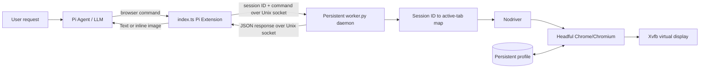

# Pi Nodriver Browser

A global [Pi coding agent](https://github.com/badlogic/pi-mono) extension that registers a persistent `browser` tool backed by **Nodriver**, a real headful **Chrome/Chromium** instance, and **Xvfb**.

This project is intended for Linux Pi installations that need interactive browser automation—opening pages, inspecting interactive elements, clicking, typing, selecting options, scrolling, and returning screenshots to the model—without using Chrome's headless mode.

> The extension reduces obvious headless-browser fingerprints, but it does **not** guarantee bypassing CAPTCHA, bot detection, authentication, or a site's terms of service.

## Features

- Registers the standard Pi tool name `browser`
- Persistent Chrome/Xvfb daemon that survives Pi tasks and session shutdowns
- Headful Chrome rendered on an Xvfb virtual display
- Persistent browser profile for shared cookies/local state, with one active tab per Pi session ID
- Stable `@e1`, `@e2`, … references generated by `snapshot -i`, including custom controls and open Shadow DOM
- Click by reference, text, CSS selector, or viewport coordinates, plus fill, type, select, keyboard, scroll, wait, text extraction, screenshots, and safe overlay dismissal
- Supports new tabs opened by clicks
- Serializes commands within each Pi session while other sessions remain responsive
- Disconnects Pi clients on session shutdown without closing Chrome
- Replaces the conflicting `npm:pi-agent-browser` package during installation

## Requirements

| Dependency | Purpose | Required |
|---|---|---|
| Linux | Current supported platform | Yes |
| Pi coding agent | Loads `index.ts` and exposes the tool | Yes |
| Python 3.10+ | Runs the Nodriver worker | Yes |
| `venv` + `pip` | Creates the isolated Python environment | Yes |
| Nodriver 0.50.3 | Controls Chrome through the DevTools protocol | Yes; installed automatically |
| Google Chrome or Chromium | Browser engine | Yes |
| Xvfb / `xvfb-run` | Virtual X11 display for headful Chrome | Yes |

### Ubuntu/Debian prerequisites

```bash
sudo apt update
sudo apt install -y python3 python3-venv xvfb
```

Install Google Chrome separately, or use an available Chromium package. The worker searches for:

1. `$PI_NODRIVER_CHROME`
2. `google-chrome`
3. `google-chrome-stable`
4. `chromium`
5. `chromium-browser`

Example custom browser path:

```bash
export PI_NODRIVER_CHROME=/opt/google/chrome/google-chrome
```

Some restricted containers cannot use Chrome's sandbox. Only in such an isolated environment, opt out explicitly:

```bash
export PI_NODRIVER_NO_SANDBOX=1
```

Do not disable the sandbox on a normal workstation or server.

Override the persistent profile directory when running concurrent or isolated sessions:

```bash
export PI_NODRIVER_PROFILE=/tmp/pi-browser-profile-$USER
```

Override the Unix socket used to reconnect Pi sessions to the browser daemon:

```bash
export PI_NODRIVER_SOCKET="$HOME/.pi/agent/nodriver-browser.sock"
```

The default Xvfb display and Chrome window are **1280×720 (720p, 16:9)**. Chrome's visible toolbar reduces the page-content viewport height.

Commands time out after 75 seconds and screenshots after 30 seconds by default, preventing a stuck Chrome operation from locking a session indefinitely. Override when necessary:

```bash
export PI_NODRIVER_COMMAND_TIMEOUT=75
export PI_NODRIVER_SCREENSHOT_TIMEOUT=30
```

## Architecture



### Components

- **`index.ts`** — Pi extension entry point. Registers `browser`, connects to or lazily starts the daemon, queues requests, returns screenshots as image tool results, and disconnects without closing Chrome when the Pi session ends.
- **`worker.py`** — Long-lived Unix-socket daemon that owns Nodriver, maps each Pi session ID to its own active tab, and implements browser commands.
- **`browser_logic.py`** — Pure parsing, browser discovery, and snapshot formatting functions.
- **`.venv/`** — Isolated Nodriver runtime created inside the installed extension.
- **`~/.pi/agent/nodriver-profile/`** — Persistent Chrome profile containing cookies and site data.
- **`~/.pi/agent/nodriver-browser.sock`** — Local Unix socket used by later Pi tasks and sessions to reconnect to the same daemon.

## Extension workflow

A typical agent interaction is:

```text
open https://example.com
dismiss overlays --cookies=reject-optional
snapshot -i
click @e2
snapshot -i
fill @e1 "search phrase"
press Enter
wait 1500
screenshot --full
```

1. Pi loads `index.ts` from its global extension directory.
2. `pi.registerTool({ name: "browser" })` exposes the tool to the model.
3. Each tool call reads `ctx.sessionManager.getSessionId()` and sends that stable Pi session ID with the command.
4. The first command connects to the existing Unix socket or lazily starts `xvfb-run → worker.py --server → Nodriver → Chrome`.
5. The daemon routes the command to that session's active tab; `open` creates/replaces only that session's tab.
6. `snapshot -i` marks visible interactive DOM nodes with `data-pi-ref` attributes and returns model-friendly references.
7. Commands such as `click @e2` resolve those references in that session's live DOM.
8. OAuth/login popups opened by a click become the session's active page. When a popup closes, the next command automatically returns to its opener.
9. A navigation or major DOM change invalidates old references. After a missing/stale-ref error, a per-session guard blocks further ref-based commands until an explicit `snapshot -i` succeeds; text, CSS, coordinate, and overlay-dismiss fallbacks remain available.
10. Pi task/session shutdown closes only its socket connection. The daemon, Xvfb, Chrome, session tabs, and in-memory page map remain alive.
11. `close` closes only the caller's tab. `shutdown`, installer upgrade, uninstall, process termination, or machine restart closes the shared daemon and Chrome.

## Browser command reference

| Command | Description |
|---|---|
| `open <url>` | Navigate to a URL |
| `snapshot -i` | List visible interactive elements with `@eN` references |
| `click <@ref>` | Click a snapshot element, including custom controls and open Shadow DOM |
| `click <x> <y>` | Click viewport coordinates; fallback for canvas, cross-origin iframes, and visual-only controls |
| `click-text <text>` | Click the best visible element matching text or its accessible label |
| `click-css <selector>` | Click the first visible element matching a CSS selector, including open Shadow DOM |
| `click-js <@ref>` | Dispatch a deferred DOM click when a native mouse handler disrupts CDP |
| `download-info <@ref>` | Inspect the URL, filename, inferred MIME type, and cross-origin status without clicking |
| `download <@ref> [ms]` | Click and wait for a verified completed download; default 30 seconds |
| `wait-download [ms]` | Wait for the active or most recent download; default 30 seconds |
| `downloads [limit]` | List completed files and in-progress percentages; default 10 |
| `download-latest` | Return metadata and the absolute path of the newest completed file |
| `fill <@ref> <text>` | Clear an input and type text |
| `type <@ref> <text>` | Type without clearing |
| `select <@ref> <value>` | Select a dropdown option by value or visible text |
| `press <key>` | Send Enter, Tab, Space, Backspace, or text |
| `scroll <direction> [px]` | Scroll up, down, left, or right |
| `get text [@ref]` | Get page or element text |
| `get url` / `get title` | Get current page metadata |
| `wait <@ref>` / `wait <ms>` | Wait for an element or duration |
| `wait-popup [ms]` | Wait for an OAuth/login popup and switch to it; default 30 seconds |
| `wait-popup-close [ms]` | Wait for the active popup to close, then return to its opener; default 30 seconds |
| `switch opener` | Return to the popup opener without closing the popup |
| `dismiss overlays [--cookies=…]` | Dismiss cookie banners and modal overlays safely |
| `screenshot [--full]` | Return a PNG screenshot inline |
| `close` | Close only the current Pi session's active tab |
| `shutdown` | Close Chrome and stop the persistent browser daemon |

Send exactly one command per tool call. Shell chaining such as `wait 2000 && screenshot` is rejected; call `wait 2000` and `screenshot` separately.

For OAuth flows such as LINE Login, click the login control normally, then interact with the popup using `snapshot -i`. Immediate popups are selected automatically; `wait-popup 30000` also catches delayed script-opened windows. After QR, 2FA, or consent completes, `wait-popup-close 30000` waits for the popup to close and restores the original site. If it closes between commands, restoration happens automatically. Use `switch opener` to return early without closing it.

Download links are marked with `download="…"` in snapshots. Use `download-info @e5` to inspect one without triggering it, or `download @e5 30000` to click and wait for completion. Chrome download lifecycle events are combined with `.crdownload`-aware filesystem verification; completed results include an absolute `downloadPath` suitable for attaching to the final response. Files are restricted to `PI_NODRIVER_DOWNLOAD_DIR`, defaulting to `~/.pi/agent/nodriver-downloads`, separated into hashed per-session directories, and never executed automatically. CDP frame attribution prevents one Pi session from listing or waiting on another session's downloads.

Use quotes around arguments containing spaces:

```text
fill @e1 "鼎泰豐 101 店"
```

### Overlay and cookie handling

Use one of these explicit policies:

```text
dismiss overlays                              # default: reject optional cookies
dismiss overlays --cookies=reject-optional   # choose necessary/essential cookies when offered
dismiss overlays --cookies=accept            # accept cookies
dismiss overlays --cookies=ignore            # leave cookie banners untouched
```

The command scans visible dialog, modal, popup, overlay, cookie, and consent containers. It uses real mouse clicks and repeats after each DOM change. For non-cookie marketing dialogs it prefers privacy-safe controls such as **No thanks**, **Not now**, **稍後**, or **不用，謝謝**, then falls back to a close control. It intentionally does not treat generic **Yes/是** buttons as dismiss actions.

If the requested cookie policy has no matching control, the cookie banner is left in place and reported instead of silently choosing a different consent level. Run `snapshot -i` afterward to verify the page state. Cross-origin iframe and closed Shadow DOM consent managers may still require manual interaction.

## Deployment

### Automated installation

```bash
git clone git@github.com:AyaSakura-comp/pi-nodriver-browser.git
cd pi-nodriver-browser
./install.sh
```

The installer:

1. Verifies Python, Xvfb, and Chrome/Chromium.
2. Copies the extension to `~/.pi/agent/extensions/nodriver-browser/`.
3. Creates `.venv` and installs `requirements.txt`.
4. Backs up Pi settings as `~/.pi/agent/settings.json.pi-nodriver-browser.bak`.
5. Removes `npm:pi-agent-browser` from `settings.json` to avoid a duplicate `browser` registration.

Then start a new Pi session or run:

```text
/reload
```

To install into a non-default Pi directory:

```bash
PI_AGENT_DIR=/custom/pi/agent ./install.sh
```

### Manual installation

```bash
TARGET="$HOME/.pi/agent/extensions/nodriver-browser"
mkdir -p "$TARGET"
cp index.ts worker.py browser_logic.py requirements.txt "$TARGET/"
python3 -m venv "$TARGET/.venv"
"$TARGET/.venv/bin/pip" install -r "$TARGET/requirements.txt"
```

Remove `npm:pi-agent-browser` from `~/.pi/agent/settings.json` if present, then reload Pi.

### Upgrade

```bash
cd pi-nodriver-browser
git pull --ff-only
./install.sh
```

The persistent Chrome profile is outside the extension directory and survives upgrades. The installer gracefully shuts down a running old daemon before replacing its code; a later browser command starts the upgraded daemon with the same profile.

### Uninstall

```bash
./uninstall.sh
```

If desired, restore the old settings backup manually and reload Pi:

```bash
cp ~/.pi/agent/settings.json.pi-nodriver-browser.bak ~/.pi/agent/settings.json
```

## Usage from Pi

Ask Pi naturally:

> Use the browser tool to open `https://example.com`, run `snapshot -i`, click the documentation link, and take a full-page screenshot.

The model decides when to invoke the tool. There is no separate slash command.

## Testing

Run pure unit and installer tests:

```bash
python3 -m unittest discover -s tests -v
```

Run the real Chrome/Xvfb integration test after installing dependencies:

```bash
python3 -m venv .venv
.venv/bin/pip install -r requirements.txt
RUN_BROWSER_INTEGRATION=1 NODRIVER_PYTHON="$PWD/.venv/bin/python" \
  python3 -m unittest discover -s tests -v
```

The integration tests open local HTML fixtures, exercise clicks and overlay dismissal, disconnect one Unix-socket client, reconnect another, and verify that the same live Chrome page survived between clients.

## Security and operational notes

- The browser accepts arbitrary URLs requested by the model. Apply normal SSRF and network-access precautions in sensitive environments.
- The persistent profile may contain authenticated cookies. Protect `~/.pi/agent/nodriver-profile/` and never commit it.
- Screenshots and page text can contain private information and are returned to the active model session.
- `snapshot -i` references are page-state dependent; re-snapshot after navigation. Never retry a missing/stale ref: the extension requires a successful fresh snapshot before accepting another ref-based command in that session.
- The daemon serializes commands per Pi session ID. A slow screenshot or wait in one session does not block unrelated sessions.
- Every command has a daemon-side timeout, so an abandoned client request cannot retain its session lock forever.
- Each Pi session has an independent active tab, but all tabs share the same Chrome profile, cookies, login state, browser process, and network identity.
- Session shutdown deliberately leaves Chrome running. Use `browser shutdown` before maintenance when the browser must be fully stopped.
- A daemon restart preserves profile data but loses the in-memory session-to-tab map; each session must `open` a page again afterward.
- The Unix socket is created with mode `0600`; all Pi sessions running as the same OS user share the authenticated browser state.
- The current implementation targets Linux/Xvfb. Native macOS and Windows display backends are not implemented.
- `PI_NODRIVER_NO_SANDBOX=1` weakens Chrome process isolation and should only be used inside an already-isolated CI/container environment.

## License

MIT
