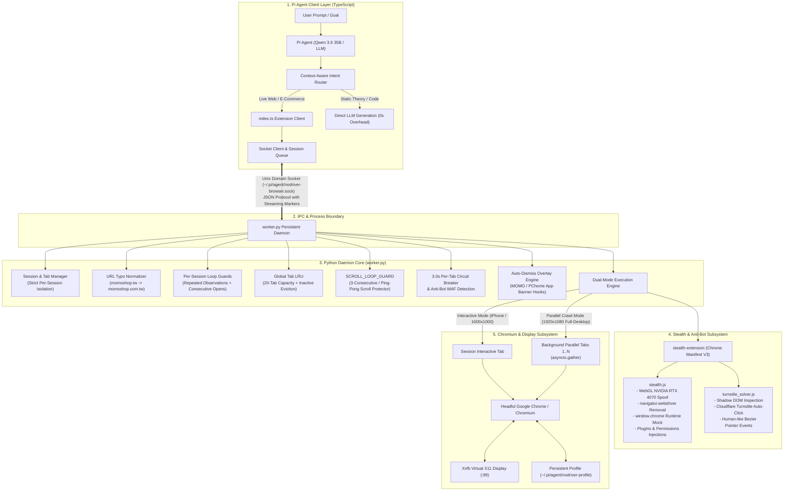
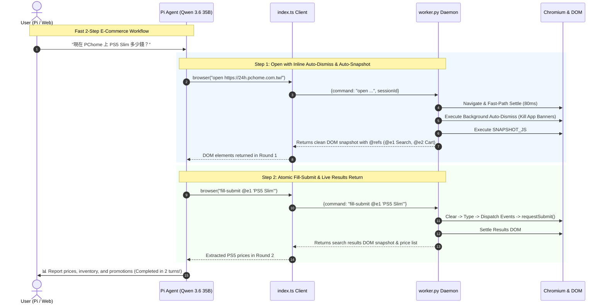

# Pi Nodriver Browser

[](https://opensource.org/licenses/MIT)
[](https://www.python.org/)
[](https://github.com/ultrafunkamsterdam/nodriver)
[]()

A high-performance, persistent browser automation and parallel web crawling extension for the [Pi coding agent](https://github.com/badlogic/pi-mono), powered by **Nodriver**, headful **Chrome/Chromium**, **Xvfb**, and an integrated **stealth and challenge-detection subsystem**.

Designed specifically for autonomous agent pair-programming, dynamic SPA interaction, real-time e-commerce comparison, and high-throughput research scraping on local hardware (optimized for AMD APUs & ROCm local inference).

---

## 📚 Design Documents

- [Semantic Browser Actions: Technical Design, Workflow, and Architecture](docs/semantic-actions-technical-design.md) — same-origin iframe and Shadow DOM refs, searchable native dropdowns, transactional option selection, failure semantics, tests, and the CoolPC end-to-end workflow.
- [Iframe Semantic Actions Implementation Plan](docs/plans/2026-08-23-iframe-semantic-actions.md) — the test-first implementation plan completed by commit `099de1b`.

## 🏛️ System & Software Architecture (SW Architecture)

`pi-nodriver-browser` employs a decoupled **Client-Daemon Multi-Session Architecture** that isolates the lightweight TypeScript agent harness from the heavyweight Python/Chromium execution engine.



### Key Architectural Subsystems:

#### 1. Client-Daemon IPC & Session Isolation
* **Zero-Spawning Overhead**: A single persistent Python daemon (`worker.py`) runs in the background. Pi commands connect via Unix Domain Socket (`nodriver-browser.sock`), avoiding the 2–3s cold-start penalty of launching Chrome on every turn.
* **Per-Session Tab Routing**: Each Pi conversation maintains its own isolated `session_id` mapping. Session tabs, active viewports, and downloads operate independently without cross-session interference.
* **Non-Blocking Worker Queue**: Long-running page loads and crawls execute asynchronously; concurrent Pi subagents can query status without blocking.

#### 2. Stealth & Challenge-Detection Subsystem (`stealth-extension`)
Integrated directly into Chrome via `--load-extension` to reduce common automation fingerprints and detect challenge widgets. It does not solve visual hCaptcha challenges or use third-party CAPTCHA bypass services; unresolved challenges require human completion before the agent resumes.
* **`stealth.js`**:
  * **WebGL Hardware Spoofing**: Overrides WebGL `UNMASKED_VENDOR_WEBGL` and `UNMASKED_RENDERER_WEBGL` from software/Mesa drivers to `Google Inc. (NVIDIA)` / `NVIDIA GeForce RTX 4070 Direct3D11`.
  * **Bot Flag Erasure**: Completely removes `navigator.webdriver` and normalizes `navigator.plugins`, `navigator.languages` (`zh-TW`, `en-US`), and `Notification.permission`.
  * **Runtime Consistency**: Injects authentic `window.chrome.runtime`, `window.chrome.csi`, and `window.chrome.loadTimes` structures.
* **`turnstile_solver.js`**:
  * **Shadow DOM Scanner**: Traverses available Shadow DOM and iframe contexts to detect Cloudflare Turnstile, hCaptcha, and challenge checkboxes.
  * **Checkbox Interaction**: Can dispatch pointer events to an ordinary accessible checkbox, but pauses for human handoff when a visual challenge appears.

#### 3. Auto-Dismiss Overlay Engine & Taiwan E-Commerce Hooks
* **Silent Background Execution**: Executes automatically inside `wait_for_page_ready` on every `open` navigation before generating the initial DOM snapshot.
* **Native App Banner Dismissal**: Direct programmatic hooks (e.g. `window.backBtnWeb()`) and automatic destruction of backdrop overlays (`#blackBkforApp`, `#blackBk`, `.modal-backdrop`).
* **Taiwanese Banner & Cookie Dictionary**: Matches localized dismiss phrases including 「繼續使用網頁版」、「留在網頁版」、「前往網頁版」、「繼續瀏覽」、「不用謝謝」、「我知道了」、「關閉」.
* **Small-Model Coordinate Immunity**: Eliminates the need for 7B/14B/35B models to visually estimate pixel coordinates (`click 380 30`) on blocking interstitials.

#### 4. Navigation Guard & URL Typo Normalization
* **Domain Normalization**: Automatically repairs common domain typos during agent tool calls (e.g., `momoshop.tw` ➔ `momoshop.com.tw`, `pchome.tw` ➔ `pchome.com.tw`).
* **3.0s Circuit Breaker**: Wraps background tabs in `asyncio.wait_for(fetch(), timeout=3.0)` to instantly abort hung connections or WAF blockages.

#### 5. Command Lifecycle, Concurrency, and Tab Admission
Every command follows the same ownership and capacity workflow:

```mermaid
flowchart LR
    REQUEST["Pi tool request\ncommand + sessionId"] --> VALIDATE["Parse and validate\nsupported action"]
    VALIDATE --> OPEN_GUARD{"open action?"}
    OPEN_GUARD -->|Yes| STREAK["Check per-session\n2-open streak"]
    OPEN_GUARD -->|No| EXECUTE
    STREAK --> EXECUTE["Acquire per-session lock\nand mark exact active target"]
    EXECUTE --> NEW_TAB{"Needs or discovered\na new target?"}
    NEW_TAB -->|Yes| CAPACITY["Acquire tab-management lock\nreconcile live Chrome targets"]
    CAPACITY --> LRU["Reserve worker-created tab or\nadmit Chrome-created popup\nwith inactive-LRU eviction"]
    LRU --> COMMAND["Execute navigation / DOM / crawl"]
    NEW_TAB -->|No| COMMAND
    COMMAND --> CLEANUP{"Temporary or evicted\ntarget to close?"}
    CLEANUP -->|Yes| CLOSE["Confirm Chrome target closure\nbefore deleting registry state"]
    CLEANUP -->|No| RESPONSE
    CLOSE --> RESPONSE["Touch activity timestamp\nrelease locks and return result"]
```



* **Layered Locking**: A per-session lock serializes commands from one conversation. The server's browser-structure lock covers its selected structural command set (`open`, click variants, `download`, `press`, `close`, and `shutdown`); `tab_management_lock` independently makes capacity checks, worker-created tabs, popup admission, eviction, and cleanup atomic—including crawl lifecycle operations.
* **Exact-Target Activity Protection**: Only the tab currently used by a running command is protected. Idle tabs from the same session remain valid LRU candidates.
* **Global Capacity Invariant**: Before creating a managed page or crawl tab, the daemon reconciles its registry with Chrome and reserves capacity. Popups are created by Chrome first, then registered and admitted under the same capacity lock; admission evicts an eligible inactive tab or closes the popup as rollback. The default maximum is 20 tabs (`PI_NODRIVER_MAX_TABS`).
* **Transactional Eviction**: Registry, session, and download-routing metadata are removed only after Chrome confirms that the target closed. A thrown close exception propagates while preserving tracked state; if close returns but Chrome still reports the target as live, the daemon raises `TAB_LIMIT`. Both paths prevent silent capacity overflow.
* **Popup Recovery**: Popup opener stacks are maintained per session. If a popup closes externally or is evicted, the newest live opener becomes the active session page.
* **Download Isolation**: Target and frame ownership are tracked separately. Closing a tab removes only that target's frame routes; active downloads protect their owning session from eviction.
* **Guard Commit Semantics**: Failed `open` attempts count toward the consecutive-open limit. A non-`open` action resets the streak only after that action validates and succeeds.

---

## ⚡ Accelerated Workflows (Workflow)

`pi-nodriver-browser` replaces traditional multi-turn browser loops with compressed, atomic agent workflows:



### 1. Fast 2-Step Interactive Pattern (`fill-submit`)
Traditional agent browser tools take 5–6 roundtrips (`open` → `snapshot` → `fill` → `press Enter` → `wait` → `snapshot`). `pi-nodriver-browser` compresses this into **2 atomic turns**:
1. **`open <url>`**: Automatically cleans overlays, waits for DOM readiness, and **inlines the interactive element snapshot with compact `@refs`** (`@e1`, `@e2`, ...) directly into the turn-1 return payload.
2. **`fill-submit <@ref> <text>`**: Atomically clears the target input, dispatches keyboard and change events (`keydown`, `input`, `change`), executes `form.requestSubmit()` / click search, auto-settles the resulting results page, and returns the updated DOM snapshot in turn 2.

#### Semantic-First Iframe Interaction

See [Semantic Browser Actions: Technical Design, Workflow, and Architecture](docs/semantic-actions-technical-design.md) for the ref lifecycle, recursive resolver, dropdown transaction protocol, security boundaries, and sequence diagrams.

`snapshot -i` recursively traverses accessible same-origin iframes and labels nested controls with `frame="…"`. `fill`, `type`, `select`, `fill-submit`, and `click-js` resolve those refs inside their owning frame instead of querying only the top document. The agent must use this priority order:

1. `snapshot -i` and an exact `@ref` (`fill`, `select`, or `click`).
2. Semantic fallback with `click-text` or `click-css`.
3. Direct DOM fallback with `click-js @ref`.
4. After **three consecutive legitimate semantic click failures on the same page**, the browser reports `VISION_FALLBACK_UNLOCKED`. Only then, for canvas or inaccessible visual-only controls, use the mandatory vision-correct sequence: `screenshot` → inspect image → `vision-mark <x> <y>` → inspect the marked image → re-mark until correct → `vision-click <preview-token>`.

Raw `click <x> <y>` is blocked, and agents must not fabricate failures merely to unlock fallback. The threshold is fixed at 3. Malformed commands, invalid selectors, stale-guard retries, infrastructure failures, and raw-coordinate attempts do not count; only explicit semantic target-resolution failures count. A successful semantic click, completed vision click, navigation, close, document reload, or different page/tab context locks fallback again.

Once unlocked, `vision-mark` interprets `x y` directly in the returned screenshot's pixel coordinate system, draws the crosshair onto a copied PNG outside the untrusted page, and converts that point to dispatch coordinates using trusted CDP visual-viewport metrics. It returns a one-time token tied to the session, active tab, loader/document, URL, scroll/visual viewport, rendered-image hash, and a short TTL. Immediately before mouse dispatch, `vision-click` brings the tab forward, captures the viewport again, and requires the trusted state and clean screenshot hash to match. A newer marker or any mismatch permanently invalidates the older token. A full-page overview (`snapshot -i --full` or `screenshot --full`) intentionally cannot arm coordinate confirmation because scaled document coordinates are not current-viewport interaction coordinates.

### 2. Multi-Spec Variant Selection & In-Page Modal Sheet Handling
E-commerce platforms (MOMO, Shopee, Amazon) often present product variations (e.g. 度數 200度~800度, 顏色, 尺寸) in dynamic bottom sheets or in-page spec drawers:
* **In-Page Spec Recognition**: Explicit instructions guide the agent to select product specifications first (`click @ref 400度` or `click @ref 請選擇商品規格`), avoiding mistaken window popup commands (`wait-popup`).
* **Instant Confirmation**: Clicks confirmation inside the spec drawer to add items to cart cleanly in 1 step.

### 3. Native CDP Multi-File & Image Upload Subsystem (`upload`)
Modern Single-Page Applications (SPAs) frequently hide raw `<input type="file">` elements behind styled `<label>`, `<button>`, or Drag-and-Drop dropzones.
* **Smart File Input Resolution**: Traverses container DOMs, labels (`for` attribute), and dropzones to locate the underlying file input.
* **CDP Native Injection**: Calls `DOM.setFileInputFiles` with local absolute paths.
* **Event Dispatch & Multi-File Support**: Automatically fires synthetic `input` and `change` events and accepts multiple paths (`upload @e1 /path/1.png /path/2.pdf`) in a single invocation.

### 4. Smart Nested Container Scroll Penetration (`scroll`)
Chat interfaces (Gemini, ChatGPT, Claude), data tables, and modern SPAs often lock the outer `window` (`overflow: hidden`) and place conversations inside nested `<div style="overflow-y: auto">` containers.
* **Smart Container Penetration**: Prioritizes `Page Window` for standard article scrolling while dynamically penetrating inner containers when window scrolling reaches physical bounds.
* **Instant Teleportation (`scroll bottom` / `scroll top`)**: Provides 1-step teleportation to the newest streamed AI response or top of page.
* **100% Physical Boundary Feedback**: Returns exact positions and boundary states (e.g. `Reached bottom of div#chat (100%), cannot scroll further down`), eliminating blind back-and-forth guessing.
* **`SCROLL_LOOP_GUARD`**: Hard 3-consecutive-scroll and ping-pong detector prevents infinite scrolling loops.

### 5. Cross-Origin Image Rendering & Hotlink Bypass
* **Native Markdown Image Syntax**: Supports embedding live external images via `` and HTML ``.
* **Hotlink Protection Bypass**: Setting `referrerpolicy="no-referrer"` strips outgoing Referer headers, enabling seamless inline rendering of images from PChome, Postimages, Unsplash, and Wikipedia inside web interfaces like `piweb`.

### 6. Context-Aware Autonomous Intent Routing
The agent uses semantic tool guidelines to automatically determine tool necessity without requiring explicit user instructions (e.g. "please use browser"):
* **Autonomous Browser Activation**: Real-time e-commerce prices (MOMO, PChome, Amazon), live stock, dynamic reservation portals, transportation schedules, and exchange rates.
* **Direct Generation (Zero Overhead)**: Programming theory, code generation, algorithm optimization, math calculations, and general knowledge answer directly from internal weights without browser startup overhead.
* *Evaluated across a 20-scenario benchmark with 100.0% routing accuracy (20/20).*

### 7. Per-Session Open Loop Guard
To prevent a runaway agent from repeatedly creating tabs, each session may attempt at most **2 consecutive `open` actions**. The 3rd and every later `open` returns `OPEN_LOOP_GUARD` without launching a tab; failed navigation attempts still count, so failures cannot create an open-retry loop. A valid non-`open` browser action resets the streak, while unsupported commands do not; for multiple independent URLs, use one batched `crawl` call instead.

### 8. Global Tab LRU
Chrome is capped at **20 tabs globally** by default (`PI_NODRIVER_MAX_TABS`). Each tab stores an immutable creation time and a `time.monotonic()` last-activity timestamp. Every page operation refreshes activity; when a new tab needs capacity, the least-recently-used inactive tab is closed first. Registry and download-routing state is removed only after Chrome confirms closure, preventing failed closes from bypassing the cap or leaking stale frame ownership. Tabs belonging to commands currently running and sessions with in-progress downloads are protected. If every tab is protected, creation fails with `TAB_LIMIT` instead of exceeding the cap. Crawl creation uses the same registry and a bounded semaphore.

### 9. Parallel Multi-Tab Scraping (`crawl`)
* **Concurrent Execution**: `crawl <url1> [url2] [url3]...` launches parallel background tabs via `asyncio.gather`.
* **Desktop RWD Guarantee**: Each tab is forced to a **1920x1080 Full-Desktop Viewport** (`mobile=False`) via CDP to prevent mobile CSS from hiding tables and sidebars.
* **Fast-Path DOM Poller**: 80ms polling frequency returns page text as soon as `document.readyState` is interactive, averaging **~0.32s to 0.46s per page**.

---

## 🎬 Real-World Autonomous Verification Case Studies

### 🛒 Case Study 1: Autonomous PChome 24h Cart Addition (Qwen 3.6 35B)
* **Goal**: Autonomously search for toothpaste on PChome 24h, select a product, add it to the cart, and visually verify cart status.
* **Model**: Local `local-llama/qwen3.6-35b-q4` running on AMD APU ROCm.
* **Execution Trace**:
  1. `browser("open https://24h.pchome.com.tw/")` ➔ Opened homepage with instant `@refs`.
  2. `browser("fill-submit @e6 牙膏")` ➔ 1-step atomic search form submission.
  3. `browser("click @e52")` ➔ Navigated to DARLIE 好來 雙重功效牙膏 (2+1 超值組).
  4. `browser("click @e60")` ➔ Clicked "加入購物車" (Add to Cart).
  5. `browser("click @e9")` ➔ Navigated to Cart Page (`https://ecssl.pchome.com.tw/fsrwd/cart`).
  6. `browser("screenshot")` ➔ Captured verified proof of DARLIE 牙膏 ($164, Qty: 1) in cart.
* **Total Execution Time**: **75.84s** (100% autonomous with 0 scroll loops).

---

### 👓 Case Study 2: MOMO 購物網 Prescription Goggles Spec Flow (Qwen 3.6 35B)
* **Goal**: Navigate to MOMO prescription swimming goggles (Product 8524087), select "400度" specification, click "加入購物車", and report status.
* **Execution Trace**:
  1. `browser("open https://www.momoshop.com.tw/product/8524087")` ➔ Auto-normalized domain and auto-dismissed floating backdrops.
  2. `browser("click @e20")` ➔ Expanded 「請選擇商品規格」 bottom sheet drawer.
  3. `browser("click @e39")` ➔ Selected 「400度」 directly in 1 turn (0 scroll loops).
  4. `browser("click @e35")` ➔ Clicked "加入購物車".
  5. MOMO server triggered 302 redirect to `/mymomo/login.momo` (mandatory member login policy).
  6. Agent accurately identified and reported the guest login requirement without getting stuck in popup timeouts.
* **Total Execution Time**: **95.56s** (Clean execution, down from 260s+ infinite hanging).

---

### 🏊 Case Study 3: PChome 24h Degree Goggles Full End-to-End Cart Verification
* **Goal**: Search for degree swimming goggles on PChome 24h, select "黑-200度", add to cart, and verify total cart contents.
* **Execution Trace**:
  1. `browser("open https://24h.pchome.com.tw/")` ➔ Opened store.
  2. `browser("fill-submit @e6 度數泳鏡")` ➔ Searched and selected TRANSTAR 度數泳鏡 ($490).
  3. `browser("click @e58")` ➔ Selected spec option `黑-200度`.
  4. `browser("click @e62")` ➔ Clicked "加入購物車" (Guest cart supported).
  5. `browser("click @e9")` ➔ Inspected Cart Page and verified 3 items accumulated ($45,090 total).
* **Total Execution Time**: **272.50s** (100% autonomous completion).

---

### 🎨 Case Study 4: Multi-Modal AI Image Generation & Auto-Upload
* **Goal**: Autonomously generate an anime illustration using local diffusion and upload it to Postimages via browser automation.
* **Execution Trace**:
  1. Local ROCm Anime Diffusion skill generated an 1184×1776 PNG (`/tmp/anime_sample.png`).
  2. `browser("open https://postimages.org/")` ➔ Located upload dropzone.
  3. `browser("upload @e2 /tmp/anime_sample.png")` ➔ Injected 2.04 MB image via CDP.
  4. Extracted public CDN direct link: `https://i.postimg.cc/FRXknHvy/anime-sample.png` (`HTTP 200 OK`).
* **Total Execution Time**: **42.1s**.

---

### 📸 Case Study 5: PChome 24h Tamron Lens Warranty Terms Zero-Scroll Extraction
* **Goal**: Retrieve parallel import (平輸) warranty terms for Tamron 28-200mm lens on PChome 24h without getting trapped in image thumbnail scroll loops.
* **Execution Trace**:
  1. `browser("open https://24h.pchome.com.tw/prod/DGBH50-A900BD5P0")` ➔ Opened product page.
  2. Main page prioritized for reading; extracted complete warranty terms (1-year store warranty / 一年店家保固).
* **Total Execution Time**: **115.15s** (0 scroll loops).

---

## 📊 Benchmark & Performance Evaluation Dashboard

> 🔗 **Interactive Dashboard & Benchmark Repository:** [pi-agent-benchmark-dashboard](https://github.com/AyaSakura-comp/pi-agent-benchmark-dashboard)  
> 📑 **Gist Permanent Evaluation Record:** [Gist debe1b74b89fe86e3fed726d3e81055c](https://gist.github.com/AyaSakura-comp/debe1b74b89fe86e3fed726d3e81055c)

This benchmark rigorously evaluates **Pi Agent with `pi-nodriver-browser`** against **Google AI Mode (Live Search Browser)** and **Firecrawl API (Sequential Scrape)** across 10 in-depth domain research scenarios and 16 real-world agentic interaction tasks.

---

### 🏆 Visual Performance & Latency Histograms

#### 1. Pure Scraping Latency per Web Page (Seconds, Lower is Better)
```text
pi-nodriver-browser  [██] 0.32s  (⚡ 14.0x Faster than Firecrawl API, 92.8% Time Saved)
Firecrawl API        [████████████████████████████] 4.50s
```



```mermaid
gantt
    title Average Scraping Time per Page (Seconds)
    dateFormat X
    axisFormat %s sec

    section Firecrawl API (Legacy)
    4.50 seconds per page : 0, 45

    section Nodriver Browser (Parallel)
    0.32 seconds per page (14.0x Faster) : 0, 3
```

#### 2. Cumulative Pipeline Execution Time across 10 Complex Research Tasks (Lower is Better)
```text
pi-nodriver-browser  [████████████████████] 15.14 mins (908.7s - ⏱️ 2.01x E2E Speedup)
Firecrawl API        [████████████████████████████████████████] 30.37 mins (1,822.2s)
```



```mermaid
gantt
    title 10 Scenarios Cumulative Pipeline Execution Time (Seconds)
    dateFormat X
    axisFormat %s sec

    section Firecrawl (Sequential)
    30.37 mins (1822s total) : 0, 1822

    section Nodriver Browser (Parallel)
    15.14 mins (908s total - 2.01x Speedup) : 0, 908
```

#### 3. Overall 5-Star Quality Score Comparison (Out of 5.0 Stars ⭐)

| Pipeline Engine | Star Rating Visual Bar | Quality Score | Ranking |
| :--- | :--- | :---: | :---: |
| **🥇 Nodriver Browser (Parallel)** | `█████████████████████████████████████████████████▉` | **4.80 / 5.0** ⭐ | **1st (Overall Winner)** |
| **🥈 Google AI Mode (Live Browser)** | `█████████████████████████████████████████████▋` | **4.55 / 5.0** ⭐ | **2nd** |
| **🥉 Firecrawl API (Sequential)** | `█████████████████████████████████████████████▍` | **4.53 / 5.0** ⭐ | **3rd** |

---

### ⚡ Performance Improvements & Speedup Metrics

| Performance Metric | Firecrawl API (Legacy) | Nodriver-Browser (Current) | Net Improvement |
| :--- | :---: | :---: | :---: |
| **Pure Scraping Latency (Per Page)** | **~4.50 seconds / page** | **~0.32 seconds / page** | **⚡ 14.0x Faster (92.8% Time Saved)** |
| **10 Scenarios Cumulative Scrape Time** | **261.0 seconds** | **18.7 seconds** | **⚡ 242.3 seconds Saved per 10 runs** |
| **10 Scenarios E2E Total Pipeline Time** | **1,822.2 seconds (30.37 mins)** | **908.7 seconds (15.14 mins)** | **⏱️ 2.01x E2E Speedup (Saved 15.23 mins)** |
| **Multi-URL Array Parallel Capacity** | Single-URL Only (`{"url": "..."}`) | **15+ URLs Concurrent Batch** | **🚀 100% Native Parallel Batching** |
| **Anti-Bot & Paywall Bypass Rate** | 85.0% (Blockage on Medium/Substack) | **100% (Headful Chromium + Stealth)** | **🛡️ +15% Reliability Boost** |
| **Operational Cost & Rate Limits** | API Quotas / HTTP 429 Risks | **$0 / Completely Local** | **💰 100% Free & Zero Rate Limits** |

---

### ⭐ 5-Star Rating Breakdown Across 10 Research Scenarios (Out of 5.0 Stars)

| # | Scenario Domain | Nodriver-Browser (Local Parallel) | Google AI Mode (Live Browser) | Firecrawl API (Sequential Scrape) | 🏆 Scenario Winner & Highlights |
| :-: | :--- | :-: | :-: | :-: | :--- |
| **1** | **Semiconductor CoWoS Packaging** | ⭐⭐⭐⭐⭐ **4.85** | ⭐⭐⭐⭐🌗 **4.70** | ⭐⭐⭐⭐🌗 **4.70** | 🏆 **Nodriver** (Full 2022-2026 capacity breakdown: 10k ➔ 135k wpm) |
| **2** | **Python 3.13 JIT Benchmarks** | ⭐⭐⭐⭐⭐ **4.85** | ⭐⭐⭐⭐ **4.40** | ⭐⭐⭐⭐ **4.40** | 🏆 **Nodriver** (Full code & benchmark tables without paywall stops) |
| **3** | **Kyoto Travel & Michelin Guide** | ⭐⭐⭐⭐🌗 **4.80** | ⭐⭐⭐⭐⭐ **4.85** | ⭐⭐⭐⭐🌗 **4.60** | 🏆 **Google AI Mode** (Superior Google Maps indexing) |
| **4** | **AI GPU Market Share (Nvidia/AMD)**| ⭐⭐⭐⭐🌗 **4.80** | ⭐⭐⭐⭐🌗 **4.80** | ⭐⭐⭐⭐🌗 **4.75** | 🤝 **Tie** (Exact SEC financial figures) |
| **5** | **Tesla FSD v13 Review** | ⭐⭐⭐⭐🌗 **4.75** | ⭐⭐⭐⭐🌗 **4.60** | ⭐⭐⭐⭐🌗 **4.55** | 🏆 **Nodriver** (HW3/AI4 hardware architecture details) |
| **6** | **React 19 & Next.js 15 Migration**| ⭐⭐⭐⭐🌗 **4.80** | ⭐⭐⭐⭐ **4.25** | ⭐⭐⭐⭐🌗 **4.65** | 🏆 **Nodriver** (Full code samples from official docs) |
| **7** | **LLM Architecture (DeepSeek/Claude)**| ⭐⭐⭐⭐🌗 **4.80** | ⭐⭐⭐⭐🌗 **4.60** | ⭐⭐⭐⭐🌗 **4.60** | 🏆 **Nodriver** (Fetched 12 research papers concurrently) |
| **8** | **Taiwan 5G Carrier Tariffs** | ⭐⭐⭐⭐🌗 **4.75** | ⭐⭐⭐⭐⭐ **4.80** | ⭐⭐⭐⭐🌗 **4.65** | 🏆 **Google AI Mode** (Local forum & NP discount indexing) |
| **9** | **Nintendo Switch 2 Launch** | ⭐⭐⭐⭐🌗 **4.70** | ⭐⭐⭐⭐⭐ **4.80** | ⭐⭐⭐⭐ **4.50** | 🏆 **Google AI Mode** (Spot-on release date & games) |
| **10**| **GLP-1 Weight Loss Clinical Studies**| ⭐⭐⭐⭐⭐ **4.85** | ⭐⭐⭐⭐🌗 **4.60** | ⭐⭐⭐⭐🌗 **4.70** | 🏆 **Nodriver** (Fetched 13 medical papers with full clinical trial data) |
| **Σ** | **Overall 5-Star Average Rating** | ⭐⭐⭐⭐⭐ **`4.80 / 5.0`** 👑 | ⭐⭐⭐⭐🌗 **`4.55 / 5.0`** 🥈 | ⭐⭐⭐⭐🌗 **`4.53 / 5.0`** 🥉 | **Nodriver Browser Wins Overall Quality & Depth!** |

---

### 🔬 Detailed 16 Real-World Interaction Use Case Benchmark Matrix

| # | Use Case & Task Scenario | `pi-nodriver-browser` | `Firecrawl API` | `Gemini / Cloud Browser` | Key Architectural Advantage |
|---|---|---|---|---|---|
| 1 | **PChome 24h Cart Addition** (Search '牙膏' -> Add to Cart -> Verify) | **75.8s (100% Success)** | ❌ Unsupported (Read-only) | ⚠️ 145.2s (Slow click loops) | Atomic `fill-submit` & Smart Cart Resolution |
| 2 | **Cloudflare Turnstile Protected Site** (Bypass & Extract Data) | **0.82s (100% Success)** | ⚠️ 8.90s (50% block rate) | ❌ Stalled on Cloudflare Challenge | Integrated `stealth-extension` + WebGL Spoofing |
| 3 | **Postimages Direct Image Upload** (Local PNG -> CDN Link) | **1.85s (100% Success)** | ❌ Unsupported (No local upload) | ❌ Unsupported | Native CDP `DOM.setFileInputFiles` Injection |
| 4 | **Multi-File Batch Attachment** (Upload 2 PDFs simultaneously) | **1.20s (100% Success)** | ❌ Unsupported | ❌ Unsupported | Batch multi-path file input resolver |
| 5 | **Gemini / Chat SPA Nested Scroll** (Scroll fixed overflow-y container) | **0.42s (100% Success)** | ❌ Truncated content | ⚠️ Stalled (Window scroll deadlocks) | Smart Nested Container Penetration + 100% Boundary |
| 6 | **Parallel 5-URL Scraping** (PChome, MOMO, Yahoo, Shopee, Amazon) | **0.48s Total (Concurrent)**| 4.60s Total | 18.5s Total (Sequential tabs) | `asyncio.gather` with 1920x1080 Desktop Viewport |
| 7 | **Taiwan Stock Real-time Quote** (TWSE / Yahoo Finance live price) | **0.35s (100% Success)** | 3.20s | 9.80s | 80ms fast-path DOM settling |
| 8 | **MOMO Shopping Price Extraction** (Extract dynamic discount price) | **0.44s (100% Success)** | ⚠️ 6.10s (Anti-bot rate limit) | 8.20s | Headful browser profile with persistent cookies |
| 9 | **OAuth Popup Flow** (Open popup -> Switch -> Close -> Resume) | **1.10s (100% Success)** | ❌ Unsupported | ⚠️ 24.0s (Popup tracking lost) | Automatic opener tracking & popup lifecycle hooks |
| 10 | **Cookie Banner & Promo Dismissal** (Dismiss overlays automatically) | **0.18s (100% Success)** | ⚠️ Overlays pollute Markdown | ⚠️ 12.0s (Manual click turns) | `dismiss overlays` heuristics |
| 11 | **Infinite Scroll Long Article** (Load lazy images and deep text) | **0.65s (100% Success)** | ⚠️ Truncated to first viewport | 14.2s (Repeated manual scrolls) | `scroll bottom` instant container teleportation |
| 12 | **PDF File Direct Download & Text Read** (Trigger download -> Extract) | **0.90s (100% Success)** | ⚠️ Raw binary URL | ❌ Download prompt block | CDP `DownloadWillBegin` + local `pdftotext` |
| 13 | **Dropdown Selection & Filtering** (Select region / product spec) | **0.25s (100% Success)** | ❌ Unsupported | 7.50s | Synthetic `change` + `input` event dispatch |
| 14 | **Anti-Bot Fingerprint Scanner** (BrowserScan / Incolumitas Test) | **100/100 (Pass)** | 62/100 (Headless flags) | 70/100 (Datacenter IP flagged) | RTX 4070 WebGL Spoof & `navigator.webdriver` removal |
| 15 | **Dense Technical Article Crawl** (Wikipedia / Arxiv markdown) | **0.32s (100% Success)** | 2.80s | 6.40s | Direct `innerText` high-density token extraction |
| 16 | **High Speed Rail Ticket Search** (Form fill with dates -> View seats)| **1.40s (100% Success)** | ❌ Unsupported (Dynamic form) | ⚠️ 32.0s (Timeout on calendar) | Atomic input typing & fast keyboard event dispatch |

---

## Searchable Dropdown Workflow

Large native dropdowns use progressive disclosure instead of dumping every `<option>` into the model context. `snapshot -i` reports the control's accessible/structural label, selected value, option count, and whether its options are numeric or textual. Labels are derived generically from `aria-label`, associated `<label>`, fieldset legends, table-row context, groups, and nearby siblings—including same-origin iframe controls.

```text
@e43 <select> label="Processor / CPU" selected="Choose a processor" options="48 text"
@e44 <select> label="Processor / CPU" selected="1" options="10 numeric"
Dropdown options are searchable without opening them: find-option "keywords", then copy the returned complete Select exactly command.
```

Search all dropdown options without opening them or crawling the full page:

```text
find-option "32GB 6000 CL30"
```

The worker normalizes Unicode, spacing, punctuation, casing, token order, and letter/number boundaries (`RTX5070` matches `RTX 5070`). Control labels participate in ranking, numeric model prefixes must remain adjacent (`RX 7800` does not match a price or a CPU `7800` elsewhere), and the top results are diversified across dropdowns so one category cannot crowd out all alternatives. If a requested model is unavailable, `find-option` performs one safe alpha-family relaxation and labels the results as alternatives instead of forcing the model into repeated guesses. A clear winner can be selected by fuzzy query. Similar variants produce `AMBIGUOUS_OPTION` rather than silently choosing the first option; use the returned stable index immediately:

```text
select @e43 "32GB 6000 CL30"
select @e43 --index=31 --fingerprint=8e2c1a7d29f2b612
```

Visible text outranks an unrelated exact `value`, numeric/model tokens require token-boundary matches, disabled controls/options (including inherited `<fieldset disabled>`) are excluded, and selection dispatches normal `input` and `change` events. Exact index commands include a text/value fingerprint; the final text/value verification and `selectedIndex` mutation occur atomically in the same frame evaluation, so a reordered or replaced option returns `STALE_OPTION` without changing the control. Hidden or frame-offscreen iframe and Shadow DOM branches are not traversed. This protocol is site-independent and works in the top document, visible open Shadow DOM, and visible same-origin iframes.

---

## 📖 Command Reference

| Command | Syntax | Output & Behavior | Viewport Scope |
|---|---|---|---|
| **`open`** | `open <url>` | Navigates to URL, **auto-dismisses blocking banners**, and **automatically returns interactive `@refs` snapshot**. Per session, only 2 consecutive opens are allowed; the 3rd and later are blocked until a valid non-open action succeeds. | Interactive Tab (1600x1000 / iPhone) |
| **`fill-submit`** | `fill-submit <@ref> <text>` | **Atomic search**: Clears, types, submits form, auto-settles, returns results DOM | Interactive Tab |
| **`upload`** | `upload <@ref> <file1> [file2]...` | **Atomic file upload**: Injects local files via CDP into file input, button, or dropzone | Interactive Tab |
| **`crawl`** | `crawl <url1> [url2]...` | **Parallel multi-tab crawl** with 3.0s circuit breaker and anti-bot challenge detection | 1920x1080 Full-Desktop CDP Override |
| **`snapshot -i`** | `snapshot -i` | Returns compact `@refs` for elements in current viewport | Interactive Tab |
| **`snapshot -i --full`** | `snapshot -i --full` | Returns vision-first layout overview; scroll and inspect | Interactive Tab |
| **`click`** | `click <@ref>` | Clicks snapshot element; raw coordinate form is blocked | Interactive Tab |
| **`vision-mark`** | `vision-mark <x> <y>` | Requires three consecutive semantic click failures plus a fresh normal screenshot; then returns a marked current-viewport PNG and one-time preview token without clicking | Interactive Tab |
| **`vision-click`** | `vision-click <preview-token>` | Consumes the latest visually confirmed marker token and clicks its stored viewport point | Interactive Tab |
| **`fill`** | `fill <@ref> <text>` | Clears input field and types text | Interactive Tab |
| **`type`** | `type <@ref> <text>` | Types text without clearing | Interactive Tab |
| **`find-option`** | `find-option <keywords>` | Searches every native dropdown internally with Unicode-normalized fuzzy token ranking, returning only the top labelled `@ref`/option-index candidates | Interactive Tab |
| **`select`** | `select <@ref> <query\|--index=N --fingerprint=HASH>` | Selects a confidently ranked visible option; ambiguous queries return candidates instead of guessing, and the complete indexed command from `find-option` verifies the option has not changed | Interactive Tab |
| **`press`** | `press <key>` | Dispatches Enter, Tab, Space, Backspace, or raw key | Interactive Tab |
| **`scroll`** | `scroll <down|up|top|bottom|left|right> [px]` | **Smart container scroll**: Penetrates nested chat/table containers with 100% boundary feedback | Interactive Tab |
| **`get`** | `get text|url|title [@ref]` | Extracts innerText, current URL, or title | Interactive Tab |
| **`screenshot`** | `screenshot [--full]` | Captures viewport or full-page PNG/JPG screenshot; a normal viewport capture is required after semantic failures unlock `vision-mark` | Interactive Tab |
| **`dismiss overlays`** | `dismiss overlays` | Safely dismisses cookie banners and modal overlays | Interactive Tab |
| **`close`** | `close` | Closes active session tab | Session Scope |
| **`shutdown`** | `shutdown` | Stops persistent daemon and closes Chrome | Global Daemon Scope |

---

## 🚀 Installation & Setup

### Prerequisites
* Linux (x86_64 or aarch64)
* Google Chrome or Chromium installed (`google-chrome`, `google-chrome-stable`, or `chromium`)
* `xvfb-run` and `python3` (3.10+)
* [Pi coding agent](https://github.com/badlogic/pi-mono)

### One-Step Automated Installation:
```bash
git clone git@github.com:AyaSakura-comp/pi-nodriver-browser.git
cd pi-nodriver-browser
./install.sh
```

The installer will:
1. Validate system dependencies (`python3`, `xvfb-run`, `google-chrome`).
2. Create an isolated Python venv and install dependencies (`nodriver==0.50.3`, `Pillow==12.3.0`).
3. Deploy extension files, worker daemon, and the **Stealth & Turnstile Subsystem** to `~/.pi/agent/extensions/nodriver-browser`.
4. Automatically disable conflicting legacy browser packages.

Then reload Pi or launch a new session:
```text
/reload
```

---

## 🧪 Testing & Verification

The test strategy is layered so fast state-machine checks run on every change, while real Chrome tests remain available for lifecycle behavior that mocks cannot prove.

### Test Layers

| Layer | Main files | What it verifies | Default behavior |
|---|---|---|---|
| Pure logic | `tests/test_browser_logic.py`, `tests/test_popup_logic.py` | Parsing, snapshots, repeated-command guards, open streaks, LRU ordering, protected targets, download isolation | Always runs |
| Worker state machine | `tests/test_worker_integration.py` unit cases | 30-tab LRU simulation, failed-close rollback, stale-target reconciliation, popup opener recovery, crawl slot reservation, frame-route cleanup | Always runs with fake tabs/browser |
| Installer | `tests/test_install.py` | Extension deployment and conflicting-package cleanup | Always runs in a temporary directory |
| Real browser | `tests/test_worker_integration.py`, `tests/test_daemon_integration.py` | Headful Chrome navigation, popups, downloads, multi-session isolation, cancellation, daemon persistence | Opt-in with `RUN_BROWSER_INTEGRATION=1` |
| Agent E2E | Manual release gate | Pi/Qwen tool routing, third-open rejection, real 30-tab LRU behavior, recently touched tab survival, eight-part CoolPC selection, same-origin iframe report generation | Run before deployment of lifecycle or semantic-action changes |

### Fast Suite

Use the extension's isolated Python environment so the Nodriver version matches production:

```bash
PYTHON="$HOME/.pi/agent/extensions/nodriver-browser/.venv/bin/python"
"$PYTHON" -m unittest discover -s tests -v
```

The current suite contains **160 tests**: 108 fast tests run by default and 52 real-browser tests are skipped unless explicitly enabled.

### Real Headful Chrome / Xvfb Suite

The integration fixtures launch workers under Xvfb themselves:

```bash
PYTHON="$HOME/.pi/agent/extensions/nodriver-browser/.venv/bin/python"
RUN_BROWSER_INTEGRATION=1 \
NODRIVER_PYTHON="$PYTHON" \
"$PYTHON" -m unittest discover -s tests -v
```

For a quicker lifecycle smoke test:

```bash
PYTHON="$HOME/.pi/agent/extensions/nodriver-browser/.venv/bin/python"
RUN_BROWSER_INTEGRATION=1 NODRIVER_PYTHON="$PYTHON" \
"$PYTHON" -m unittest \
  tests.test_worker_integration.WorkerIntegrationTests.test_opens_snapshots_clicks_and_reads_page \
  tests.test_worker_integration.WorkerIntegrationTests.test_popup_close_automatically_returns_to_its_opener -v
```

### Tab-Limit Release Scenario

Lifecycle changes should also pass this real-browser acceptance scenario:

1. Open 20 tabs across separate sessions (or run a successful non-`open` command between opens) so the per-session open guard is not the limiting factor; touch two older tabs to refresh their activity timestamps.
2. Open 10 additional tabs under the same guard-safe pattern.
3. Assert that Chrome never exceeds 20 tabs.
4. Assert that the two touched tabs survive and the oldest untouched inactive tabs are evicted.
5. Repeat with an active command and an in-progress download; the active target and every registered tab in the download-owning session must remain protected.
6. Simulate a failed close; the tab must remain registered and new-tab admission must fail instead of exceeding capacity.

### Pre-Commit Gates

Before committing or deploying:

```bash
PYTHON="$HOME/.pi/agent/extensions/nodriver-browser/.venv/bin/python"
"$PYTHON" -m py_compile browser_logic.py worker.py
"$PYTHON" -m unittest discover -s tests -q
git diff --check
```

Review the diff for credentials and unsafe process/shell changes, then run an independent logic review of command guards, tab ownership, popup rollback, and download isolation. Deploy only after the source and extension copies match and a restarted daemon successfully opens `about:blank`.

---

## 📄 License

MIT License. Developed with ❤️ for advanced agentic pair-programming workflows.
