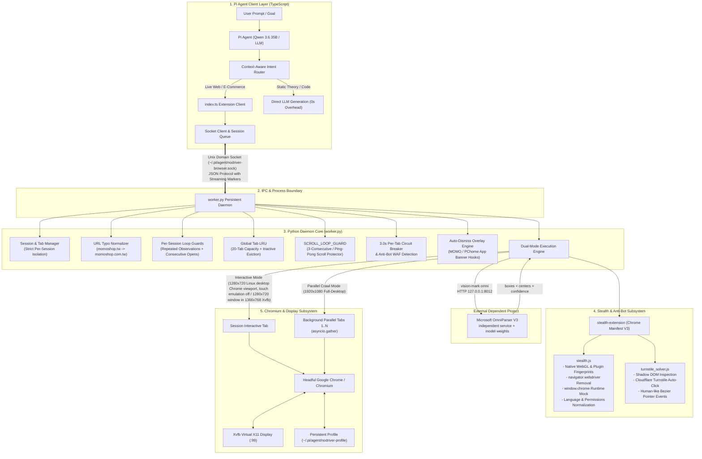
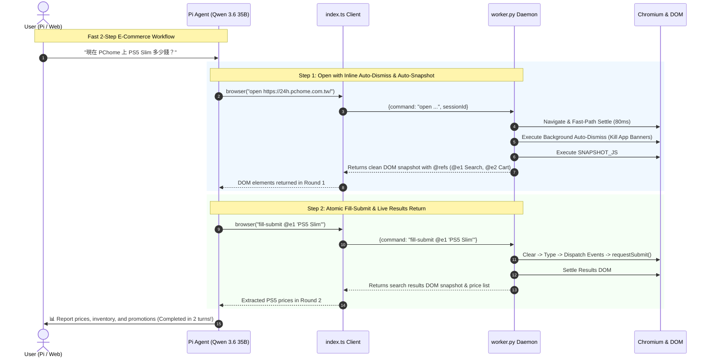

# Pi Nodriver Browser

[](https://opensource.org/licenses/MIT)
[](https://www.python.org/)
[](https://github.com/ultrafunkamsterdam/nodriver)
[]()

A high-performance, persistent browser automation and parallel web crawling extension for the [Pi coding agent](https://github.com/badlogic/pi-mono), powered by **Nodriver**, headful **Chrome/Chromium**, **Xvfb**, and an integrated **stealth and challenge-detection subsystem**.

Designed specifically for autonomous agent pair-programming, dynamic SPA interaction, real-time e-commerce comparison, and high-throughput research scraping on local hardware (optimized for AMD APUs & ROCm local inference).

---

## Deploy from a fresh clone (Linux)

**Choose a deployment tier:** the core `browser` tool needs Pi + Python + Chrome/Xvfb.
OmniParser adds visual detection; Laya adds the separate `browser_intent` tool;
Xvfb Streaming is optional viewing/recording. Submodules pin source code only:
they do **not** install model weights, Python environments, or background services.

### 1. Prerequisites and pinned source

Install Pi separately and confirm `pi --version`. On Debian/Ubuntu, install the
browser system dependencies (adapt package names for other distributions):

```sh
sudo apt-get update
sudo apt-get install -y git python3 python3-venv python3-pip xvfb xauth \
  xdotool poppler-utils
# Install Google Chrome or Chromium separately; verify its executable exists.
command -v google-chrome || command -v chromium || command -v chromium-browser
```

Model-service examples below use Python 3.12 and separate environments. Do not
replace the Python/PyTorch environment of an already-running model service.

```sh
git clone https://github.com/AyaSakura-comp/pi-nodriver-browser.git
cd pi-nodriver-browser
export ROOT="$PWD"   # reuse this absolute path in the following terminals

# Public dependencies only; enough for the core browser + detector + Laya model.
git submodule update --init -- dependencies/omniparser dependencies/laya
```

For **all four** submodules, first authenticate with an account authorized for
`xvfb-streaming` (private):

```sh
gh auth login
gh auth setup-git
git submodule update --init --recursive
git submodule status --recursive
```

Do not use `--remote` during normal installation: it would advance the pins.
No credentials belong in `.gitmodules`. See [dependency setup](docs/dependencies.md)
for exact versions, selective initialization, upgrades, and private access errors.

### 2. Install the core browser extension

Finish any active browser task first. **`install.sh` is not a dry run**: it shuts
down the current browser daemon, cleans browser state, copies the extension,
creates its worker environment, and may disable a conflicting browser package.
Do not run it from a dirty development tree if you intend to install the release.

```sh
cd "$ROOT"
bash install.sh
# In Pi: /reload, or start a new Pi session.
```

The target is `~/.pi/agent/extensions/nodriver-browser`; Chrome/the daemon start
on the first browser tool call. No standalone `worker.py` service is needed.
For a deliberate **core-only** deployment without OmniParser, launch Pi with:

```sh
PI_NODRIVER_VISION_FALLBACK=manual pi
```

This keeps semantic browser operations available and uses manual visual marking
instead of contacting a missing detector. Ask Pi to search for a public page,
open the exact returned URL, and run `snapshot -i` to smoke-test the core tool.

### 3. Optional OmniParser visual detection (localhost:8012)

Follow the pinned fork's [CPU INT8 installation guide](dependencies/omniparser/docs/CPU_INT8_INSTALL.md)
to create a compatible environment, obtain the trusted YOLOv9-E checkpoint,
and export or provision the calibrated XML/BIN pair. Model files are not in Git.
After that preparation, run in a separate terminal with the chosen environment:

```sh
export OMNI_PYTHON=/absolute/path/to/omni-environment/bin/python
"$OMNI_PYTHON" "$ROOT/dependencies/omniparser/detector_service.py" \
  --backend openvino-int8 --device cpu --threads 16 \
  --model "$ROOT/dependencies/omniparser/weights/icon_detect_v3/openvino-int8/int8-1024.xml" \
  --threshold 0.05 --image-size 1024 --host 127.0.0.1 --port 8012
```

From another terminal, verify `curl -fsS http://127.0.0.1:8012/health` reports
`backend: openvino-int8` and `device: cpu`. Launch/reload Pi with
`PI_NODRIVER_VISION_FALLBACK=omni` and call `vision-mark omni` on an open public
page. A non-default detector URL is configured with `PI_NODRIVER_OMNIPARSER_URL`.

**INT8 is optional and lossy, not a speed/accuracy upgrade over GPU FP16.** In the
20-site test, CPU INT8 took 114 ms vs GPU FP16 71 ms and failed raw-output cosine
>=0.99 on all 20 images. Use the fork's PyTorch backend if this loss is unsuitable.
Sizes 800–1280 are supported, with a compile cost for a new/evicted size.

### 4. Optional Laya `browser_intent` stack

This needs `dependencies/laya` (model server) and the integrated
`intent/` router/API (no separate extension or intent submodule). First prepare a
separate Python 3.12 environment; select an appropriate PyTorch build before
installing model dependencies. Installing packages/checkpoints may download
large files; the first Laya/e5 requests may also download model weights.

```sh
python3.12 -m venv "$HOME/.venvs/pi-laya"
export LAYA_PYTHON="$HOME/.venvs/pi-laya/bin/python"
"$LAYA_PYTHON" -m pip install -e "$ROOT/dependencies/laya[serve]"
"$LAYA_PYTHON" -m pip install transformers

# Terminal A: Laya model server (not the intent router).
"$LAYA_PYTHON" "$ROOT/dependencies/laya/examples/server.py" \
  --host 127.0.0.1 --port 8000 --device cpu --no-preload
```

In terminal B, after restoring `ROOT` and `LAYA_PYTHON`, start the intent router:

```sh
LAYA_URL=http://127.0.0.1:8000/v1/systemone \
PI_NODRIVER_SOCKET="$HOME/.pi/agent/nodriver-browser.sock" \
"$LAYA_PYTHON" "$ROOT/intent/intent_service.py" --port 8011
```

Check `http://127.0.0.1:8000/health` and `http://127.0.0.1:8011/health` with curl.
Laya health before lazy model load is **not** a successful model inference test.
The integrated extension starts the core socket daemon as needed. Select intent mode
in `~/.pi/agent/browser-config.json` and reload Pi:

```json
{"browserMode":"intent"}
```

Use `"direct"` for the low-level `browser` tool instead. Only one is registered.
Do not load an older standalone `browser-intent.ts` entry. The router uses the caller's
model context where supported; standalone judge defaults point to a separately
provisioned OpenAI-compatible model on localhost:8001. Configure `JUDGE_URL` and
`JUDGE_MODEL` in the router's environment when those defaults do not apply. Laya
is not that judge model; this guide does not install or restart Qwen for you.
See the [intent README](intent/README.md) for its model
requirements. Smoke-test one harmless public-page task; do not test with real
passwords, checkout, or destructive actions.

### 5. Optional streaming, persistence, and updates

Follow [Xvfb Streaming's deployment guide](dependencies/xvfb-streaming/README.md)
for FFmpeg/X11, environment variables, Docker and optional Tailscale setup.
Bind to the **actual browser** DISPLAY/XAUTHORITY, not an assumed `:99`; never
commit `.env`, Tailscale keys, browser profiles, or recorded personal screens.
Streaming is not required for either browser tool.

The service commands above run in the foreground. For persistent deployment,
create service-manager units with **absolute** interpreter/model paths and the
same localhost bindings; keep each service/environment independent. On the
maintained host, use the existing restart-service hub and the documented
OmniParser rollback rather than replacing active units blindly. Adding submodules
did not migrate existing `~/src/...` service working directories.

Before upgrades, inspect both parent and child working trees, preserve local
changes, pull the parent, then run `git submodule sync --recursive` and
`git submodule update --init --recursive`. Reinstall the core only during a safe
browser maintenance window; restart a dependency only if deliberately deploying
its changed version. See [dependency upgrade rules](docs/dependencies.md).

**Verification scope:** fresh recursive source checkout and pin checks were
verified. The existing host's INT8 API and browser integration were smoke-tested.
The complete multi-service installation above has not been tested from scratch
on a clean machine; do not treat it as a one-command, fully automated installer.

## 📚 Design Documents

- [Pi + Qwen Image Search Verification](docs/image-search-qwen-verification.md) — local working-tree one-shot search evidence, publication status, and the distinction between visual similarity and proven image provenance.
- [Semantic Browser Actions: Technical Design, Workflow, and Architecture](docs/semantic-actions-technical-design.md) — same-origin iframe and Shadow DOM refs, searchable native dropdowns, transactional option selection, failure semantics, tests, and the CoolPC end-to-end workflow.
- [Iframe Semantic Actions Implementation Plan](docs/plans/2026-08-23-iframe-semantic-actions.md) — the test-first implementation plan completed by commit `099de1b`.
- [Research: streaming search → crawl → prefill pipeline](docs/research-streaming-pipeline.md) — default `research` tool: speculative start at q1, crawl pool, evidence/prefill overlap, guards, settings and measurements.
- [Google Search Engine: Technical Design, Workflow, and Architecture](docs/google-search-workflow-and-architecture.md) — multi-directional parallel Google Search, DOM extraction engine, anti-bot interception, de-duplication, and benchmark verification.
- [Bad UI Seven-Level Benchmark](benchmarks/bad-ui/README.md) — portable end-to-end Pi agent challenge for low-contrast, tiny, native, and non-semantic controls across forced Omni, hybrid CDP+Omni, and CDP+manual-vision modes.

## Research (default web lookup)

`research` is the agent's default web search. The agent writes only four keyword
queries (`q1`–`q4`, concrete dates); the tool searches (3 fourget + 1 Google),
crawls results in search order through a dedicated 32-tab pool, and returns
append-only, source-labelled evidence (~6,000-token budget) ending with an
explicit "answer now" footer.

Every stage overlaps the next:

- **Speculative start** — the job starts as soon as `q1` has streamed out of the
  tool call; `q2`–`q4` join while they are still being written, and `execute()`
  adopts the running job.
- **Search → crawl pipeline** — each result is crawled the moment its search
  returns (first crawl ≤10 ms after the first result).
- **Crawl → prefill** — evidence is committed while pages arrive and Pi's
  `ctx.prefill` warms the model with it, so the final request only processes the tail.
- **Images** — while pages are crawled, their main images are downloaded in the
  background (they finish inside the crawl window); up to 3 are listed as
  `[[image: …]]` markers and the answer embeds them in the paragraphs they illustrate.

The evidence closes by telling the agent it is enough, and the answer ends by
asking the user whether to search for more. Guards: `RESEARCH_DONE_GUARD` blocks
follow-up `crawl`/`google_search`/`fetch_image(s)`/`browser`/`browser_intent`/
`research` in the same user message unless the user asks for more, and tells a
retrying agent to stop calling tools; URL provenance rules are unchanged.

Tunables (all in the [Configuration Reference](#-configuration-reference)): `RESEARCH_CRAWL_CONCURRENCY` (32),
`RESEARCH_CRAWL_TOP_PER_QUERY` (5; 0 = off — each query's top 5 keep answer quality
and cut ~30 % of evidence), `RESEARCH_EVIDENCE_BUDGET` (6000), `RESEARCH_CRAWL_TIMEOUT` (3 s), `RESEARCH_IMAGES` (3; 0 = off).

Design, settings and measurements: [research-streaming-pipeline.md](docs/research-streaming-pipeline.md).
Earlier designs (planner / Laya ranking / extension-side prefill) are kept for
history in [research-ranked-workflow.md](docs/research-ranked-workflow.md) and
[research-progressive-prefill-validation.md](docs/research-progressive-prefill-validation.md).

## Google Lens local-image search

### One-shot entry (preferred)

Use the standalone **`image_search({"path":"/absolute/path/image.png"})`** tool, or
`browser("image-search '/absolute/path/image.png'")`. A single call validates the
image, opens the previously verified `https://www.google.com/imghp?hl=en` entry in
Linux desktop mode, prepares the camera dialog, uploads once and returns up to 20
labeled `@lens-…` candidates. No prerequisite web search, mode switch, open, or
manual camera clicks. It replaces this session's active tab; other sessions and
the session's configured mode are unchanged. The flow is bounded to 40 seconds;
consent overlays are not dismissed and gates do not trigger identity fallback.

Natural requests such as **「搜圖」「找原圖」「找同款」＋圖片** route to this tool
through its prompt guidelines, without requiring the words Google Lens. The
agent needs the exact local attachment path and authorization to send that image
to Google. Ambiguous/private-photo requests require clarification; this tool is
not for face identification. It never auto-selects the first match: inspect the
returned evidence and, if needed, use `google-lens-select @lens-…`.

On a blocked, empty or uncertain outcome, **do not retry the upload or click
around**; use `google-lens-results` to observe without another upload or stop.
Transport replay is disabled for `image-search`, including noncanonical action
spellings. Offline coverage: `tests/test_image_search.py` (orchestration, gates,
mode restoration, cancellation/timeout, registration, quoting and no replay).

### Parallel images

For multiple authorized images, use one batch rather than separate single-image
calls (separate calls still share the extension's execution queue):

```text
image_search_batch({"paths":["/absolute/red.png","/absolute/blue.png"],"concurrency":2})
```

The equivalent browser command is `image-search-batch` followed by that JSON.
Accepts 1–3 distinct paths, default concurrency 2, maximum 3. Validate all files
before any upload. Each job has its own managed tab, private state and opaque
`searchId`; returned entries preserve input order and include the path, status,
refs and relative `startedAt`/`finishedAt` times. Tabs share Chrome's profile and
cookies, **not** separate login identities. The caller's main tab and configured
browser mode are not replaced. Failures are reported per image, without retries.
The batch has a 60-second deadline; unfinished jobs are cancelled and reported
as uncertain rather than silently re-uploaded.

Use only the ID/ref pair returned for the intended image:

```text
browser("image-search-results search-…")
browser("image-search-select search-… @lens-…")
```

Selection focuses the corresponding tab, navigates to that exact result, and
returns destination evidence labeled with its `searchId` and input path. Do not
use `google-lens-select` for batch refs. Choose at most one destination per search:
after navigation, other refs from that search are expired. Cross-owner IDs,
wrong-image refs and closed/evicted tabs fail closed rather than falling back to
the caller's main tab. Similarity is not proof of identity, original source or
license.

Retained batch tabs are capped at three per owning session. **Starting another
batch expires and closes that owner's previous batch**; session cleanup also
closes its batch tabs. Other sessions are unaffected. Active jobs are protected
from normal LRU eviction; completed tabs can be evicted under the global tab
limit, in which case their follow-ups fail safely. Cancelled batches drain their
jobs and close only their owned tabs.

Offline contracts: `tests/test_image_search_batch.py` covers actual coroutine
overlap, concurrency limits, per-image pairing/failures, ID/ref isolation,
expiry, cancellation/deadline, cleanup and transport no-replay.

### Low-level commands (manual workflows only)

1. Use `web_search` or `google_search` to discover an **exact** Google Images URL; never construct one. The verified desktop workflow uses `browser-mode-switch linux` before opening that returned URL (Lens does not change identity mode itself). `google-lens` can prepare the upload dialog by activating a unique visible **Search by image / 以圖搜尋** semantic camera button once. If preparation is unavailable, inspect snapshot refs; `click-js @eN` is an explicit semantic alternative when native activation does not expose the dialog. The `lens.google` marketing site is not an upload surface and is not allowlisted.
2. Run `google-lens "/absolute/path/to/public image.png"`. This sends the file to Google: only use the user's explicitly authorized, non-private image. Paths must be absolute (or begin with `~/`), quoted if needed, readable regular files, and valid PNG/JPEG/WEBP/GIF matching the extension, at most 20 MiB and 40 megapixels. Paths are parsed with `shlex`, not executed by a shell.
3. Compare returned **title, exact URL and snippet** with the requested subject. Run `google-lens-select @lens-...` using the matching candidate's full literal ref. Never select the first result just because it is first. Selection opens that observed link in the same tab and returns destination title/URL/text; it does not guess the original source behind a Google preview URL.
4. Use `google-lens-results` to inspect without uploading, including after an inconclusive upload. Pending-upload freshness is retained across observation, errors and cancellation: unchanged pre-upload candidates remain inconclusive and cannot acquire selectable refs. Refs are session- and document-bound and fail closed on removed nodes or changed titles/URLs. Re-list and reassess after a stale result, rather than retrying its old ref.

The upload command accepts no destination URL or arbitrary upload ref. It requires a supported HTTPS Google surface (`lens.google.com`, or the root/search/image surfaces on `www.google.com` and `images.google.com`), Lens text context, exactly one enabled image input, and a Google form target. It does not reuse the permissive generic `upload` command. CDP dispatches the upload once, without duplicate synthetic change events. Consent detection reads the current document independently of result payloads and is rechecked before upload/selection. Consent, access, CAPTCHA and login gates stop the operation; **no bypass, automatic consent acceptance, identity fallback, navigation replay, or upload retry** occurs in these commands. A timeout, cancellation or lost connection may mean the upload already happened: **do not re-upload**. Quoted or escaped action spellings also cannot trigger transport replay; noncanonical action tokens conservatively disable retries. Resolve gates manually or stop.

Result extraction is deliberately conservative: up to 20 rendered, labeled image/heading links, with duplicate URLs and Google navigation links excluded. Observed Google `/goto`, `/url` and `/imgres` result links retain their exact opaque hrefs; they are never decoded or rewritten. Layouts without reliable links, unsupported regional hosts, cross-origin frames and localized consent text not recognized by the gate probe can require manual inspection. Use existing semantic refs first; `vision-mark omni` / guarded `vision-click` is available for ordinary controls without reliable semantic targets, never for gates or ambiguous result selection. The Lens command itself does not automate vision. Isolated source verification with the non-private red-circle fixture demonstrated automatic dialog preparation and upload on desktop-mode Google Images (Traditional Chinese and English), candidate extraction, and selection of matching result #5 with destination evidence. Layouts and gates still vary; the independent verification lane should recheck its own session.

Offline checks (no browser):

```bash
RUN_BROWSER_INTEGRATION=0 .venv/bin/python -m unittest discover -s tests -p test_google_lens.py -v
RUN_BROWSER_INTEGRATION=0 .venv/bin/python -m unittest discover -s tests -p test_image_search.py -v
RUN_BROWSER_INTEGRATION=0 .venv/bin/python -m unittest discover -s tests -q
```

## 🧩 Dependent Project: OmniParser

The default visual fallback uses the [OmniParser fork](https://github.com/AyaSakura-comp/OmniParser), pinned as `dependencies/omniparser`. Laya's model server and optional Xvfb Streaming are also pinned submodules. Browser Intent is integrated under `intent/`. See [dependent projects setup](docs/dependencies.md) for exact versions, initialization, private-repository access, and upgrades. Each project retains its own environment, model weights, service lifecycle, and license; fetching submodules does not install or start services.

| Integration item | Contract |
|---|---|
| Upstream project | `microsoft/OmniParser` |
| Initial fork pin | `f4e53d5` (authoritative pin: submodule gitlink) |
| Detector | YOLOv9-E; original PyTorch or opt-in lossy OpenVINO INT8 CPU service |
| Runtime boundary | Local HTTP service; default endpoint `http://127.0.0.1:8012/parse` |
| Configuration | `PI_NODRIVER_OMNIPARSER_URL` and `PI_NODRIVER_OMNIPARSER_TIMEOUT` |
| Required for | Default `PI_NODRIVER_VISION_FALLBACK=omni` and `vision-mark omni` |
| Not required for | CDP/DOM semantic actions or `PI_NODRIVER_VISION_FALLBACK=manual` |

The dependent service accepts a base64 PNG and returns image dimensions, latency, and detected `elements` containing `box`, `center`, and `confidence`. `pi-nodriver-browser` remains responsible for filtering candidates, preview guards, coordinate mapping, and dispatch. If the OmniParser service is unavailable, start the dependent project separately or configure `manual`; the installer does not silently download models or launch an external service.

## 🏛️ System & Software Architecture (SW Architecture)

`pi-nodriver-browser` employs a decoupled **Client-Daemon Multi-Session Architecture** that isolates the lightweight TypeScript agent harness from the heavyweight Python/Chromium execution engine.


```mermaid
flowchart TB
    subgraph ClientLayer["1. Pi Agent Client Layer (TypeScript)"]
        UI["User Prompt / Goal"] --> AGENT["Pi Agent (Qwen 3.6 35B / LLM)"]
        AGENT --> ROUTER["Context-Aware Intent Router"]
        ROUTER -->|"Live Web / E-Commerce"| EXT["index.ts Extension Client"]
        ROUTER -->|"Static Theory / Code"| DIRECT["Direct LLM Generation (0s Overhead)"]
        EXT --> IPC_CLIENT["Socket Client & Session Queue"]
    end

    subgraph IPCLayer["2. IPC & Process Boundary"]
        IPC_CLIENT <==>|"Unix Domain Socket (~/.pi/agent/nodriver-browser.sock)\nJSON Protocol with Streaming Markers"| DAEMON["worker.py Persistent Daemon"]
    end

    subgraph DaemonLayer["3. Python Daemon Core (worker.py)"]
        DAEMON --> SESSIONS["Session & Tab Manager\n(Strict Per-Session Isolation)"]
        DAEMON --> URL_NORM["URL Typo Normalizer\n(momoshop.tw -> momoshop.com.tw)"]
        DAEMON --> GUARD["Per-Session Loop Guards\n(Repeated Observations + Consecutive Opens)"]
        DAEMON --> TAB_LRU["Global Tab LRU\n(20-Tab Capacity + Inactive Eviction)"]
        DAEMON --> SCROLL_GUARD["SCROLL_LOOP_GUARD\n(3-Consecutive / Ping-Pong Scroll Protector)"]
        DAEMON --> BREAKER["3.0s Per-Tab Circuit Breaker\n& Anti-Bot WAF Detection"]
        DAEMON --> AUTO_DISMISS["Auto-Dismiss Overlay Engine\n(MOMO / PChome App Banner Hooks)"]
        DAEMON --> ENGINE["Dual-Mode Execution Engine"]
    end

    subgraph StealthLayer["4. Stealth & Anti-Bot Subsystem"]
        ENGINE --> STEALTH_EXT["stealth-extension (Chrome Manifest V3)"]
        STEALTH_EXT --> S_STEALTH["stealth.js\n- Native WebGL & Plugin Fingerprints\n- navigator.webdriver Removal\n- window.chrome Runtime Mock\n- Language & Permissions Normalization"]
        STEALTH_EXT --> S_SOLVER["turnstile_solver.js\n- Shadow DOM Inspection\n- Cloudflare Turnstile Auto-Click\n- Human-like Bezier Pointer Events"]
    end

    subgraph DependentProjectLayer["External Dependent Project"]
        ENGINE -->|"vision-mark omni\nHTTP 127.0.0.1:8012"| OMNI["Microsoft OmniParser V3\nindependent service + model weights"]
        OMNI -->|"boxes + centers + confidence"| ENGINE
    end

    subgraph BrowserLayer["5. Chromium & Display Subsystem"]
        ENGINE -->|"Interactive Mode (1280x720 Linux desktop Chrome viewport, touch emulation off / 1280x720 window in 1366x768 Xvfb)"| TAB_ACTIVE["Session Interactive Tab"]
        ENGINE -->|"Parallel Crawl Mode (1920x1080 Full-Desktop)"| TABS_POOL["Background Parallel Tabs 1..N\n(asyncio.gather)"]
        TAB_ACTIVE --> CHROME["Headful Google Chrome / Chromium"]
        TABS_POOL --> CHROME
        CHROME <--> XVFB["Xvfb Virtual X11 Display (:99)"]
        CHROME <--> PROFILE["Persistent Profile (~/.pi/agent/nodriver-profile)"]
    end
```

### Key Architectural Subsystems:

#### 1. Client-Daemon IPC & Session Isolation
* **Zero-Spawning Overhead**: A single persistent Python daemon (`worker.py`) runs in the background. Pi commands connect via Unix Domain Socket (`nodriver-browser.sock`), avoiding the 2–3s cold-start penalty of launching Chrome on every turn. Before tab-creating operations, the daemon probes its Chrome DevTools connection and atomically relaunches Chrome if the browser process exited while the daemon remained alive.
* **Per-Session Tab Routing**: Each Pi conversation maintains its own isolated `session_id` mapping. Session tabs, active viewports, and downloads operate independently without cross-session interference.
* **Session-scoped Browser Identity Mode**: `browser-mode-switch auto|android|linux` reports or changes the session-scoped identity used by subsequent `open` commands in only the calling session. It does not reload or modify the current tab. By default (`auto` mode), origins open in **native Linux desktop Chrome** (`1280x720` desktop viewport, `1366x768` Xvfb display, deviceScaleFactor 1.0, mobile mode off, touch emulation off) providing authentic desktop site rendering and 1:1 pixel accuracy. `android` switches the session to mobile emulation mode (`390x844` viewport, touch emulation on, deviceScaleFactor 3.0, Android Chrome UA). In `auto`, when configured in mobile mode, strong CAPTCHA/access/login gates retry in a fresh native-Linux target and pin only that origin to Linux for the rest of the Pi session. Unexpected post-click login gates reopen the pre-click URL without replaying the click. Explicit login clicks are not treated as fallback triggers. Results report the identity, origin route, layout dimensions, scale, and input mode.
* **Non-Blocking Worker Queue**: Long-running page loads and crawls execute asynchronously; concurrent Pi subagents can query status without blocking.

#### 2. Stealth & Challenge-Detection Subsystem (`stealth-extension`)
Integrated directly into Chrome via `--load-extension` to reduce common automation fingerprints and detect challenge widgets. It does not solve visual hCaptcha challenges or use third-party CAPTCHA bypass services; unresolved challenges require human completion before the agent resumes.
* **`stealth.js`**:
  * **Coherent Chrome Fingerprints**: Preserves Chrome's real WebGL renderer and plugin list while advertising an Android Chrome UA and matching User-Agent Client Hints derived from the installed Chrome version. It never mixes an iPhone Safari identity with a Chromium engine.
  * **Bot Flag Erasure**: Completely removes `navigator.webdriver` and normalizes `navigator.plugins`, `navigator.languages` (`zh-TW`, `en-US`), and `Notification.permission`.
  * **Runtime Consistency**: Injects authentic `window.chrome.runtime`, `window.chrome.csi`, and `window.chrome.loadTimes` structures.
* **`turnstile_solver.js`**:
  * **Shadow DOM Scanner**: Traverses available Shadow DOM and iframe contexts to detect Cloudflare Turnstile, hCaptcha, and challenge checkboxes.
  * **Checkbox Interaction**: Can dispatch pointer events to an ordinary accessible checkbox, but pauses for human handoff when a visual challenge appears.

#### 3. Auto-Dismiss Overlay Engine & Taiwan E-Commerce Hooks
* **Silent Background Execution**: Executes automatically inside `wait_for_page_ready` on every `open` navigation before generating the initial DOM snapshot.
* **Native App Banner Dismissal**: Direct programmatic hooks (e.g. `window.backBtnWeb()`) and automatic destruction of backdrop overlays (`#blackBkforApp`, `#blackBk`, `.modal-backdrop`).
* **Taiwanese Banner & Cookie Dictionary**: Matches localized dismiss phrases including 「繼續使用網頁版」、「留在網頁版」、「前往網頁版」、「繼續瀏覽」、「不用謝謝」、「我知道了」、「關閉」.
* **Small-Model Coordinate Immunity**: Eliminates the need for 7B/14B/35B models to visually estimate pixel coordinates (`click 380 30`) on blocking interstitials.

#### 4. Navigation Guard & URL Typo Normalization
* **Domain Normalization**: Automatically repairs common domain typos during agent tool calls (e.g., `momoshop.tw` ➔ `momoshop.com.tw`, `pchome.tw` ➔ `pchome.com.tw`).
* **3.0s Circuit Breaker**: Wraps background tabs in `asyncio.wait_for(fetch(), timeout=3.0)` to instantly abort hung connections or WAF blockages.

#### 5. Command Lifecycle, Concurrency, and Tab Admission
Every command follows the same ownership and capacity workflow:


```mermaid
flowchart LR
    REQUEST["Pi tool request\ncommand + sessionId"] --> DEADLINE["Validate preflight deadline\nbefore command bookkeeping"]
    DEADLINE --> VALIDATE["Parse and validate\nsupported action"]
    VALIDATE --> OPEN_GUARD{"open action?"}
    OPEN_GUARD -->|Yes| STREAK["Check per-session\n2-open streak"]
    OPEN_GUARD -->|No| EXECUTE
    STREAK --> EXECUTE["Acquire per-session lock\nand mark exact active target"]
    EXECUTE --> PREFLIGHT{"Current target preflight\nfinishes before deadline?"}
    PREFLIGHT -->|Timeout| QUARANTINE["Quarantine only the poisoned\nsession target mapping"]
    PREFLIGHT -->|Ready or non-timeout error| NEW_TAB{"Needs or discovered\na new target?"}
    QUARANTINE --> NEW_TAB
    NEW_TAB -->|Yes| CAPACITY["Acquire tab-management lock\nreconcile live Chrome targets"]
    CAPACITY --> LRU["Reserve worker-created tab or\nadmit Chrome-created popup\nwith inactive-LRU eviction"]
    LRU --> COMMAND["Execute navigation / DOM / crawl"]
    NEW_TAB -->|No| COMMAND
    COMMAND --> CLEANUP{"Temporary or evicted\ntarget to close?"}
    CLEANUP -->|Yes| CLOSE["Confirm Chrome target closure\nbefore deleting registry state"]
    CLEANUP -->|No| RESPONSE
    CLOSE --> RESPONSE["Touch activity timestamp\nrelease locks and return result"]
```

#### 6. Daemon Lifecycle, Self-Healing & Zombie Lock Reclamation
* **Active Socket Probing**: When `worker.py --server` starts, if `nodriver-browser.sock.lock` is currently held, it performs a real-time health probe on the UNIX socket. If the lock holder is dead, hung, or missing its socket, the new worker automatically terminates the zombie process and reclaims the lock without deadlock.
* **Dead Socket Unlinking & Transparent Auto-Retry**: The TypeScript extension (`index.ts`) unlinks stale sockets prior to spawning and transparently retries requests if a connection drop occurs, ensuring zero agent disruption during worker respawns.

* **Layered Locking**: A per-session lock serializes commands from one conversation. The server's browser-structure lock covers its selected structural command set (`open`, click variants, `download`, `press`, `close`, and `shutdown`); `tab_management_lock` independently makes capacity checks, worker-created tabs, popup admission, eviction, and cleanup atomic—including crawl lifecycle operations.
* **Exact-Target Activity Protection**: Only the tab currently used by a running command is protected. Idle tabs from the same session remain valid LRU candidates.
* **Hung-Target Quarantine**: Before each command, the worker bounds vision/context preflight to 2 seconds by default (`PI_NODRIVER_PREFLIGHT_TIMEOUT`, positive finite seconds; invalid values fail before open/repeat/activity bookkeeping or page-less browser initialization). At the deadline it cancels the preflight task, tracks it for eventual result consumption without awaiting cancellation completion, detaches only the poisoned target from that session, releases active-target accounting, invalidates its vision state, and lets the command continue or fail normally. A live popup opener is restored when available. Every `close` remains bound to the target captured before preflight, so reconciliation cannot redirect it to a healthy opener whether preflight succeeds, reaches its deadline, or raises a task-level error. Immediate `wait-popup-close` remains idempotent after both normal and quarantined popup closure, even when an older opener remains in a nested popup stack. The poisoned target remains marked as quarantined and excluded from popup admission until Chrome reports it gone or normal LRU closes it. It also remains registered while live, preserving the global tab cap, LRU eligibility, and in-progress download ownership; preflight task errors—including a nested `asyncio.TimeoutError` distinct from worker deadline expiry—preserve the current page mapping.
* **Global Capacity Invariant**: Before creating a managed page or crawl tab, the daemon reconciles its registry with Chrome and reserves capacity. Popups are created by Chrome first, then registered and admitted under the same capacity lock; admission evicts an eligible inactive tab or closes the popup as rollback. The default maximum is 20 tabs (`PI_NODRIVER_MAX_TABS`).
* **Transactional Eviction**: Registry, session, and download-routing metadata are removed only after Chrome confirms that the target closed. A thrown close exception propagates while preserving tracked state; if close returns but Chrome still reports the target as live, the daemon raises `TAB_LIMIT`. Both paths prevent silent capacity overflow.
* **Popup Recovery**: Popup opener stacks are maintained per session. If a popup closes externally or is evicted, the newest live opener becomes the active session page.
* **Download Isolation**: Target and frame ownership are tracked separately. Closing a tab removes only that target's frame routes; active downloads protect their owning session from eviction.
* **Guard Commit Semantics**: Failed `open` attempts count toward the consecutive-open limit. A non-`open` action resets the streak only after that action validates and succeeds.

---

## ⚡ Accelerated Workflows (Workflow)

`pi-nodriver-browser` replaces traditional multi-turn browser loops with compressed, atomic agent workflows:


```mermaid
sequenceDiagram
    autonumber
    actor User as User (Pi / Web)
    participant LLM as Pi Agent (Qwen 3.6 35B)
    participant EXT as index.ts Client
    participant Daemon as worker.py Daemon
    participant Chrome as Chromium & DOM

    Note over User,LLM: Fast 2-Step E-Commerce Workflow
    User->>LLM: "現在 PChome 上 PS5 Slim 多少錢？"
    
    rect rgb(240, 248, 255)
    Note over LLM,Daemon: Step 1: Open with Inline Auto-Dismiss & Auto-Snapshot
    LLM->>EXT: browser("open https://24h.pchome.com.tw/")
    EXT->>Daemon: {command: "open ...", sessionId}
    Daemon->>Chrome: Navigate & Fast-Path Settle (80ms)
    Daemon->>Chrome: Execute Background Auto-Dismiss (Kill App Banners)
    Daemon->>Chrome: Execute SNAPSHOT_JS
    Daemon-->>EXT: Returns clean DOM snapshot with @refs (@e1 Search, @e2 Cart)
    EXT-->>LLM: DOM elements returned in Round 1
    end

    rect rgb(245, 255, 245)
    Note over LLM,Daemon: Step 2: Atomic Fill-Submit & Live Results Return
    LLM->>EXT: browser("fill-submit @e1 'PS5 Slim'")
    EXT->>Daemon: {command: "fill-submit @e1 'PS5 Slim'"}
    Daemon->>Chrome: Clear -> Type -> Dispatch Events -> requestSubmit()
    Daemon->>Chrome: Settle Results DOM
    Daemon-->>EXT: Returns search results DOM snapshot & price list
    EXT-->>LLM: Extracted PS5 prices in Round 2
    end

    LLM->>User: 📊 Report prices, inventory, and promotions (Completed in 2 turns!)
```

### 1. Fast 2-Step Interactive Pattern (`fill-submit`)
Traditional agent browser tools take 5–6 roundtrips (`open` → `snapshot` → `fill` → `press Enter` → `wait` → `snapshot`). `pi-nodriver-browser` compresses this into **2 atomic turns**:
1. **`open <url>`**: Automatically cleans overlays, waits for DOM readiness, and **inlines the interactive element snapshot with compact `@refs`** (`@e1`, `@e2`, ...) directly into the turn-1 return payload.
2. **`fill-submit @e1 "query"`**: Atomically clears the literal target ref, dispatches cancellation-aware keyboard and change events, requires an associated form, executes `form.requestSubmit()`, auto-settles the resulting page, and returns the updated DOM snapshot in turn 2. It never guesses or clicks an unrelated fallback button.

> **Literal ref syntax:** If a snapshot prints `@e16`, send exactly `activate @e16`. Never send `activate <@e16>`; angle brackets in generic notation are placeholders, not characters to type. The plain `click` command has been removed; `vision-click` remains the guarded visual-coordinate action.
>
> **Form safety:** `fill`, `type`, and `fill-submit` reject `<label>` refs and non-text controls instead of typing into whichever field was previously focused. Hidden native checkbox/radio controls remain actionable through their visible label proxy, and snapshots expose `control`, `checked`, `required`, and `disabled` state so optional marketing consent can be audited before submission.

#### Semantic-First Iframe Interaction

See [Semantic Browser Actions: Technical Design, Workflow, and Architecture](docs/semantic-actions-technical-design.md) for the ref lifecycle, recursive resolver, dropdown transaction protocol, security boundaries, and sequence diagrams.

`snapshot -i` recursively traverses accessible same-origin iframes and labels nested controls with `frame="…"`. `fill`, `type`, `select`, `fill-submit`, and `click-js` resolve those refs inside their owning frame instead of querying only the top document.

**Cross-origin iframes** (e.g. MOMO's login overlay served from `account.momoshop.com.tw` inside `www.momoshop.com.tw`) cannot be entered by page JavaScript, so the worker enters them through CDP instead: every visible cross-origin child frame is snapshotted in its own isolated world, its refs continue the numbering and carry `frame="host"` (e.g. `@e92 <input> label="密碼" frame="account.momoshop.com.tw" type="password"`), and `activate` / `fill` / `type` / `select` / `check` on those refs run inside that frame, with click coordinates offset by the iframe's box. The iframe element itself is listed with `src="origin" cross-origin="true"`; a hint to use `vision-mark omni` appears only if its contents could not be read. Cross-site (out-of-process) iframes are not covered yet. `vision-fill` also works on a point inside a cross-origin iframe: it no longer steals focus back to the frame and types into the focused control with trusted `Input.insertText`.

The agent must use this priority order:

1. `snapshot -i` and an exact `@ref` (`fill`, `select`, or `activate`).
2. Semantic fallback with `click-text` or `click-css`.
3. Direct DOM fallback with `click-js @ref`.
4. For canvas or inaccessible visual-only controls, use the mandatory vision-correct sequence directly: `screenshot` → inspect image → `vision-mark <x> <y>` → inspect the marked image → re-mark until correct → `vision-click <preview-token>`.

The plain `click` command is removed entirely. Use `activate @ref` for semantic refs; no deliberately failed semantic action is required before `vision-mark` or `vision-click`.

`vision-mark` interprets `x y` directly in the returned screenshot's pixel coordinate system and draws a high-contrast mouse cursor onto a copied PNG outside the untrusted page; its upper-left red tip is the exact click hotspot. When the screenshot and input backend are Xvfb, `vision-click` dispatches that exact 1:1 screen pixel with no viewport scaling or duplicated toolbar offset. CDP fallback separately uses the stored visual-viewport conversion. It returns a one-time token tied to the session, active tab, loader/document, URL, scroll/visual viewport, rendered-image hash, and a short TTL. Immediately before mouse dispatch, `vision-click` brings the tab forward, captures the viewport again, and requires the trusted state and clean screenshot hash to match. A newer marker or any mismatch permanently invalidates the older token. A full-page overview (`snapshot -i --full` or `screenshot --full`) intentionally cannot arm coordinate confirmation because scaled document coordinates are not current-viewport interaction coordinates.

### 2. Multi-Spec Variant Selection & In-Page Modal Sheet Handling
E-commerce platforms (MOMO, Shopee, Amazon) often present product variations (e.g. 度數 200度~800度, 顏色, 尺寸) in dynamic bottom sheets or in-page spec drawers:
* **In-Page Spec Recognition**: Explicit instructions guide the agent to select product specifications first (`activate @ref` for options such as `400度` or `請選擇商品規格`), avoiding mistaken window popup commands (`wait-popup`).
* **Instant Confirmation**: Clicks confirmation inside the spec drawer to add items to cart cleanly in 1 step.

### 3. Native CDP Multi-File & Image Upload Subsystem (`upload`)
Modern Single-Page Applications (SPAs) frequently hide raw `<input type="file">` elements behind styled `<label>`, `<button>`, or Drag-and-Drop dropzones.
* **Smart File Input Resolution**: Traverses container DOMs, labels (`for` attribute), and dropzones to locate the underlying file input.
* **CDP Native Injection**: Calls `DOM.setFileInputFiles` with local absolute paths.
* **Event Dispatch & Multi-File Support**: Automatically fires synthetic `input` and `change` events and accepts multiple paths (`upload @e1 /path/1.png /path/2.pdf`) in a single invocation.

### 4. DOM-Targeted Nested Container Scrolling (`scroll`)
Chat interfaces (Gemini, ChatGPT, Claude), data tables, and modern SPAs often lock the outer `window` (`overflow: hidden`) and place conversations inside nested `<div style="overflow-y: auto">` containers.
* **DOM-First Positioning**: Run `snapshot -i --full`, select an offscreen `@ref`, and use `scroll to @ref`; `scrollIntoView()` moves the owning nested containers as needed.
* **Explicit Destinations Only**: Vertical scrolling requires a DOM ref, text anchor, absolute pixel position, percentage, `top`, or `bottom`; relative vertical movement is unavailable.
* **Instant Teleportation (`scroll bottom` / `scroll top`)**: Provides 1-step positioning at the newest streamed AI response or top of page.
* **100% Physical Boundary Feedback**: Returns exact positions and boundary states for the selected container.
* **`SCROLL_LOOP_GUARD`**: Stops three consecutive scroll commands without an intervening interaction.

### 5. DOM Image Discovery, Parallel Delivery & Cross-Origin Rendering
* **Rendered-DOM Image Sidecar**: `get text`, `get images`, and every successful crawl extract ranked image metadata from the already-rendered DOM before returning clean text. Candidates combine ordered Open Graph image blocks, Twitter fallback, bounded Schema.org JSON-LD image traversal, `img.currentSrc` / `src` / `srcset`, common lazy-load attributes, `<figure>` captions, dimensions, visibility, and video posters. Exact URLs are deduplicated; tiny tracking pixels plus obvious logos, icons, avatars, sprites, placeholders, badges, and other utility assets are rejected. No image bytes are downloaded during discovery.
* **Explicit Discovery State**: Results distinguish `imageCandidates` / `imageCount` from downloaded attachments and report `imageDiscoveryStatus` (`ok`, `timeout`, `error`, or `not-run`). A successful inspection prints `Images found: N candidates (metadata only; not downloaded)`; timeouts and evaluation errors are never misreported as zero matches.
* **Bounded Model-Visible Sidecars**: Candidate summaries are placed before crawl text but capped at 6,000 UTF-8 bytes per page view and 12,000 UTF-8 bytes per multi-page crawl, preserving at least most of the 50 KiB head-truncated tool budget for readable page content. Full bounded candidate objects remain in structured details.
* **Source-Agnostic Image Delivery**: After `web_search`, `crawl`, or interactive browser work discovers a direct image URL, `fetch_image` downloads it without requiring or inspecting an open browser page, validates the actual bytes with Pillow, and returns an inline image attachment. It therefore bypasses page vision preflight and quarantine.
* **Parallel Multi-Image Delivery**: `fetch_images` accepts up to four unique direct URLs and dispatches their independent secure fetches with `Promise.allSettled`. A daemon-wide four-request semaphore bounds network/write concurrency, a separate four-slot decoder semaphore stays occupied until cancelled background Pillow threads actually finish, and the final marker-selected files are capped at 40 MiB total. Partial success is preserved and only generated local paths become outbox markers. Batch delivery intentionally returns text markers without reinjecting multiple image byte payloads into the next model turn, avoiding provider-specific WebP/GIF or multi-image failures; use single-image `fetch_image` when the model itself must inspect an inline candidate.
* **PiWeb / Discord Transfer**: Each result includes a session-isolated local path and the exact `[[image: <path>]]` outbox marker the agent must emit in its final reply, so the user receives images rather than inaccessible filesystem links. Saves use exclusive file creation, collision-safe names, and a bounded sanitized filename stem.
* **SSRF-Safe Default**: URL credentials and port zero are rejected. For the initial URL and every manually handled redirect, the async resolver is called once and every returned address must be safe global unicast; loopback, private, link-local, site-local, reserved/compatible/translated IPv6, metadata, multicast, unsafe IPv4-mapped/6to4/Teredo targets, and private IPv4 embedded in the well-known NAT64 prefix are blocked. The connection is then made only to one of those validated numeric addresses with `AI_NUMERICHOST`, so the original hostname is never resolved again during connect. HTTPS retains default certificate verification and uses the original hostname for SNI and certificate matching. Fetches do not use an HTTP client or opener, so `http_proxy`, `HTTP_PROXY`, `HTTPS_PROXY`, `no_proxy`, and other environment proxy settings have no effect. Redirect bodies are closed without reading and at most 3 redirects are followed. `PI_NODRIVER_ALLOW_PRIVATE_IMAGE_URLS=1` explicitly disables only the address-class block for trusted/local fixtures; do not enable it for untrusted URLs.
* **Bounded Async Fetching**: One absolute asyncio timeout (`PI_NODRIVER_IMAGE_FETCH_TIMEOUT`, 15 positive finite seconds by default) covers DNS, numeric-address connect and TLS, request drain, status line, all headers, every redirect, and the complete body. Status and individual header lines are limited to 8 KiB, response headers to 64 KiB and 100 fields, redirects to 3, and decoded transfer bytes to `PI_NODRIVER_IMAGE_MAX_BYTES` (20 MiB by default). The HTTP/1.0/1.1 parser supports validated `Content-Length`, chunked transfer coding, and connection-close bodies; it rejects conflicting or malformed framing and non-identity content encoding. Body reads use chunks of at most 64 KiB.
* **Cancellation Semantics**: Cancellation of DNS, connect/TLS, status/header parsing, or body reads propagates promptly and closes any active stream. `loop.getaddrinfo` may leave its already-running platform resolver call in the event loop executor after the await is cancelled; that residual call has no fetch side effects and is neither awaited nor allowed to connect. A cancelled Pillow decode thread may finish in the background but cannot write a file. File writes use an exclusively created path and inode-aware cleanup, receive a cancellation signal, and get a bounded cleanup wait; an old writer cannot unlink a later same-name replacement. Releasing the cancelled task also releases the daemon session lock and client queue normally.
* **Decode Limits**: Only PNG, JPEG, GIF, and WebP are accepted. Before full frame loading, decoded metadata is limited to 8192 pixels in either dimension (`PI_NODRIVER_IMAGE_MAX_WIDTH`, `PI_NODRIVER_IMAGE_MAX_HEIGHT`), 100 frames (`PI_NODRIVER_IMAGE_MAX_FRAMES`), and 40,000,000 cumulative frame pixels (`PI_NODRIVER_IMAGE_MAX_TOTAL_PIXELS`). These settings and the byte cap must be positive integers. Every accepted frame is fully loaded; PNG chunks and CRCs plus terminal JPEG/GIF/WebP container structure are checked. Every accepted format is decoded and re-encoded into a canonical PNG/JPEG/GIF/WebP container before saving, preventing Pillow-tolerated malformed or duplicate-chunk source bytes from being attached. MIME type and dimensions come from image bytes, not response headers.
* **Browser Command Parity**: `fetch-image <url>` exposes single-image delivery through the `browser` command interface. `get images` inspects the active page without repeating page text, while `get text` returns both text and the same candidate sidecar. For an open HTTP(S) or local `file://` PDF, `get text` copies/downloads the source, extracts its text, and saves all embedded images with sendable `[[image: ...]]` markers.
* **Cross-Origin Rendering**: Live external images can still be embedded via `` or ``; the fetched-image path is preferred when the image must be delivered reliably through PiWeb or Discord.

### 6. Context-Aware Autonomous Intent Routing
The agent uses semantic tool guidelines to automatically determine tool necessity without requiring explicit user instructions (e.g. "please use browser"):
* **Autonomous Browser Activation**: Real-time e-commerce prices (MOMO, PChome, Amazon), live stock, dynamic reservation portals, transportation schedules, and exchange rates.
* **Direct Generation (Zero Overhead)**: Programming theory, code generation, algorithm optimization, math calculations, and general knowledge answer directly from internal weights without browser startup overhead.
* *Evaluated across a 20-scenario benchmark with 100.0% routing accuracy (20/20).*

### 7. Search & Candidate Link URL Provenance Guard & Open Loop Guard
Every HTTP(S) `open` must use an authorized URL with verified provenance:
- **Search Engine Query Allowlist**: Standard search engine queries (e.g. `https://www.google.com/search?q=...`, Bing, DuckDuckGo, Yahoo) are pre-authorized directly, allowing the agent to initiate or refine web searches without provenance deadlocks.
- **Search Results & Research**: URLs returned earlier in the same session by `google_search`, `web_search`, `research`, or browser `google-search`.
- **Page Candidate Links**: In `browser_intent`, candidate links extracted from the active page DOM are listed (`[1]..[N]`) and authorized for subsequent `open` actions via exact URL or `action: "open", pick: <number>`.
- **User-Supplied URLs**: Exact URLs provided verbatim in user messages.

User-guessed, inferred, or invented deep URLs outside these authorized sources are blocked with `URL_PROVENANCE_GUARD`; local non-HTTP fixture URLs remain available for development. Browser-native search uses `google-search {"searches":[{"direction":"official","query":"search terms"}]}` or direct search query `open`.

To prevent a runaway agent from repeatedly opening the same site, each session may attempt at most **2 consecutive `open` actions to the same origin**. The 3rd same-origin `open` returns `OPEN_LOOP_GUARD` without launching a tab. A valid non-`open` browser action or a different-origin `open` resets the streak, while unsupported commands do not; for multiple same-site URLs, prefer one batched `crawl` call.

`NO_PROGRESS_GUARD` fingerprints meaningful page content and interaction state before and after mutating browser actions. The fingerprint covers URL, title, visible text, form values and selections, focus, dimensions, and window/nested-container scroll positions without returning sensitive form values to the model. If two consecutive action attempts leave that state unchanged, the second attempt is blocked and the counter resets. A real page-state change resets the counter immediately; observation-only commands do not count as attempts. This stops loops such as repeatedly pressing Backspace after a field is already empty.

### 8. Global Tab LRU
Chrome is capped at **20 tabs globally** by default (`PI_NODRIVER_MAX_TABS`). Each tab stores an immutable creation time and a `time.monotonic()` last-activity timestamp. Every page operation refreshes activity; when a new tab needs capacity, the least-recently-used inactive tab is closed first. Registry and download-routing state is removed only after Chrome confirms closure, preventing failed closes from bypassing the cap or leaking stale frame ownership. A CDP target quarantined after a preflight timeout remains in the registry until Chrome confirms it has disappeared or normal LRU eviction closes it. Tabs belonging to commands currently running and sessions with in-progress downloads are protected. If every tab is protected, creation fails with `TAB_LIMIT` instead of exceeding the cap. Crawl creation uses the same registry and a bounded semaphore.

### 9. Parallel Multi-Tab Scraping (`crawl`)
* **Concurrent Execution**: `crawl <url1> [url2] [url3]...` launches parallel background tabs via `asyncio.gather`.
* **Text + Image Sidecar**: Each HTML tab returns clean `document.body.innerText` plus bounded, ranked `imageCandidates`; the candidate evaluation reuses the rendered page and does not issue image downloads.
* **Direct PDF Crawl**: Direct PDF URLs are downloaded through Chrome's authenticated network context, parsed with Poppler `pdftotext`, and have embedded images extracted with `pdfimages`. Source, plaintext, aggregate image bytes, image count, subprocess time, and extraction concurrency all have configurable limits; image extraction is best-effort and does not discard successfully extracted text.
* **Temporary LLM Wiki for Large PDFs**: PDF text above 12,000 characters (configurable with `PI_NODRIVER_PDF_INLINE_MAX_CHARS`) is split into overlapping chunks and indexed in a restrictive-permission, per-session SQLite FTS5 wiki. Supplemental CJK character bigrams support unsegmented CJK questions while normal lexical search remains available. The full text is withheld from model context, and PDF artifacts are removed at session shutdown without touching ordinary downloads.
* **Desktop RWD Guarantee**: Each tab is forced to a **1920x1080 Full-Desktop Viewport** (`mobile=False`) via CDP to prevent mobile CSS from hiding tables and sidebars.
* **Fast-Path DOM Poller**: 80ms polling frequency returns page text as soon as `document.readyState` is interactive, averaging **~0.32s to 0.46s per page**.

### 10. Multi-Directional Parallel Google Search (`google_search`)
* **Multi-Directional Queries**: Dispatches up to **4 directional queries in parallel** (e.g. official docs, troubleshooting, benchmark comparisons) in a single turn via `google-search {"searches":[{"direction":"official","query":"search terms"}]}`.
* **Zero External API Cost & Ultra-Low Latency**: Directly leverages persistent Chromium inside Xvfb with hardware stealth, achieving **~0.82s median latency**.
* **Clean DOM Card Extraction**: Evaluates `GOOGLE_RESULTS_JS` directly on the rendered Google SERP to extract un-redirected URLs, `h3` titles, and clean snippets (`[data-sncf="1"], .VwiC3b`).
* **Stealth & Anti-Bot Protection**: Backed by `stealth.js` (coherent native WebGL/plugins, bot flag removal) with automated interception of `unusual traffic` / `verify you are human` challenges.
* **Balanced Diversity Re-ranking**: Uses `select_diverse_search_results` to interleave multi-direction results and deliver a balanced Top 10 to the agent context.

---

## 🎬 Real-World Autonomous Verification Case Studies

### 🛒 Case Study 1: Autonomous PChome 24h Cart Addition (Qwen 3.6 35B)
* **Goal**: Autonomously search for toothpaste on PChome 24h, select a product, add it to the cart, and visually verify cart status.
* **Model**: Local `local-llama/qwen3.6-35b-q4` running on AMD APU ROCm.
* **Execution Trace**:
  1. `browser("open https://24h.pchome.com.tw/")` ➔ Opened homepage with instant `@refs`.
  2. `browser("fill-submit @e6 牙膏")` ➔ 1-step atomic search form submission.
  3. `browser("activate @e52")` ➔ Navigated to DARLIE 好來 雙重功效牙膏 (2+1 超值組).
  4. `browser("activate @e60")` ➔ Activated "加入購物車" (Add to Cart).
  5. `browser("activate @e9")` ➔ Navigated to Cart Page (`https://ecssl.pchome.com.tw/fsrwd/cart`).
  6. `browser("screenshot")` ➔ Captured verified proof of DARLIE 牙膏 ($164, Qty: 1) in cart.
* **Total Execution Time**: **75.84s** (100% autonomous with 0 scroll loops).

---

### 👓 Case Study 2: MOMO 購物網 Prescription Goggles Spec Flow (Qwen 3.6 35B)
* **Goal**: Navigate to MOMO prescription swimming goggles (Product 8524087), select "400度" specification, click "加入購物車", and report status.
* **Execution Trace**:
  1. `browser("open https://www.momoshop.com.tw/product/8524087")` ➔ Auto-normalized domain and auto-dismissed floating backdrops.
  2. `browser("activate @e20")` ➔ Expanded 「請選擇商品規格」 bottom sheet drawer.
  3. `browser("activate @e39")` ➔ Selected 「400度」 directly in 1 turn (0 scroll loops).
  4. `browser("activate @e35")` ➔ Activated "加入購物車".
  5. MOMO server triggered 302 redirect to `/mymomo/login.momo` (mandatory member login policy).
  6. Agent accurately identified and reported the guest login requirement without getting stuck in popup timeouts.
* **Total Execution Time**: **95.56s** (Clean execution, down from 260s+ infinite hanging).

---

### 🏊 Case Study 3: PChome 24h Degree Goggles Full End-to-End Cart Verification
* **Goal**: Search for degree swimming goggles on PChome 24h, select "黑-200度", add to cart, and verify total cart contents.
* **Execution Trace**:
  1. `browser("open https://24h.pchome.com.tw/")` ➔ Opened store.
  2. `browser("fill-submit @e6 度數泳鏡")` ➔ Searched and selected TRANSTAR 度數泳鏡 ($490).
  3. `browser("activate @e58")` ➔ Selected spec option `黑-200度`.
  4. `browser("activate @e62")` ➔ Activated "加入購物車" (Guest cart supported).
  5. `browser("activate @e9")` ➔ Inspected Cart Page and verified 3 items accumulated ($45,090 total).
* **Total Execution Time**: **272.50s** (100% autonomous completion).

---

### 🎨 Case Study 4: Multi-Modal AI Image Generation & Auto-Upload
* **Goal**: Autonomously generate an anime illustration using local diffusion and upload it to Postimages via browser automation.
* **Execution Trace**:
  1. Local ROCm Anime Diffusion skill generated an 1184×1776 PNG (`/tmp/anime_sample.png`).
  2. `browser("open https://postimages.org/")` ➔ Located upload dropzone.
  3. `browser("upload @e2 /tmp/anime_sample.png")` ➔ Injected 2.04 MB image via CDP.
  4. Extracted public CDN direct link: `https://i.postimg.cc/FRXknHvy/anime-sample.png` (`HTTP 200 OK`).
* **Total Execution Time**: **42.1s**.

---

### 📸 Case Study 5: PChome 24h Tamron Lens Warranty Terms Zero-Scroll Extraction
* **Goal**: Retrieve parallel import (平輸) warranty terms for Tamron 28-200mm lens on PChome 24h without getting trapped in image thumbnail scroll loops.
* **Execution Trace**:
  1. `browser("open https://24h.pchome.com.tw/prod/DGBH50-A900BD5P0")` ➔ Opened product page.
  2. Main page prioritized for reading; extracted complete warranty terms (1-year store warranty / 一年店家保固).
* **Total Execution Time**: **115.15s** (0 scroll loops).

---

## 📊 Benchmark & Performance Evaluation Dashboard

> 🔗 **Interactive Dashboard & Benchmark Repository:** [pi-agent-benchmark-dashboard](https://github.com/AyaSakura-comp/pi-agent-benchmark-dashboard)  
> 📑 **Gist Permanent Evaluation Record:** [Gist debe1b74b89fe86e3fed726d3e81055c](https://gist.github.com/AyaSakura-comp/debe1b74b89fe86e3fed726d3e81055c)

This benchmark rigorously evaluates **Pi Agent with `pi-nodriver-browser`** against **Google AI Mode (Live Search Browser)** and **Firecrawl API (Sequential Scrape)** across 10 in-depth domain research scenarios and 16 real-world agentic interaction tasks.

---

### 🏆 Visual Performance & Latency Histograms

#### 1. Pure Scraping Latency per Web Page (Seconds, Lower is Better)
```text
pi-nodriver-browser  [██] 0.32s  (⚡ 14.0x Faster than Firecrawl API, 92.8% Time Saved)
Firecrawl API        [████████████████████████████] 4.50s
```


```mermaid
gantt
    title Average Scraping Time per Page (Seconds)
    dateFormat X
    axisFormat %s sec

    section Firecrawl API (Legacy)
    4.50 seconds per page : 0, 45

    section Nodriver Browser (Parallel)
    0.32 seconds per page (14.0x Faster) : 0, 3
```

#### 2. Cumulative Pipeline Execution Time across 10 Complex Research Tasks (Lower is Better)
```text
pi-nodriver-browser  [████████████████████] 15.14 mins (908.7s - ⏱️ 2.01x E2E Speedup)
Firecrawl API        [████████████████████████████████████████] 30.37 mins (1,822.2s)
```


```mermaid
gantt
    title 10 Scenarios Cumulative Pipeline Execution Time (Seconds)
    dateFormat X
    axisFormat %s sec

    section Firecrawl (Sequential)
    30.37 mins (1822s total) : 0, 1822

    section Nodriver Browser (Parallel)
    15.14 mins (908s total - 2.01x Speedup) : 0, 908
```

#### 3. Overall 5-Star Quality Score Comparison (Out of 5.0 Stars ⭐)

| Pipeline Engine | Star Rating Visual Bar | Quality Score | Ranking |
| :--- | :--- | :---: | :---: |
| **🥇 Nodriver Browser (Parallel)** | `█████████████████████████████████████████████████▉` | **4.80 / 5.0** ⭐ | **1st (Overall Winner)** |
| **🥈 Google AI Mode (Live Browser)** | `█████████████████████████████████████████████▋` | **4.55 / 5.0** ⭐ | **2nd** |
| **🥉 Firecrawl API (Sequential)** | `█████████████████████████████████████████████▍` | **4.53 / 5.0** ⭐ | **3rd** |

---

### ⚡ Performance Improvements & Speedup Metrics

| Performance Metric | Firecrawl API (Legacy) | Nodriver-Browser (Current) | Net Improvement |
| :--- | :---: | :---: | :---: |
| **Pure Scraping Latency (Per Page)** | **~4.50 seconds / page** | **~0.32 seconds / page** | **⚡ 14.0x Faster (92.8% Time Saved)** |
| **10 Scenarios Cumulative Scrape Time** | **261.0 seconds** | **18.7 seconds** | **⚡ 242.3 seconds Saved per 10 runs** |
| **10 Scenarios E2E Total Pipeline Time** | **1,822.2 seconds (30.37 mins)** | **908.7 seconds (15.14 mins)** | **⏱️ 2.01x E2E Speedup (Saved 15.23 mins)** |
| **Multi-URL Array Parallel Capacity** | Single-URL Only (`{"url": "..."}`) | **15+ URLs Concurrent Batch** | **🚀 100% Native Parallel Batching** |
| **Anti-Bot & Paywall Bypass Rate** | 85.0% (Blockage on Medium/Substack) | **100% (Headful Chromium + Stealth)** | **🛡️ +15% Reliability Boost** |
| **Operational Cost & Rate Limits** | API Quotas / HTTP 429 Risks | **$0 / Completely Local** | **💰 100% Free & Zero Rate Limits** |

---

### ⭐ 5-Star Rating Breakdown Across 10 Research Scenarios (Out of 5.0 Stars)

| # | Scenario Domain | Nodriver-Browser (Local Parallel) | Google AI Mode (Live Browser) | Firecrawl API (Sequential Scrape) | 🏆 Scenario Winner & Highlights |
| :-: | :--- | :-: | :-: | :-: | :--- |
| **1** | **Semiconductor CoWoS Packaging** | ⭐⭐⭐⭐⭐ **4.85** | ⭐⭐⭐⭐🌗 **4.70** | ⭐⭐⭐⭐🌗 **4.70** | 🏆 **Nodriver** (Full 2022-2026 capacity breakdown: 10k ➔ 135k wpm) |
| **2** | **Python 3.13 JIT Benchmarks** | ⭐⭐⭐⭐⭐ **4.85** | ⭐⭐⭐⭐ **4.40** | ⭐⭐⭐⭐ **4.40** | 🏆 **Nodriver** (Full code & benchmark tables without paywall stops) |
| **3** | **Kyoto Travel & Michelin Guide** | ⭐⭐⭐⭐🌗 **4.80** | ⭐⭐⭐⭐⭐ **4.85** | ⭐⭐⭐⭐🌗 **4.60** | 🏆 **Google AI Mode** (Superior Google Maps indexing) |
| **4** | **AI GPU Market Share (Nvidia/AMD)**| ⭐⭐⭐⭐🌗 **4.80** | ⭐⭐⭐⭐🌗 **4.80** | ⭐⭐⭐⭐🌗 **4.75** | 🤝 **Tie** (Exact SEC financial figures) |
| **5** | **Tesla FSD v13 Review** | ⭐⭐⭐⭐🌗 **4.75** | ⭐⭐⭐⭐🌗 **4.60** | ⭐⭐⭐⭐🌗 **4.55** | 🏆 **Nodriver** (HW3/AI4 hardware architecture details) |
| **6** | **React 19 & Next.js 15 Migration**| ⭐⭐⭐⭐🌗 **4.80** | ⭐⭐⭐⭐ **4.25** | ⭐⭐⭐⭐🌗 **4.65** | 🏆 **Nodriver** (Full code samples from official docs) |
| **7** | **LLM Architecture (DeepSeek/Claude)**| ⭐⭐⭐⭐🌗 **4.80** | ⭐⭐⭐⭐🌗 **4.60** | ⭐⭐⭐⭐🌗 **4.60** | 🏆 **Nodriver** (Fetched 12 research papers concurrently) |
| **8** | **Taiwan 5G Carrier Tariffs** | ⭐⭐⭐⭐🌗 **4.75** | ⭐⭐⭐⭐⭐ **4.80** | ⭐⭐⭐⭐🌗 **4.65** | 🏆 **Google AI Mode** (Local forum & NP discount indexing) |
| **9** | **Nintendo Switch 2 Launch** | ⭐⭐⭐⭐🌗 **4.70** | ⭐⭐⭐⭐⭐ **4.80** | ⭐⭐⭐⭐ **4.50** | 🏆 **Google AI Mode** (Spot-on release date & games) |
| **10**| **GLP-1 Weight Loss Clinical Studies**| ⭐⭐⭐⭐⭐ **4.85** | ⭐⭐⭐⭐🌗 **4.60** | ⭐⭐⭐⭐🌗 **4.70** | 🏆 **Nodriver** (Fetched 13 medical papers with full clinical trial data) |
| **Σ** | **Overall 5-Star Average Rating** | ⭐⭐⭐⭐⭐ **`4.80 / 5.0`** 👑 | ⭐⭐⭐⭐🌗 **`4.55 / 5.0`** 🥈 | ⭐⭐⭐⭐🌗 **`4.53 / 5.0`** 🥉 | **Nodriver Browser Wins Overall Quality & Depth!** |

---

### 🔬 Detailed 16 Real-World Interaction Use Case Benchmark Matrix

| # | Use Case & Task Scenario | `pi-nodriver-browser` | `Firecrawl API` | `Gemini / Cloud Browser` | Key Architectural Advantage |
|---|---|---|---|---|---|
| 1 | **PChome 24h Cart Addition** (Search '牙膏' -> Add to Cart -> Verify) | **75.8s (100% Success)** | ❌ Unsupported (Read-only) | ⚠️ 145.2s (Slow click loops) | Atomic `fill-submit` & Smart Cart Resolution |
| 2 | **Cloudflare Turnstile Protected Site** (Bypass & Extract Data) | **0.82s (100% Success)** | ⚠️ 8.90s (50% block rate) | ❌ Stalled on Cloudflare Challenge | Integrated `stealth-extension` + coherent browser fingerprint |
| 3 | **Postimages Direct Image Upload** (Local PNG -> CDN Link) | **1.85s (100% Success)** | ❌ Unsupported (No local upload) | ❌ Unsupported | Native CDP `DOM.setFileInputFiles` Injection |
| 4 | **Multi-File Batch Attachment** (Upload 2 PDFs simultaneously) | **1.20s (100% Success)** | ❌ Unsupported | ❌ Unsupported | Batch multi-path file input resolver |
| 5 | **Gemini / Chat SPA Nested Scroll** (Scroll fixed overflow-y container) | **0.42s (100% Success)** | ❌ Truncated content | ⚠️ Stalled (Window scroll deadlocks) | Smart Nested Container Penetration + 100% Boundary |
| 6 | **Parallel 5-URL Scraping** (PChome, MOMO, Yahoo, Shopee, Amazon) | **0.48s Total (Concurrent)**| 4.60s Total | 18.5s Total (Sequential tabs) | `asyncio.gather` with 1920x1080 Desktop Viewport |
| 7 | **Taiwan Stock Real-time Quote** (TWSE / Yahoo Finance live price) | **0.35s (100% Success)** | 3.20s | 9.80s | 80ms fast-path DOM settling |
| 8 | **MOMO Shopping Price Extraction** (Extract dynamic discount price) | **0.44s (100% Success)** | ⚠️ 6.10s (Anti-bot rate limit) | 8.20s | Headful browser profile with persistent cookies |
| 9 | **OAuth Popup Flow** (Open popup -> Switch -> Close -> Resume) | **1.10s (100% Success)** | ❌ Unsupported | ⚠️ 24.0s (Popup tracking lost) | Automatic opener tracking & popup lifecycle hooks |
| 10 | **Cookie Banner & Promo Dismissal** (Dismiss overlays automatically) | **0.18s (100% Success)** | ⚠️ Overlays pollute Markdown | ⚠️ 12.0s (Manual click turns) | `dismiss overlays` heuristics |
| 11 | **Infinite Scroll Long Article** (Load lazy images and deep text) | **0.65s (100% Success)** | ⚠️ Truncated to first viewport | 14.2s (Repeated manual scrolls) | `scroll bottom` instant container teleportation |
| 12 | **PDF File Direct Download & Text Read** (Trigger download -> Extract) | **0.90s (100% Success)** | ⚠️ Raw binary URL | ❌ Download prompt block | CDP `DownloadWillBegin` + local `pdftotext` |
| 13 | **Dropdown Selection & Filtering** (Select region / product spec) | **0.25s (100% Success)** | ❌ Unsupported | 7.50s | Synthetic `change` + `input` event dispatch |
| 14 | **Anti-Bot Fingerprint Scanner** (BrowserScan / Incolumitas Test) | **100/100 (Pass)** | 62/100 (Headless flags) | 70/100 (Datacenter IP flagged) | Native WebGL/plugins & `navigator.webdriver` removal |
| 15 | **Dense Technical Article Crawl** (Wikipedia / Arxiv markdown) | **0.32s (100% Success)** | 2.80s | 6.40s | Direct `innerText` high-density token extraction |
| 16 | **High Speed Rail Ticket Search** (Form fill with dates -> View seats)| **1.40s (100% Success)** | ❌ Unsupported (Dynamic form) | ⚠️ 32.0s (Timeout on calendar) | Atomic input typing & fast keyboard event dispatch |

---

## Searchable Dropdown Workflow

Large native dropdowns use progressive disclosure instead of dumping every `<option>` into the model context. `snapshot -i` reports the control's accessible/structural label, selected value, option count, and whether its options are numeric or textual. Labels are derived generically from `aria-label`, associated `<label>`, fieldset legends, table-row context, groups, and nearby siblings—including same-origin iframe controls.

```text
@e43 <select> label="Processor / CPU" selected="Choose a processor" options="48 text"
@e44 <select> label="Processor / CPU" selected="1" options="10 numeric"
Dropdown options are searchable without opening them: find-option "keywords", then copy the returned complete Select exactly command.
```

Search all dropdown options without opening them or crawling the full page:

```text
find-option "32GB 6000 CL30"
```

The worker normalizes Unicode, spacing, punctuation, casing, token order, and letter/number boundaries (`RTX5070` matches `RTX 5070`). Control labels participate in ranking, numeric model prefixes must remain adjacent (`RX 7800` does not match a price or a CPU `7800` elsewhere), and the top results are diversified across dropdowns so one category cannot crowd out all alternatives. If a requested model is unavailable, `find-option` performs one safe alpha-family relaxation and labels the results as alternatives instead of forcing the model into repeated guesses. A clear winner can be selected by fuzzy query. Similar variants produce `AMBIGUOUS_OPTION` rather than silently choosing the first option; use the returned stable index immediately:

```text
select @e43 "32GB 6000 CL30"
select @e43 --index=31 --fingerprint=8e2c1a7d29f2b612
```

Visible text outranks an unrelated exact `value`, numeric/model tokens require token-boundary matches, disabled controls/options (including inherited `<fieldset disabled>`) are excluded, and selection dispatches normal `input` and `change` events. Exact index commands include a text/value fingerprint; the final text/value verification and `selectedIndex` mutation occur atomically in the same frame evaluation, so a reordered or replaced option returns `STALE_OPTION` without changing the control. Hidden or frame-offscreen iframe and Shadow DOM branches are not traversed. This protocol is site-independent and works in the top document, visible open Shadow DOM, and visible same-origin iframes.

---

## 📖 Command Reference

| Command | Syntax | Output & Behavior | Viewport Scope |
|---|---|---|---|
| **`open`** | `open <url> [timeout_seconds]` | Navigates using the session identity mode. By default, opens in native Linux desktop Chrome mode (`1280x720` layout, mobile mode off, touch emulation off). When switched to `android`, uses `390x844` mobile metrics with touch emulation. Hanging navigations abort cleanly and restore previous tabs. Returns an interactive `@refs` snapshot plus identity, origin route, layout, scale, and fallback metadata. | Interactive Tab (1280x720 desktop window in 1366x768 Xvfb) |
| **`browser-mode-switch`** | `browser-mode-switch [auto\|android\|linux]` | With no argument, reports the session mode. `auto` opens new origins in native Linux desktop Chrome (`1280x720`, `mobile=False`, touch disabled). `android` forces mobile metrics (`390x844`) and touch emulation; `linux` opens with native Linux identity. | Session Scope |
| **`fill-submit`** | `fill-submit @e1 "query"` | **Atomic search**: Clears, types, submits form, auto-settles, returns results DOM | Interactive Tab |
| **`google-lens`** | `google-lens "/absolute/image.png"` | Upload one explicitly authorized non-private image on the already-open Google Lens dialog; returns candidate evidence, never auto-selects | Interactive Tab |
| **`google-lens-results`** | `google-lens-results` | Observe up to 20 linked image candidates with title, exact URL, snippet and session/document-bound `@lens-` refs; no upload | Interactive Tab |
| **`google-lens-select`** | `google-lens-select @lens-...` | Open the exact chosen result URL, after checking node/title/URL identity, and return destination evidence | Interactive Tab |
| **`upload`** | `upload @e1 <file1> [file2]...` | **Atomic file upload**: Injects local files via CDP into the literal file input, button, or dropzone ref | Interactive Tab |
| **`fetch-image` / `fetch_image`** | `fetch-image <http(s)://image-url>` | Fetches and validates one direct image URL, saves it in the session-isolated download directory, and returns an inline image plus a `[[image: <path>]]` delivery marker. | Session Scope |
| **`fetch_images`** | `fetch_images({ urls: [...] })` | Fetches up to four selected direct images concurrently, preserves partial success, and returns exact delivery markers without reinjecting image bytes into the next model turn. | Session Scope |
| **`crawl`** | `crawl <url1> [url2]...` | **Parallel multi-tab crawl** returning HTML text/image candidates or PDF extraction results. Large PDF text becomes a temporary wiki instead of entering model context. | 1920x1080 Full-Desktop CDP Override |
| **`pdf-query` / `pdf_query`** | `pdf_query({ query, wikiId?, limit? })` | Queries the active temporary PDF wiki and returns only the best matching chunks (maximum 6); defaults to the latest large PDF in the session. | Session Scope |
| **`snapshot -i`** | `snapshot -i` | Returns compact `@refs` plus checkbox/radio `checked`, `required`, and `disabled` state in the current viewport | Interactive Tab |
| **`snapshot -i --full`** | `snapshot -i --full` | Returns full-page interactive DOM elements with `@refs` and `offscreen="true"` attributes | Interactive Tab |
| **`activate`** | `activate @e16` | Activates the literal snapshot ref. The plain `click` command is removed. | Interactive Tab |
| **`long-press`** | `long-press @e16 [duration]` | **DOM Long Press**: Long presses literal ref for `duration` (e.g. `2s`, `1.5s`, `1500ms`, `2`, default `1000ms`) with **human-like $\pm 2$px micro-drift** and **automatic 50% live midway screenshot** (`isTrusted: true`). | Interactive Tab |
| **`vision-mark omni`** | `vision-mark omni` | Runs OmniParser V3 on the **measured page-content area only** (tab strip, address bar and empty X-screen margins cropped away; located by aligning a CDP viewport capture inside the Xvfb screenshot, cached 120 s per window size), with detector input size and candidate cap scaled to that area (desktop 1280×633 → 1024 px / 51 boxes, mobile → 800 / 30). Returns numbered regions with exact screenshot-pixel centers, each labelled with the DOM element under its centre (`dom=<input password placeholder=…>`, via CDP hit test, also inside cross-origin iframes) | Interactive Tab |
| **`vision-mark`** | `vision-mark <x> <y>` | Draws a high-contrast mouse cursor whose upper-left red tip is the screenshot-pixel click hotspot; returns a one-time preview token | Interactive Tab |
| **`vision-click` (Omni)** | `vision-click <x> <y>` | Clicks an exact center returned by the latest fresh `vision-mark omni`; arbitrary raw coordinates remain blocked | Interactive Tab |
| **`vision-click`** | `vision-click [preview-token]` | Consumes the visually confirmed marker token; Xvfb clicks the exact screenshot pixel while CDP fallback uses its separately mapped viewport point | Interactive Tab |
| **`vision-long-press`** | `vision-long-press [preview-token] [duration]` | **Vision Mouse Long Press**: Uses Xvfb `xdotool` to hold the left mouse button at the visually confirmed point for `duration` (e.g. `2s`, `1500ms`, `1.5`, default `1000ms`), with slight pointer jitter and a live midway snapshot. Falls back to CDP mouse events when Xvfb input is unavailable. | Interactive Tab |
| **`vision-mark-drag`** | `vision-mark-drag <start_x> <start_y> <end_x> <end_y>` | Draws a visual drag trajectory (Green start circle ➔ Blue arrow ➔ Red end target) on screenshot for inspection and calibration without executing drag | Interactive Tab |
| **`vision-drag`** | `vision-drag [preview-token] [duration_ms]` | Executes smooth hardware drag on Xvfb along the visually confirmed trajectory (via `xdotool` interpolation, `isTrusted: true`) | Interactive Tab |
| **`fill`** | `fill @e6 "text"` | Clears and types only into a text-editable input/textarea/contenteditable ref; `<label>` refs fail closed | Interactive Tab |
| **`type`** | `type @e6 "text"` | Types into the literal input ref without clearing | Interactive Tab |
| **`find-option`** | `find-option <keywords>` | Searches every native dropdown internally with Unicode-normalized fuzzy token ranking, returning only the top labelled `@ref`/option-index candidates | Interactive Tab |
| **`select`** | `select @e43 <query\|--index=N --fingerprint=HASH>` | Selects from the literal dropdown ref; ambiguous queries return candidates instead of guessing, and the complete indexed command from `find-option` verifies the option has not changed | Interactive Tab |
| **`press`** | `press <key>` | Dispatches only control keys such as Enter, Tab, Space, or Backspace. Enter field text with `fill @e6 "text"` or `type @e6 "text"`. | Interactive Tab |
| **`scroll`** | `scroll to <@ref|text|pixels|percentage>` / `scroll <top|bottom>` | **DOM-targeted scroll**: choose an offscreen ref from `snapshot -i --full`; relative vertical movement is unavailable | Interactive Tab |
| **`get`** | `get text|images|url|title [@ref]` | `get text` returns innerText plus ranked image candidates; `get images` returns only candidate metadata; URL/title behavior is unchanged. | Interactive Tab |
| **`screenshot`** | `screenshot [--full] [--png]` | **Default**: Captures current viewport as lightweight JPG (`1280x720` desktop viewport, 1:1 coordinates for visual checks, `vision-mark`, & user delivery).<br>**`--full`**: Captures entire scrollable long page via CDP (default JPG, or `--png`). | Interactive Tab |
| **`dismiss overlays`** | `dismiss overlays` | Safely dismisses cookie banners and modal overlays | Interactive Tab |
| **`close`** | `close` | Closes active session tab | Session Scope |
| **`shutdown`** | `shutdown` | Stops persistent daemon and closes Chrome cleanly; subsequent commands auto-spawn a fresh daemon | Global Daemon Scope |

---

### 🕹️ Advanced Touch & Long-Press Mechanics

1. **Flexible Duration Formats**:
   - Supports seconds (`2s`, `1.5s`, `3.5`), milliseconds (`1500ms`, `2500`), or numeric inputs (values `< 50` are automatically interpreted as seconds, while `>= 50` are milliseconds).
2. **Human Kinematic Drift**:
   - DOM `long-press` retains subtle random mouse micro-movements within a $\pm 2$px radius.
   - `vision-click`, `vision-long-press`, and `vision-drag` prefer trusted Xvfb mouse input; long press uses `mousedown` → timed hold with slight jitter → `mouseup`, while drag interpolates mouse movement with the button held. CDP mouse events remain the fallback.
3. **Live Midway Snapshot Capture (50% Checkpoint)**:
   - Captures an instant non-intrusive X11 snapshot exactly halfway through the hold duration while `mousedown` remains active. The screenshot is automatically attached to the tool response (`screenshotPath`), enabling the Agent to visually verify charging bars, hold-to-reveal modals, or radial menus.
4. **Daemon Self-Healing & Transparent Reconnection**:
   - The TypeScript client automatically supervises the daemon process. If the daemon is terminated, crashes, or connection drops, the client automatically transparently restarts a clean daemon and retries the command without surfacing connection errors to the model.

---

### 📸 Screenshot & Interaction Guide

- **預設截圖 (`screenshot`)**：
  - **適用情境**：**使用者要求傳截圖**（優先傳送當前畫面的 JPG）、檢視當前可視範圍、檢查表單狀態、或進行 `vision-mark` 座標校準。回傳路徑可直接透過 `[[image: <path>]]` 傳送給使用者。
  - **JPG 輕量輸出**：預設產出 `.jpg` 格式，大幅縮小傳輸體積與載入延遲（亦可加 `--png` 取得 PNG）。
  - **運作機制**：直接從 Xvfb 擷取 `500x1000` 實體視窗畫面（包含 Chrome 分頁標籤、網址列與 1:1 實體像素座標）。
  - **Wayland / Ozone X11 強制隔離**：啟動時自動從環境變數過濾 `WAYLAND_DISPLAY` 並傳遞 `--ozone-platform=x11`，防止 Linux 桌面環境下 Chrome 誤連 Wayland 造成 Xvfb 擷取出未繪製的純黑空圖。
  - **多 Session 條件式聚焦 (`bring_to_front`)**：只有目標 session tab 與目前作用中 tab 不同時才切到前景；同一 tab 的連續截圖、Omni 偵測與點擊驗證不會重複搶焦點，因此原生 dropdown/menu 等 transient UI 能保持展開。
  - **全黑圖保護與 CDP 自動 Fallback**：透過 `is_empty_screenshot` 進行像素層級校驗，若 Xvfb 畫面為純黑未初始化狀態，自動無縫切換 CDP 記憶體渲染，保證 100% 回傳可用畫面。
- **整頁長截圖 (`screenshot --full`)**：
  - **適用情境**：**視覺長佈局檢查**。當頁面很長且 Agent 需要一眼掌握全頁排版、結構時使用。如需直接取得全頁互動元素與 `@refs`，請使用 `snapshot -i --full`。
  - **運作機制**：透過 Chrome Blink CDP 引擎在記憶體中拼接長圖，不提供 X11 物理座標（不能用於座標點擊）。
- **整頁 DOM 元素清單 (`snapshot -i --full`)**：
  - **適用情境**：一次取得全網頁所有可互動元素之 `@refs`，可直接 `activate @ref`、`fill @ref` 或 `scroll to @ref`，超越可視範圍的元素會標註 `offscreen="true"`。
- **原生 Chrome UI 彈窗淨化**：
  - 預設注入 `--simulate-outdated-no-au="Tue, 31 Dec 2099 23:59:59 GMT"` 與 `--check-for-update-interval=31536000`，徹底防止 Chrome 跳出「Can't update Chrome / Relaunch to update」原生桌面氣泡彈窗遮擋右上角頁面內容與選單。
  - **全面抑制儲存密碼與自動填入彈窗**：透過 profile Preferences 預先寫入 `credentials_enable_service: false`、`password_manager_enabled: false`、`password_manager_leak_detection: false`、以及關閉 `autofill`（表單、地址、信用卡），並搭配啟動參數 `--password-store=basic`、`--disable-save-password-bubble`、`--disable-single-click-autofill`，杜絕登入或填表時出現「Save password?」或自動填入下拉選單遮擋網頁畫面。
  - **封鎖系統與權限提示**：搭配 `--deny-permission-prompts`（自動拒絕通知與地理位置請求）、`--disable-search-engine-choice-screen`、`--disable-session-crashed-bubble`、`--hide-crash-restore-bubble` 與 `--disable-features=Translate`，確保視窗畫面 100% 專注於網頁目標內容。

---

### Default Interaction Strategy

**Selective automatic screenshots (default on):** successful `open`, `activate`, `click-text/css/js`, `vision-click`, `select`, `press`, `fill-submit`, `scroll`, `dismiss`, `switch`, and popup-wait actions attach a current-viewport image alongside their unchanged text/refs. Existing response images are reused. `snapshot`, `get`, option inspection, and `fill`/`type` do not add images. Capture is best-effort with a three-second timeout: failure does not invalidate a completed action. These images are context only and do not authorize coordinate clicks. Set `PI_NODRIVER_AUTO_SCREENSHOT=0` in the worker environment to disable this behavior. Images may contain visible page data; typing is excluded but subsequent actions may still show that data.

The deployed default is **CDP/DOM semantic actions first, OmniParser fallback second**. Semantic refs, `find-option`, and `select` provide the fastest path for ordinary controls; `vision-mark omni` is the default fallback for visual-only or non-semantic controls. Manual screenshot marking remains available and configurable, but is not the default.

Set `PI_NODRIVER_VISION_FALLBACK=manual` before starting Pi to prefer ordinary `screenshot → vision-mark <x> <y> → vision-click <token>` as the visual fallback. Unset it or set it to `omni` to restore the recommended default. `PI_NODRIVER_VISION_ONLY=1` remains available for forced vision benchmark sessions.

Remaining fail-closed hardening work is tracked in [`docs/plans/2026-09-11-vision-safety-hardening.md`](docs/plans/2026-09-11-vision-safety-hardening.md), including process-wide Xvfb serialization, complete preview lifecycle cleanup, checked `xdotool` exit status, and DOM/geometry freshness for Omni candidates.

### Environment Variables & Display Configuration

All settings, with defaults, are listed in the [Configuration Reference](#-configuration-reference).

---

## ⚙️ Configuration Reference

Every setting this extension reads, what it does, and its default. Environment
variables are read by the Pi process (TypeScript side) or by the browser worker
it spawns (Python side, inherits the Pi environment), so set them where Pi is
started: the shell, a systemd unit, or a gateway's `config.env`. "This host"
lists the value used on the reference deployment when it differs from the default.

### Configuration files

| File | Key | Default | What it does |
|---|---|---|---|
| `~/.pi/agent/browser-config.json` (override path: `PI_BROWSER_CONFIG`, or `$PI_AGENT_DIR/browser-config.json`) | `browserMode` | `direct` | `direct` registers the low-level `browser` tool; `intent` registers `browser_intent` (natural-language actions through the integrated Laya intent router). This host: `intent`. |
| `~/.pi/agent/settings.json` (Pi) | `prefill.enabled` / `providers` / `slots` | off | Enables Pi's speculative prefill (`ctx.prefill`): research evidence is prefilled into a llama.cpp slot while pages are still being crawled. Needs a Pi build with the prefill API. This host: `{ "enabled": true, "providers": ["local-llama"], "slots": [0] }`. |
| `~/.pi/agent/settings.json` (Pi) | `thinkingBudgets` | Pi defaults | Thinking-token budget per level; `minimal` is the level used by the piweb Life channel. This host: minimal 128 (golden sweet spot: 0.3s buffer avoiding token exhaustion while maximizing TTFT speed), low 1024, medium 2048, high 4096, xhigh 12000. |
| `~/.pi/agent/AGENTS.md` (Pi) | global guidelines | — | Makes `research` the default web lookup, and injects the Enthusiastic Knowledge Curator persona and 5W1H Domain Archetype guidelines (exhaustive details, multi-column tables, $$ pricing, netizen tips & avoid-crowd guidance, core mechanisms, 3C specs & audience matrix). |

### Research (`research` tool)

| Variable | Default | What it does |
|---|---|---|
| `RESEARCH_ACTIVE_PREFILL` | `1` | `1` drives active progressive prefill via `begin`/`append`/`end` on streaming chunk boundaries (warmed on local LLM slots, reported in `details.prefill`); `0` falls back to passive buffer prefill. Auto-no-ops gracefully on unsupported or cloud providers (e.g. OpenAI/GPT Luna). |
| `RESEARCH_CRAWL_CONCURRENCY` | `32` | Pages crawled in parallel per research job (1–64). The 8/16/24/32 sweep found 32 fastest at the same success rate. |
| `RESEARCH_CRAWL_TOP_PER_QUERY` | `5` | Crawl only the first N results of each search query, in search-engine order; `0` = no cap. Results beyond the top 5 were mostly pages that missed the crawl timeout, and capping cuts ~30 % of evidence tokens. |
| `RESEARCH_IMAGES` | `3` | While pages are crawled, their main/content images (no logos, icons, thumbnails or images under 200 px) are downloaded in the background, at most 2 per page and 6 per job; up to this many finished downloads are listed in the evidence as `[[image: …]]` markers for the answer to embed in the paragraphs they illustrate. `0` = off. Files go to the Pi session's download directory (`PI_NODRIVER_DOWNLOAD_DIR`). |
| `RESEARCH_IMAGE_WAIT` | `1.0` | Seconds the finished crawl waits for in-flight image downloads before delivering the evidence. |
| `RESEARCH_CRAWL_WORD_BUDGET` | `20000` | Stop dispatching new crawls once this many words have been captured (1,000–100,000). |
| `RESEARCH_CRAWL_TIMEOUT` | `3` | Per-page load deadline in seconds (1–30). |
| `RESEARCH_EVIDENCE_BUDGET` | `6000` | Size budget of the evidence returned to the model (search snippets plus page passages). |
| `RESEARCH_SNIPPET_MODE` | `anchor` | How the top-12 search snippets are used: `anchor` uses a snippet to locate its passage in the crawled page; `commit` adds the snippet text itself. |
| `RESEARCH_SEARCH_CRAWL_PIPELINE` | `1` | `1` crawls a result as soon as its search returns; `0` waits for the whole search wave. |
| `RESEARCH_PARTIAL_ON_TIMEOUT` | unset | `1` keeps whatever text a page had rendered when it timed out. Off: it lowered answer quality in tests. |
| `RESEARCH_FOCUS_URL` | unset | Optional comma-separated endpoints of a sentence-filter service applied to crawled pages before evidence assembly. |
| `RESEARCH_FOCUS_MAX_WINDOWS` | `1` | With the focus filter: how many ~6,000-character windows of a page it reads (`0` = whole page). |
| `PI_NODRIVER_CRAWL_POOL_TABS` | `48` | Size of the dedicated crawl tab pool. Pool tabs are not part of the interactive tab LRU and are swept when a job starts. |

Fixed endpoints (not configurable by environment): 4get at `http://127.0.0.1:8088/api/v1/web`,
Laya decisions at `http://127.0.0.1:8000/v1/systemone`.

### Browser worker and Chrome

| Variable | Default | What it does |
|---|---|---|
| `PI_NODRIVER_SOCKET` | `~/.pi/agent/nodriver-browser.sock` | Unix socket between Pi and the browser worker (the intent router uses the same one). |
| `PI_NODRIVER_PROFILE` | built-in profile dir | Chrome user-data directory (cookies and logins persist here). |
| `PI_NODRIVER_CHROME` | auto-detect | Path to the Chrome/Chromium executable. |
| `PI_NODRIVER_NO_SANDBOX` | unset | `1` starts Chrome with `--no-sandbox` (containers/root only). |
| `PI_NODRIVER_DOWNLOAD_DIR` | worker default | Where downloads are saved. |
| `PI_NODRIVER_MAX_TABS` | `20` | Interactive tab limit; least-recently-used tabs are closed beyond it. |
| `PI_NODRIVER_COMMAND_TIMEOUT` | `75` | Per-command deadline in seconds. |
| `PI_NODRIVER_OPEN_TIMEOUT` | `10` | Page-open deadline in seconds for interactive `open`. |
| `PI_NODRIVER_PREFLIGHT_TIMEOUT` | `2` | Deadline for the pre-navigation reachability check. |
| `PI_NODRIVER_AUTO_IDENTITY` | `linux` | Browser identity: `linux` desktop Chrome or `android` mobile emulation. |
| `PI_NODRIVER_AUTO_SCREENSHOT` | `1` | Attach a screenshot to interactive action results. |

### Display (Xvfb) and viewport

| Variable | Default | What it does |
|---|---|---|
| `PI_NODRIVER_SCREEN` | `1366x768x24` (`500x1000x24` when frame width is 390) | Xvfb virtual screen. |
| `PI_NODRIVER_WINDOW_SIZE` | `1280,720` | Chrome `--window-size`. |
| `PI_NODRIVER_START_MAXIMIZED` | `1` for `500,1000`, else `0` | Start Chrome maximized. |
| `PI_NODRIVER_FRAME_WIDTH` / `PI_NODRIVER_FRAME_HEIGHT` | `1280` / `720` | Content viewport (mobile: `390` / `844`). |
| `PI_NODRIVER_DESKTOP_WIDTH` | built-in | Layout width used to fit desktop pages. |
| `PI_NODRIVER_TOOLBAR_HEIGHT` | measured (fallback `76`) | Chrome toolbar height for viewport→screen coordinates; set only to force a value. |
| `PI_NODRIVER_XVFB_FORWARD_CLICK` | `1` | Real X11 clicks and Xvfb screenshots (`isTrusted` events, 1:1 coordinates); `0` = CDP only. |
| `PI_NODRIVER_SCREENSHOT_TIMEOUT` | `30` | Screenshot deadline in seconds. |

### Vision fallback and OmniParser

| Variable | Default | What it does |
|---|---|---|
| `PI_NODRIVER_VISION_FALLBACK` | `omni` (default) | Fallback after DOM actions fail: `omni` (`vision-mark omni`) or `manual` (screenshot and cursor marker). |
| `PI_NODRIVER_VISION_ONLY` | `0` | `1` disables DOM actions (vision benchmarks only). |
| `PI_NODRIVER_VISION_PREVIEW_TTL` | `30` | Seconds a vision-mark preview stays valid for follow-up clicks. |
| `PI_NODRIVER_OMNIPARSER_URL` | `http://127.0.0.1:8012/parse` | OmniParser detector endpoint. |
| `PI_NODRIVER_OMNIPARSER_TIMEOUT` | `30` | Detector request deadline in seconds. |
| `PI_NODRIVER_OMNI_SCALE` | `0.8` | Detector downscale of the page-content crop (input clamped to 800–1280 px). |
| `PI_NODRIVER_OMNI_IMAGE_SIZE` | dynamic | Force the detector input size. |
| `PI_NODRIVER_OMNI_LIMIT` | dynamic (30–80) | Force the candidate box cap. |
| `PI_NODRIVER_OMNI_THRESHOLD` | service default | Detector confidence threshold. |
| `PI_NODRIVER_OMNI_LABELS` | `1` | Attach the DOM element under each box so text models can choose. |
| `PI_NODRIVER_CROSS_ORIGIN_FRAMES` | `1` | List and operate controls inside visible cross-origin iframes. |

### Pointer interaction

| Variable | Default | What it does |
|---|---|---|
| `PI_NODRIVER_DEFAULT_LONG_PRESS_MS` (alias `…_DURATION`) | `1000` | Long-press duration when none is given. |
| `PI_NODRIVER_FORCE_LONG_PRESS_MS` (alias `…_DURATION`) | unset | Force every long press to this duration. |
| `PI_NODRIVER_LONG_PRESS_JITTER` | `1` | Human-like micro-drift during long presses. |
| `PI_NODRIVER_LONG_PRESS_JITTER_PX` | `2.0` | Maximum drift radius in pixels. |

### Images and PDFs

| Variable | Default | What it does |
|---|---|---|
| `PI_NODRIVER_IMAGE_FETCH_TIMEOUT` | `15` | `fetch_image(s)` deadline in seconds. |
| `PI_NODRIVER_IMAGE_MAX_BYTES` | `20971520` (20 MiB) | Maximum fetched image size. |
| `PI_NODRIVER_IMAGE_MAX_WIDTH` / `_HEIGHT` | `8192` / `8192` | Maximum decoded image dimensions. |
| `PI_NODRIVER_IMAGE_MAX_TOTAL_PIXELS` | `40000000` | Maximum decoded pixels. |
| `PI_NODRIVER_IMAGE_MAX_FRAMES` | `100` | Maximum frames of an animated image. |
| `PI_NODRIVER_ALLOW_PRIVATE_IMAGE_URLS` | `0` | `1` allows private/loopback image URLs (test fixtures). |
| `PI_NODRIVER_PDF_MAX_BYTES` | `104857600` | Maximum source PDF size. |
| `PI_NODRIVER_PDF_TEXT_MAX_BYTES` | `33554432` | Maximum extracted text per PDF. |
| `PI_NODRIVER_PDF_IMAGES_MAX_BYTES` / `_MAX_COUNT` | `134217728` / `100` | Extracted-image limits per PDF. |
| `PI_NODRIVER_PDF_MAX_CONCURRENCY` | `2` | Concurrent Poppler extractions. |
| `PI_NODRIVER_PDF_EXTRACTION_TIMEOUT` | `60` | Total extraction deadline (s). |
| `PI_NODRIVER_PDF_QUEUE_TIMEOUT` | `5` | Wait for an extraction slot (s). |
| `PI_NODRIVER_PDF_TEXT_TIMEOUT` / `_IMAGES_TIMEOUT` | `40` / `15` | `pdftotext` / `pdfimages` phase deadlines (s). |
| `PI_NODRIVER_PDF_INLINE_MAX_CHARS` | `12000` | Larger texts go to a searchable temporary wiki instead of inline. |

### Browser Intent (`browser_intent`, `intent/`)

| Variable | Default | What it does |
|---|---|---|
| `LAYA_INTENT_URL` | `http://127.0.0.1:8011` | Intent router the tool calls. |
| `LAYA_INTENT_MODE` | unset | `task` lets the agent only hand over goals and inspect, not issue single steps. |
| `LAYA_INTENT_IMAGES` | `1` | `0` drops screenshots from tool results. |
| `LAYA_URL` | `http://127.0.0.1:8000/v1/systemone` | Laya model server used by the router. |
| `JUDGE_URL` / `JUDGE_MODEL` / `JUDGE_MAX_TOKENS` | router defaults / `96` | LLM judge that breaks ties between candidate elements. |
| `INTENT_CLICK_MODE` | `dom` | How the router clicks the chosen element. |
| `INTENT_VISION_DECIDER` | `laya` | Decider for the vision path. |
| `INTENT_MEMORY` | `~/.cache/laya-browser-intent/memory.json` | Router memory of past groundings. |
| `EMBED_THREADS` | `8` | CPU threads for the e5 embedder. This host: set in `laya-intent.service`. |

### Benchmark-only

| Variable | Default | What it does |
|---|---|---|
| `PI_NODRIVER_BENCHMARK_ACTION_POLICY` | unset | Fail-closed action policy for benchmarks: `forced-omni`, `hybrid` or `semantic-manual`. |

## 🚀 Installation & Setup

### Prerequisites
* Linux (x86_64 or aarch64)
* Google Chrome or Chromium installed (`google-chrome`, `google-chrome-stable`, or `chromium`)
* `xvfb-run` and `python3` (3.10+)
* Poppler command-line tools `pdftotext` and `pdfimages` (usually the `poppler-utils` package)
* Python's `sqlite3` module built with SQLite FTS5 support (the installer reports a clear warning when unavailable)
* [Pi coding agent](https://github.com/badlogic/pi-mono)
* For the default Omni visual fallback: a separately provisioned and running OmniParser `/parse` service from the pinned `dependencies/omniparser` source. See [dependencies setup](docs/dependencies.md) and the submodule's `docs/CPU_INT8_INSTALL.md`. It is not an installer-managed Python package. Use `PI_NODRIVER_VISION_FALLBACK=manual` when intentionally absent.

### One-Step Automated Installation:
```bash
git clone git@github.com:AyaSakura-comp/pi-nodriver-browser.git
cd pi-nodriver-browser
./install.sh
```

The installer will:
1. Validate core system dependencies (`python3`, `xvfb-run`, `google-chrome`) and diagnose missing PDF tools or SQLite FTS5 without blocking non-PDF installation.
2. Create an isolated Python venv and install dependencies (`nodriver==0.50.3`, `Pillow==12.3.0`, `idna==3.10`).
3. Deploy extension files, worker daemon, and the **Stealth & Turnstile Subsystem** to `~/.pi/agent/extensions/nodriver-browser`.
4. Automatically disable conflicting legacy browser packages.

Initialize the desired source submodules explicitly as described in [dependencies setup](docs/dependencies.md). The installer does **not** initialize them, download weights, or manage their services. Provision OmniParser separately before using the default `omni` fallback. Full recursive initialization also needs access to the private Laya Browser Intent and Xvfb Streaming repositories.

Then reload Pi or launch a new session:
```text
/reload
```

---

## 🧪 Testing & Verification

The test strategy is layered so fast state-machine checks run on every change, while real Chrome tests remain available for lifecycle behavior that mocks cannot prove.

### Test Layers

| Layer | Main files | What it verifies | Default behavior |
|---|---|---|---|
| Pure logic | `tests/test_browser_logic.py`, `tests/test_popup_logic.py` | Parsing, snapshots, repeated-command guards, open streaks, LRU ordering, protected targets, download isolation | Always runs |
| Worker state machine | `tests/test_worker_integration.py` unit cases | 30-tab LRU simulation, failed-close rollback, stale-target reconciliation, hung-preflight isolation, durable popup quarantine, target-bound close races, nested popup opener recovery, active-target cleanup, download-route preservation, crawl slot reservation, frame-route cleanup | Always runs with fake tabs/browser |
| Packaging | `tests/test_install.py` | Staging-only runtime copy/imports and static installer contracts; lifecycle commands stubbed | Always runs in a temporary directory; never installs or stops services |
| Real browser | `tests/test_worker_integration.py`, `tests/test_daemon_integration.py` | Headful Chrome navigation, popups, downloads, multi-session isolation, cancellation, daemon persistence | Opt-in with `RUN_BROWSER_INTEGRATION=1` |
| Agent E2E | Manual release gate | Pi/Qwen tool routing, third-open rejection, real 30-tab LRU behavior, recently touched tab survival, eight-part CoolPC selection, same-origin iframe report generation | Run before deployment of lifecycle or semantic-action changes |

### Fast Suite

Use the extension's isolated Python environment so the Nodriver version matches production:

```bash
PYTHON="$HOME/.pi/agent/extensions/nodriver-browser/.venv/bin/python"
"$PYTHON" -m unittest discover -s tests -v
```

The current suite contains **237 tests**: 180 fast tests run by default and 57 real-browser tests are skipped unless explicitly enabled.

### Real Headful Chrome / Xvfb Suite

The integration fixtures launch workers under Xvfb themselves:

```bash
PYTHON="$HOME/.pi/agent/extensions/nodriver-browser/.venv/bin/python"
RUN_BROWSER_INTEGRATION=1 \
NODRIVER_PYTHON="$PYTHON" \
"$PYTHON" -m unittest discover -s tests -v
```

For a quicker lifecycle smoke test:

```bash
PYTHON="$HOME/.pi/agent/extensions/nodriver-browser/.venv/bin/python"
RUN_BROWSER_INTEGRATION=1 NODRIVER_PYTHON="$PYTHON" \
"$PYTHON" -m unittest \
  tests.test_worker_integration.WorkerIntegrationTests.test_opens_snapshots_clicks_and_reads_page \
  tests.test_worker_integration.WorkerIntegrationTests.test_popup_close_automatically_returns_to_its_opener -v
```

### Tab-Limit Release Scenario

Lifecycle changes should also pass this real-browser acceptance scenario:

1. Open 20 tabs across separate sessions (or run a successful non-`open` command between opens) so the per-session open guard is not the limiting factor; touch two older tabs to refresh their activity timestamps.
2. Open 10 additional tabs under the same guard-safe pattern.
3. Assert that Chrome never exceeds 20 tabs.
4. Assert that the two touched tabs survive and the oldest untouched inactive tabs are evicted.
5. Repeat with an active command and an in-progress download; the active target and every registered tab in the download-owning session must remain protected.
6. Simulate a failed close; the tab must remain registered and new-tab admission must fail instead of exceeding capacity.

### Pre-Commit Gates

Before committing or deploying:

```bash
PYTHON="$HOME/.pi/agent/extensions/nodriver-browser/.venv/bin/python"
"$PYTHON" -m py_compile browser_logic.py worker.py
"$PYTHON" -m unittest discover -s tests -q
git diff --check
```

Review the diff for credentials and unsafe process/shell changes, then run an independent logic review of command guards, tab ownership, popup rollback, and download isolation. Deploy only after the source and extension copies match and a restarted daemon successfully opens `about:blank`.

---

## ⏱️ Time Breakdown Analysis & Benchmarking

When analyzing research execution speed, latency regressions, or speculative prefill efficiency, **always use the Time Breakdown Analysis tool** under [`benchmarks/time_breakdown/`](benchmarks/time_breakdown/) (see [`docs/research-time-breakdown-analysis.md`](docs/research-time-breakdown-analysis.md) for full methodology).

```bash
# Automated A/B evaluation of Passive vs Active Prefill with Gantt charts:
bash benchmarks/time_breakdown/run_ab_comparison.sh /tmp/eval-ab

# Plot multi-lane Gantt chart from any completed benchmark directory:
python3 benchmarks/time_breakdown/plot_breakdown.py /tmp/eval-ab/active
```

---

## 📄 License

MIT License. Developed with ❤️ for advanced agentic pair-programming workflows.
