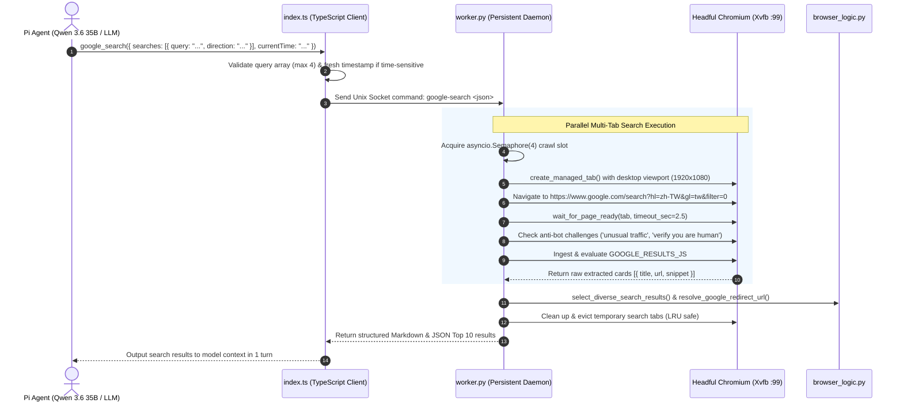

# Google Search Engine: Technical Design, Workflow, and Architecture

## 📌 Overview & Design Motivation

The `google_search` subsystem in `pi-nodriver-browser` provides the Pi coding agent with high-throughput, local, multi-directional web search capabilities directly executed inside persistent Chromium / Xvfb via **Nodriver**.

Unlike traditional web search tools that rely on costly third-party commercial APIs (e.g. Tavily, SerpAPI, AnySearch) or scraper proxies that risk IP bans, `pi-nodriver-browser` leverages the local browser daemon to query Google directly with hardware stealth, extracting clean, structured search results and snippets in **under 0.9 seconds**.

---

## 🏛️ System Architecture & Workflow



---

## 🔍 Key Technical Subsystems & Implementation

### 1. Client-Side Tool Harness (`index.ts`)
* **File:** `index.ts`
* **Registration:** `pi.registerTool({ name: "google_search", ... })`
* **Features:**
  * **Directional Search Array:** Accepts up to 4 distinct query directions simultaneously (e.g., official docs, troubleshooting, benchmark comparisons).
  * **Time-Sensitive Guard:** When queries involve current events or live dates, verifies that `currentTime` is populated with a fresh timestamp from `gettime(action: "now")`.
  * **Zero-Spawning Socket Dispatch:** Formats queries as `google-search <json>` and routes through `~/.pi/agent/nodriver-browser.sock`.

### 2. Client-Side DOM Extraction Engine (`GOOGLE_RESULTS_JS`)
* **File:** `worker.py`
* Injected into the rendered Google SERP:
  ```javascript
  const rows = [];
  for (const anchor of document.querySelectorAll('a')) {
    const heading = anchor.querySelector('h3');
    if (!heading) continue;
    const title = (heading.innerText || heading.textContent || '').trim();
    const url = anchor.href || '';
    if (!title || !url) continue;
    const card = anchor.closest('.MjjYud, .g') || anchor.closest('[data-snhf]')?.parentElement || anchor.parentElement?.parentElement?.parentElement;
    const snippetElement = card?.querySelector('[data-sncf="1"], .VwiC3b, [data-snf="nke7rc"]');
    const explicitSnippet = (snippetElement?.innerText || snippetElement?.textContent || '').trim();
    const lines = (card?.innerText || '')
      .split('\n')
      .map(line => line.trim())
      .filter(line => line && line !== title && !/^https?:\/\//i.test(line));
    const snippet = explicitSnippet || lines.slice(0, 4).join(' ');
    rows.push({ title, url, snippet: snippet.slice(0, 600) });
  }
  return rows.slice(0, 20);
  ```

### 3. Anti-Bot Circuit Breaker & Stealth Guarantees
* **Hardware & API Spoofing:** Utilizes `stealth.js` (WebGL NVIDIA RTX 4070 spoof, `navigator.webdriver` erasure, authentic `window.chrome.runtime`).
* **Anti-Bot Challenge Interception:** Inspects returned page titles and body text for triggers such as:
  * `unusual traffic`
  * `before you continue to google`
  * `our systems have detected unusual traffic`
  * `verify you are human`
  If triggered, raises an explicit challenge error rather than returning corrupt or empty results.

### 4. Post-Processing & Multi-Directional Re-ranking (`browser_logic.py`)
* **File:** `browser_logic.py`
* **`parse_google_search_payload()`**: Validates JSON query payloads.
* **`resolve_google_redirect_url()`**: Strips Google tracking wrappers (`/url?q=...`) to return clean target URLs.
* **`select_diverse_search_results()`**: Interleaves results from multi-directional searches to ensure broad domain and perspective coverage across Top-10 output.

---

## 📊 Benchmark Verification (20 Scenarios)

In a 20-scenario benchmark evaluating Google Search (Nodriver), 4get (Local DDG), and AnySearch API:

| Metric | Google Search (Nodriver) | 4get (Local DDG) | AnySearch API |
|:---|:---:|:---:|:---:|
| **Usability Rate** | **100.0%** | **100.0%** | **100.0%** |
| **Median Latency** | **0.82s** ⚡ | 1.43s | 2.15s |
| **P90 Latency** | **1.26s** | 1.62s | 2.99s |
| **Top-3 Target Hit Rate** | **95.0%** | 85.0% | 90.0% |
| **MRR (Mean Reciprocal Rank)** | **0.900** | 0.810 | **0.900** |
| **Judge Quality Score (0-10)** | 8.65 / 10 | **8.80 / 10** | 8.48 / 10 |
