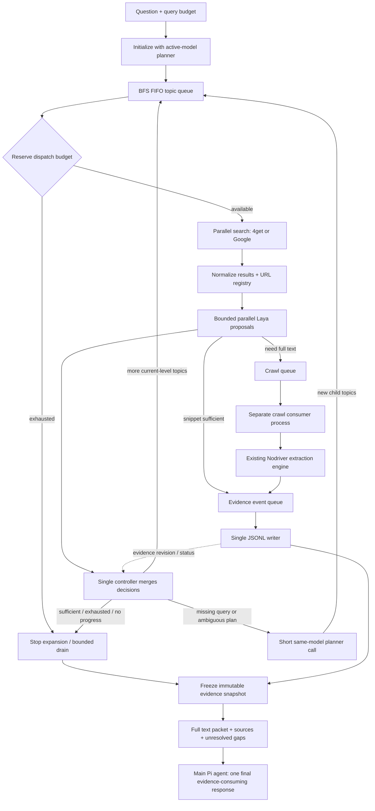

# BFS Research Controller Implementation Plan

**Status:** TODO / design only. This commit does not implement or deploy the feature.

**Execution:** Implement task-by-task with test-first verification. This document does not authorize subagent delegation; request operator approval before delegating.

**Goal:** Integrate budgeted, parallel Google/4get research into `pi-nodriver-browser`, decide whether to search further, crawl, or retain descriptions inside the tool, and return the complete collected textual evidence to the main Pi agent in one final handoff.

**Architecture:** Reuse the existing search/crawl/browser infrastructure and Laya service. A controller owns BFS topics, budgets, provenance, and evidence state; bounded concurrent workers produce proposals/results. A lightweight planner uses the invoking Pi model directly, without a Pi agent/harness. An independently running crawl consumer feeds a single evidence writer.

**Tech stack:** Pi TypeScript extension, Python asyncio/IPC, existing Nodriver daemon and tab manager, HTTP 4get adapter, existing Laya HTTP service, JSONL artifacts.

---

## 1. Agreed requirements / non-goals

- [ ] Implement inside this package, not a separate research product or a nested Pi agent.
- [ ] Both Google and 4get support parallel directional queries by default. Default provider is 4get; parallel does not mean always searching both providers.
- [ ] Default search concurrency: 3, configurable. Never invent queries just to fill concurrency.
- [ ] BFS topic expansion: children go to the next depth; do not dispatch the next depth until current-depth searches and their decision work have settled. Crawl runs independently.
- [ ] Primary budget is actual provider-query dispatch count, not tool calls, BFS depth, or result count. Retries and fallback queries consume budget.
- [ ] Cross-query/provider URL dedup prevents repeated crawl scheduling. Keep all topic/source associations.
- [ ] Laya participates in deciding `crawl`, `use_snippet`, `search_more`, or `finish`; its score is not a calibrated probability of answer completeness.
- [ ] A short planner produces new queries and updates semantic evidence gaps only when needed. It uses the exact initiating Pi provider/model with no harness, skills, tools, full chat history, or autonomous tool loop.
- [ ] Crawl requests enter a queue consumed by a separately running process. Reuse the browser daemon's extraction engine, not a second Chrome stack.
- [ ] Adequate descriptions can enter the same evidence stream directly, labelled as snippets.
- [ ] One writer appends records to one `evidence.jsonl` per job. Parallel processes must not append independently.
- [ ] First version preserves complete text received from adapters: no relevance-based paragraph trimming, no per-article LLM summaries, no semantic token-budget pruning.
- [ ] Use minimal source wrappers for the final agent packet. Formatting is deterministic, not an extra model call.
- [ ] Final main-agent handoff occurs once, after a bounded drain and immutable snapshot. Intermediate progress must not inject partial evidence into a main-model inference turn.
- [ ] Evaluate prefill with an explicitly labelled **1,500 new tokens/second assumption**, alongside measured timings. Do not assume this changes the model/server throughput.
- [ ] Do not resume the interrupted full-evidence replay experiment as part of this documentation task.

Non-goals: service restarts, new Laya model replicas, changing global Pi settings, training a search-specific Laya model, automatic purchases/logins, replacing existing standalone tools, promising a speedup before evaluation.

## 2. Inspected reuse map and constraints

| Existing code | Reuse / required work |
|---|---|
| `index.ts`: `NodriverWorker`, tool registration, cancellation and session ownership | Add a research entry point and a job-aware protocol; preserve existing tools |
| `index.ts`: shared `queue.then(...)` around Google search and crawl | Audit scheduling; do not serialize an entire research lifetime behind this queue |
| `worker.py`: `google-search` branch and nested `search_single` | Extract a reusable structured adapter without changing standalone behavior |
| `worker.py`: crawl branch and nested `crawl_single` | Extract reusable extraction operations and expose owned crawl jobs |
| `browser_logic.py`: Google payload parsing, URL handling, result selection, tab registry | Reuse validation and resource management; do not clone parallel implementations |
| `../pi-web-search/index.ts` | Reference implementation for bounded 4get HTTP requests and result sanitation |
| Installed `~/.pi/agent/extensions/web-search.ts` | Check drift: installed and repository copies differ in time-handling behavior; do not edit installed files as the source of truth |
| `../laya-browser-intent/laya_intent.py` | Reuse the Laya wire protocol/client design; existing client is synchronous |
| `../laya-browser-intent/planner.py` | Reuse short model-call approach, not browser-specific click prompts |
| `../laya-browser-intent/pi-extension/browser-intent.ts` | Reference active-model/auth binding via extension context |
| `../laya-browser-intent/intent_service.py` | Do NOT route search classification through its browser-action global lock |

Observed local Laya setup: `laya.service` exposes port 8000, CPU execution and 8 configured threads; `/v1/systemone` uses a thread pool. `laya-intent.service` exposes port 8011 and serializes browser actions. These are inspected configuration/code facts, not a concurrency throughput guarantee. The inspected `/predict/batch` handler loops serially over states; its name is not proof of batched parallel inference.

Before implementation, read `CONTRIBUTING.md`, `README.md`, `docs/google-search-workflow-and-architecture.md`, and the current Pi extension/model/provider docs. Recheck exact APIs against the installed Pi version; do not rely on earlier handoff prose.

## 3. Target flow



The crawl process is a queue consumer/scheduler. Browser operations remain in the existing daemon with owned temporary tabs. Add job-specific IPC so it does not recursively wait behind the request that launched it. Do not remove browser mutation locks wholesale to obtain concurrency.

## 4. Proposed interfaces (not implemented APIs)

### Research tool input

Register one tool, tentatively `research`, rather than requiring the agent to call separate search/crawl tools repeatedly:

```json
{
  "question": "Which films first open in Taiwan on the requested date?",
  "searchBudget": 6,
  "provider": "4get",
  "searchConcurrency": 3,
  "layaConcurrency": 2
}
```

`provider` supports `4get`, `google`, `auto`. For `auto`, start with 4get and use a bounded Google fallback only when failed/empty/non-covering results justify it. A page found with insufficient detail should usually be crawled, not automatically searched again with another engine. Read authoritative time in the controller; do not accept a model-provided timestamp as authority.

### Internal search task and normalized result

```json
{
  "taskId": "q4",
  "topicId": "t3",
  "parentTopicId": "t1",
  "depth": 1,
  "provider": "4get",
  "direction": "official release date",
  "query": "<film name> Taiwan release date",
  "addresses": ["taiwan_release_date"]
}
```

```json
{
  "sourceId": "s7",
  "taskId": "q4",
  "provider": "4get",
  "rank": 1,
  "title": "Page title",
  "url": "<exact returned URL>",
  "description": "Unmodified sanitized result description"
}
```

4get defaults mirror the existing extension: local port 8088, `/api/v1/web`, URL-encoded `s`, `scraper=ddg`, `country=any`, up to 10 results per query, bounded response size and a 10-second operation timeout. Preserve safe configurability; the caller must not be able to turn the adapter into an arbitrary HTTP proxy.

### Laya proposal / planner action

```json
{
  "evidenceRevision": 12,
  "action": "crawl",
  "sourceIds": ["s7", "s9"],
  "addresses": ["taiwan_release_date"],
  "reason": "Relevant pages found; descriptions omit exact local release dates"
}
```

A planner `search_more` action contains new `searches` with `direction`, `query`, and `addresses`. Laya chooses from already built action candidates; it does not invent query strings. Include a none/uncertain option. Model output is a proposal: the controller validates source IDs, provenance, budget, duplicates, and revision before applying it.

### Evidence journal and final result

```json
{
  "schemaVersion": 1,
  "eventId": "e19",
  "jobId": "j1",
  "sourceId": "s7",
  "topicIds": ["t1", "t3"],
  "kind": "page_extract",
  "url": "<exact source URL>",
  "title": "Page title",
  "text": "Complete text returned by the extraction adapter",
  "status": "completed",
  "truncated": false
}
```

Use `search_snippet`, `page_extract`, `crawl_failure`, and explicit lifecycle/status events. Keep snippets and later extracts as separate labelled records in v1; do not silently discard or semantically compress content for the final packet. Identical event delivery may be idempotently deduplicated by event ID. Preserve adapter-level truncation flags and PDF modes: “full dump” means all captured text, not a promise that every upstream extractor returns an unlimited full document.

Final status is `sufficient`, `incomplete`, `cancelled`, or `failed`, with stop reason, budget accounting, source list, unresolved gaps, and frozen artifact path/hash. A description is never silently relabelled as full-page evidence.

## 5. Invariants and scheduling semantics

1. **Single state owner.** Only the controller changes BFS state, reserves budgets, schedules URL fetches, and declares completion. Parallel Laya workers return proposals.
2. **Atomic budget.** Validate first, then reserve immediately before a provider attempt. A dispatched failure still counts; rejected duplicates and cancelled pre-dispatch work do not. Auto-fallback/retry requires another reservation.
3. **Strict BFS.** Within a depth, queries run up to concurrency. New child topics wait for the level barrier. Crawl need not finish before the next level, but pending coverage must prevent redundant search.
4. **Late discoveries.** Preserve parent/depth metadata from crawls. Define and test the handling of a late lower-depth discovery: dispatch no new deeper work until queued shallower work settles; do not cancel already-running work solely to reorder it.
5. **Streaming arrivals.** Completed query results can trigger classification and crawl immediately; no all-search barrier before crawling. Level advancement and evidence arrival are separate concepts.
6. **Two dedup keys.** Search key includes provider + normalized query + relevant options; URL key is cross-provider. Keep exact original URLs; normalize conservatively and never strip arbitrary semantic query parameters.
7. **Evidence-aware progress.** Track outstanding crawl coverage and evidence revision. Queue-empty while crawl is pending is not success. Increment revision when meaningful evidence/failure updates arrive, not on duplicate rows.
8. **Bounded wait.** If all useful work is pending crawl, wait for completion/deadline events instead of calling the planner repeatedly. After stopping expansion, drain eligible pending crawls within a deadline, then freeze.
9. **Completion is not a score threshold.** Requirements need cited evidence and unresolved contradictions must remain visible. Missing results cannot establish a universal negative such as “no films open that day.”
10. **Full-text-first policy.** No semantic trimming/summary before main-model handoff. Oversized jobs must fail/report explicitly or return an incomplete bounded artifact; never hide discarded text behind a success flag.
11. **Safety.** Treat pages/snippets as untrusted data. Never allow page text to trigger credential disclosure, local file access, arbitrary tool execution, or new URL authority.
12. **Isolation.** Job/session ownership on artifacts, tabs, queues and cancellation. No auth values in planner logs, subprocess argv, journals, or final output.

Initial operational defaults to validate, not benchmark claims: search concurrency 3; Laya concurrency 2; planner concurrency 1 per job; crawl concurrency governed by the existing browser resource limits. Configure crawl count/bytes/deadlines separately from search budget. Do not spawn multiple CPU Laya replicas by default.

## 6. File layout to create / modify

Proposed new modules (names are implementation targets, not current files):

```text
research/
  __init__.py
  contracts.py            # validated task/result/evidence types and terminal states
  budget.py               # atomic reservations and attempt ledger
  frontier.py             # BFS levels, topic and query dedup
  registry.py             # exact URLs, provenance, lifecycle and topic associations
  providers.py            # structured Google bridge and async 4get adapter
  decisions.py            # action candidates, Laya client and proposal validation
  controller.py           # single state owner and event-driven orchestration
  crawl_jobs.py           # separately spawned crawl queue consumer, IPC lifecycle
  evidence.py             # single writer, freeze, deterministic full-text renderer
  telemetry.py            # phase timings, counts and redaction
research-model.ts          # active Pi model binding and short direct planner calls
```

Modify `index.ts`, `worker.py`, `browser_logic.py` only where required for tool registration, factoring reusable operations, provenance and job protocol. Add focused tests under `tests/test_research_*.py`; add model-binding tests in `tests/research-model.test.ts` after choosing the repo-compatible TypeScript test runner. Add `benchmarks/research_profile.py`, `docs/research-controller.md`, and README usage only when implemented.

Shared clients from sibling projects must have an explicit packaging strategy. Prefer an extracted reusable package/module with tests; do not add imports pointing at one developer's absolute home directory. Keep sibling fixes in separate scoped commits if required.

## 7. Detailed TODO implementation sequence

Each numbered unit is a small commit boundary; each checkbox is a separate action. For every behavior change: write its focused failing test, observe the expected failure, implement minimally, rerun, then inspect the diff and commit only its files. Do not run live searches in unit tests.

### 01 — Capture baseline and reuse boundaries

**Files:** `index.ts`, `worker.py`, `browser_logic.py`, sibling reference files above (read-only initially).

- [ ] Record existing dirty files and preserve operator changes; never reset/stash them implicitly.
- [ ] Run `python3 -m unittest discover -s tests -v`; record pre-existing failures.
- [ ] Trace both TypeScript queueing and daemon command locks; document which operations mutate an interactive tab versus use independent managed tabs.
- [ ] Trace streamed progress, cancellation and process ownership so nested crawl IPC cannot deadlock.
- [ ] Confirm current Pi model/auth APIs and supported provider transports from complete relevant Pi docs/examples.

### 02 — Define validated contracts

**Files:** create `research/__init__.py`, `research/contracts.py`, `tests/test_research_contracts.py`.

- [ ] Add failing fixtures for valid and invalid search tasks, source records, decisions and terminal states.
- [ ] Reject missing ownership, negative limits, unknown source IDs and invalid provider/action values.
- [ ] Define versioned JSON-serializable records; credentials are deliberately not part of these contracts.
- [ ] Run `python3 -m unittest discover -s tests -p 'test_research_contracts.py' -v` to green.

### 03 — Atomic query budget

**Files:** create `research/budget.py`, `tests/test_research_budget.py`.

- [ ] Test three concurrent reservations with budget two: exactly two succeed.
- [ ] Test retry/fallback charging, no refund after dispatched failure, and no debit for pre-dispatch cancellation or dedup rejection.
- [ ] Implement an owner-mediated counter and attempt ledger; budget cannot go negative.
- [ ] Verify dispatched-attempt count equals budget used in every terminal outcome.

Executable test sketch (adapt names to the final contracts):

```python
import asyncio
import unittest
from research.budget import QueryBudget

class BudgetTests(unittest.IsolatedAsyncioTestCase):
    async def test_concurrent_reservations_never_overspend(self):
        budget = QueryBudget(limit=2)
        granted = await asyncio.gather(*(budget.reserve(str(i)) for i in range(3)))
        self.assertEqual(sum(bool(x) for x in granted), 2)
        self.assertEqual(budget.used, 2)
```

### 04 — BFS frontier

**Files:** create `research/frontier.py`, `tests/test_research_frontier.py`.

- [ ] Add depth barrier, empty-frontier-with-pending-crawl, repeated-topic and late-discovery tests.
- [ ] Implement same-depth FIFO dispatch and next-level child insertion without recursive free-form topic drift.
- [ ] Distinguish duplicate query suppression from cross-provider fallback eligibility.
- [ ] Verify a batch of three depth-1 tasks starts before any depth-2 task.

### 05 — URL registry and provenance

**Files:** create `research/registry.py`, `tests/test_research_registry.py`; later integrate `index.ts` provenance hooks.

- [ ] Test concurrent duplicate URL discoveries schedule one crawl and retain all topic associations.
- [ ] Test exact URL retention, semantic query strings, redirects, source ownership and unknown URLs.
- [ ] Add URL lifecycle states and retry eligibility; failure must not accidentally mark content complete.
- [ ] Register only validated successful provider results for subsequent crawl/browser navigation.

### 06 — Reusable Google adapter

**Files:** modify `worker.py`, `browser_logic.py`; create/extend `research/providers.py`, `tests/test_research_google.py`.

- [ ] Characterize current standalone Google normalization, dedup, directional balancing and challenge behavior with fixtures.
- [ ] Extract the nested search operation into a reusable structured operation.
- [ ] Preserve standalone `google_search` response compatibility and existing tab/resource guards.
- [ ] Expose per-query completion events for research, not only the final formatted Top-10 message.

### 07 — Async 4get adapter

**Files:** `research/providers.py`, `tests/test_research_fourget.py`.

- [ ] Fixture-test successful/empty/malformed/oversized responses, HTTP failures, timeout and cancellation.
- [ ] Match existing ddg/global settings and sanitation; compare repository and installed extension behavior explicitly.
- [ ] Use a shared asynchronous HTTP client or a bounded executor; never block the controller event loop with synchronous URL requests.
- [ ] Normalize to the same source schema as Google while retaining provider, query and rank.

### 08 — Parallel provider scheduling

**Files:** `research/controller.py`, `tests/test_research_search_concurrency.py`.

- [ ] Use event-gated fake providers to prove overlap, concurrency limits and immediate per-query result delivery without flaky timing assertions.
- [ ] Test budget smaller than concurrency, one failed query, cancellation, and deliberate cross-provider fallback.
- [ ] Ensure fallback consumes budget and does not repeat successful adequate work.
- [ ] Keep Google/4get provider choice separate from query parallelism.

### 09 — Shared lightweight model binding

**Files:** create `research-model.ts`, `tests/research-model.test.ts`; modify `index.ts` minimally.

- [ ] Capture active provider/model and compatible request settings when the research job starts; do not hardcode Qwen or silently fall back to another model.
- [ ] Resolve auth through the existing Pi/browser binding mechanism; avoid persisting secret material to Python job files.
- [ ] Support the selected provider through a direct model API client, not a nested agent. Use Pi's low-level provider transport if needed; that is not a harness.
- [ ] Keep long-lived credentials out of subprocess arguments; refresh ephemeral auth where required without changing pinned model identity.
- [ ] Test unsupported provider/transport fails explicitly rather than guessing `/v1/chat/completions` for every provider.
- [ ] Add a short JSON-only planner prompt, no tools, no Pi system prompt/skills/history. Disable thinking where supported and bound output; unsupported thinking controls are handled explicitly.
- [ ] Fixture-test malformed output, query invention outside required gaps, cancellation and auth-error redaction.
- [ ] Choose/document the TypeScript test runner before executing the new test. Do not add a pretend `npm test` command to a repo without its setup.

### 10 — Laya action candidates and bounded parallel client

**Files:** `research/decisions.py`, `tests/test_research_decisions.py`.

- [ ] Build candidates from registered sources and planner-generated query options, including none/uncertain.
- [ ] Test snippet adequacy, crawl-needed, wrong-date results, contradictions and unsupported negative conclusions.
- [ ] Call the existing Laya service directly with a concurrency semaphore (initially 2), not browser-intent `/act`.
- [ ] Validate probabilities structurally; do not reuse UI thresholds as calibrated research thresholds.
- [ ] Test that independent source judgments overlap but decisions only become actions through the controller.
- [ ] Test timeout/uncertainty escalates to bounded planner work or incomplete status, not unconditional finish.

### 11 — Evidence writer and full-text renderer

**Files:** `research/evidence.py`, `tests/test_research_evidence.py`.

- [ ] Test snippets and page extracts entering the same journal, unicode/newlines, crash-torn final lines and duplicate event delivery.
- [ ] Implement a single queue consumer writer with per-job restricted artifact paths and explicit flush/freeze lifecycle.
- [ ] Preserve complete captured text, source wrappers and upstream truncation flags. Do not replace a snippet with a model summary.
- [ ] Test final rendering has every captured evidence record exactly once, labels source type, and is deterministic under a defined stable ordering.
- [ ] Do not include runtime headers, cookies, API keys, raw private browser profiles or unrelated page state.

### 12 — Independent crawl consumer process

**Files:** `research/crawl_jobs.py`, `worker.py`, `tests/test_research_crawl_jobs.py`.

- [ ] Create parent-owned process startup/shutdown and bounded IPC queues; no new systemd service or second Chrome instance.
- [ ] Queue consumer requests extraction through an explicit job-aware daemon operation with session/source ownership.
- [ ] Reuse the existing extraction, PDF handling, tab cap and cleanup code rather than copying `crawl_single`.
- [ ] Verify startup failure, process death, cancellation, timed-out pages and partial results propagate to the controller/writer.
- [ ] Add a no-deadlock integration test: active research command can service child crawl requests while other searches progress.

### 13 — Event-driven evidence-aware controller

**Files:** `research/controller.py`, `tests/test_research_controller.py`.

- [ ] Test supported/missing/conflicting requirement states with evidence IDs, not free-floating confidence claims.
- [ ] Mark gaps as pending when relevant crawls are scheduled; do not search them again merely because the file has not arrived yet.
- [ ] Reject/revalidate stale Laya/planner proposals using evidence revision and URL/budget state.
- [ ] Call planner only for initialization, missing candidate queries or semantic ambiguity; do not poll it on every event.
- [ ] Test description-to-writer and description-to-crawl actions in the same batch.
- [ ] Test no-progress accounting based on new useful evidence/coverage, not raw result volume.

### 14 — Termination, drain and immutable final handoff

**Files:** `research/controller.py`, `research/evidence.py`, `tests/test_research_completion.py`.

- [ ] Test sufficient evidence, exhausted budget, no progress, empty results, all crawls pending and contradictory sources.
- [ ] Stop new dispatches, bounded-drain pending crawls, then freeze the journal and generate a snapshot hash.
- [ ] Define late-result disposal after freeze; never mutate evidence already sent to the main model.
- [ ] Report pending/failed sources and unresolved requirements as incomplete, not sufficient.
- [ ] On caller cancellation, stop owned work and preserve recoverable partial artifacts without delivering a misleading successful result.

### 15 — Integrate tool and transport without accidental serialization

**Files:** `index.ts`, `worker.py`, `tests/test_research_protocol.py`, relevant URL guard tests.

- [ ] Register the proposed `research` tool and validated schema; bind job/session and active-model handle at invocation.
- [ ] Add job-aware request/update/cancel protocol rather than calling existing serialized tool wrappers recursively.
- [ ] Scope scheduling: preserve interactive page-mutation safety while enabling independent managed search/crawl tabs.
- [ ] Stream UI progress only. Do not append evidence chunks as model-visible intermediate turns.
- [ ] Register result provenance before internal crawl scheduling and preserve it for final citations.
- [ ] Verify cancellation and cross-session isolation, including no leakage of model auth or artifacts.

### 16 — Explicit large-packet / PDF behavior

**Files:** `research/evidence.py`, `index.ts`, `tests/test_research_output_limits.py`.

- [ ] Audit existing tool output truncation and model context/output limits before claiming full delivery.
- [ ] Test packet larger than ordinary tool text limits: preserve the complete artifact and report the limitation explicitly; do not silently return truncated text as a full packet.
- [ ] Choose and document an explicit full-packet delivery path that fits supported model context. A mere file path requiring another agent tool call does not satisfy one-handoff acceptance.
- [ ] If the complete packet cannot fit, stop with an actionable incomplete/oversize result; no silent semantic pruning or hidden extra main-model turns.
- [ ] For temp-wiki PDFs, record that only retrieved/extracted content is available; do not claim or reload an unlimited full PDF contrary to existing PDF policy.

### 17 — Telemetry and deterministic regression suite

**Files:** `research/telemetry.py`, `tests/test_research_telemetry.py`, research test modules.

- [ ] Record search query count, BFS depth, provider attempts, result arrivals, Laya/planner durations and counts, crawl queue wait/execution, bytes, evidence count, terminal reasons and final packet size.
- [ ] Redact auth and distinguish event timelines from summed worker durations; overlapping work must not be double-counted as wall time.
- [ ] Count actual final main-model requests and report if the agent unexpectedly performs follow-up calls.
- [ ] Run focused research tests and the repository baseline suite; report new failures separately.

```bash
python3 -m unittest discover -s tests -p 'test_research_*.py' -v
python3 -m unittest discover -s tests -v
```

### 18 — Live verification, evaluation and docs

**Files:** create `benchmarks/research_profile.py`, `docs/research-controller.md`; update `README.md`.

- [ ] Run an operator-approved small live test for 4get and Google parallel search, proving crawl overlaps search and each result retains provenance.
- [ ] Run Laya concurrency 1/2/4 comparison on identical fixtures; report throughput and latency, not an assumed linear speedup.
- [ ] Evaluate full-evidence-first on several topics including explicit-date film releases, Python documentation, travel requirements and product specifications.
- [ ] Separate (a) frozen-evidence replay, which isolates main-model overhead, from (b) end-to-end research including all search/Laya/planner/crawl costs.
- [ ] Compare actual model prefill/decode where available and the labelled scenario `new_prefill_tokens / 1500`; exclude cache-read tokens from assumed new-prefill work.
- [ ] Preserve failed/incorrect answers and check dates, source support, unsupported certainty and missing requirements. Do not equate fewer calls with correctness.
- [ ] Record shared-server load, cache state, model/provider, context size, planner requests and sample count; repeat before claiming stable speedups.
- [ ] Document limits, cancellation, packet overflow, provider fallback budget, artifact lifecycle and examples only after implementation matches them.

Suggested future benchmark interface (must be implemented before use):

```bash
python3 benchmarks/research_profile.py --mode replay --fixtures benchmarks/fixtures/research --prefill-tps 1500
python3 benchmarks/research_profile.py --mode end-to-end --provider 4get --search-budget 6 --search-concurrency 3
```

## 8. Acceptance / definition of done

- [ ] Parallel 4get and Google searches verified; no unbounded fanout or budget overspend.
- [ ] BFS/query accounting and cross-provider URL dedup verified with deterministic tests.
- [ ] Crawl can overlap search through the existing browser engine; no queue/IPC deadlocks or unsafe shared-tab navigation.
- [ ] Laya judgments overlap within a configured limit; only the controller commits global state.
- [ ] Planner uses the initiating Pi model/provider with a short direct call; no nested harness and no silent model substitution.
- [ ] Descriptions and complete captured crawl text accumulate in one journal through one writer.
- [ ] One frozen, source-labelled evidence packet is delivered, with no hidden semantic trimming or intermediate main-agent rounds.
- [ ] Date/time authority, provenance, untrusted-content handling, cancellation and secrets redaction remain enforced.
- [ ] Budget exhaustion and absent evidence do not become fabricated certainty; incomplete results expose gaps.
- [ ] Performance evaluation includes data preparation and model costs, plus quality checks; 1500 TPS remains an explicit scenario assumption.
- [ ] Existing standalone browser, Google search, crawl and PDF flows retain their behavior and tests.

## 9. Scope of this planning commit

Only this plan is added. Existing worktree changes to `index.ts`, `tests/test_url_provenance.py`, and untracked `tests/test_url_guard_regression.py` are outside this documentation commit and must remain untouched. No service restart, package installation, model call, browser session modification or deployment is required to commit this plan.
