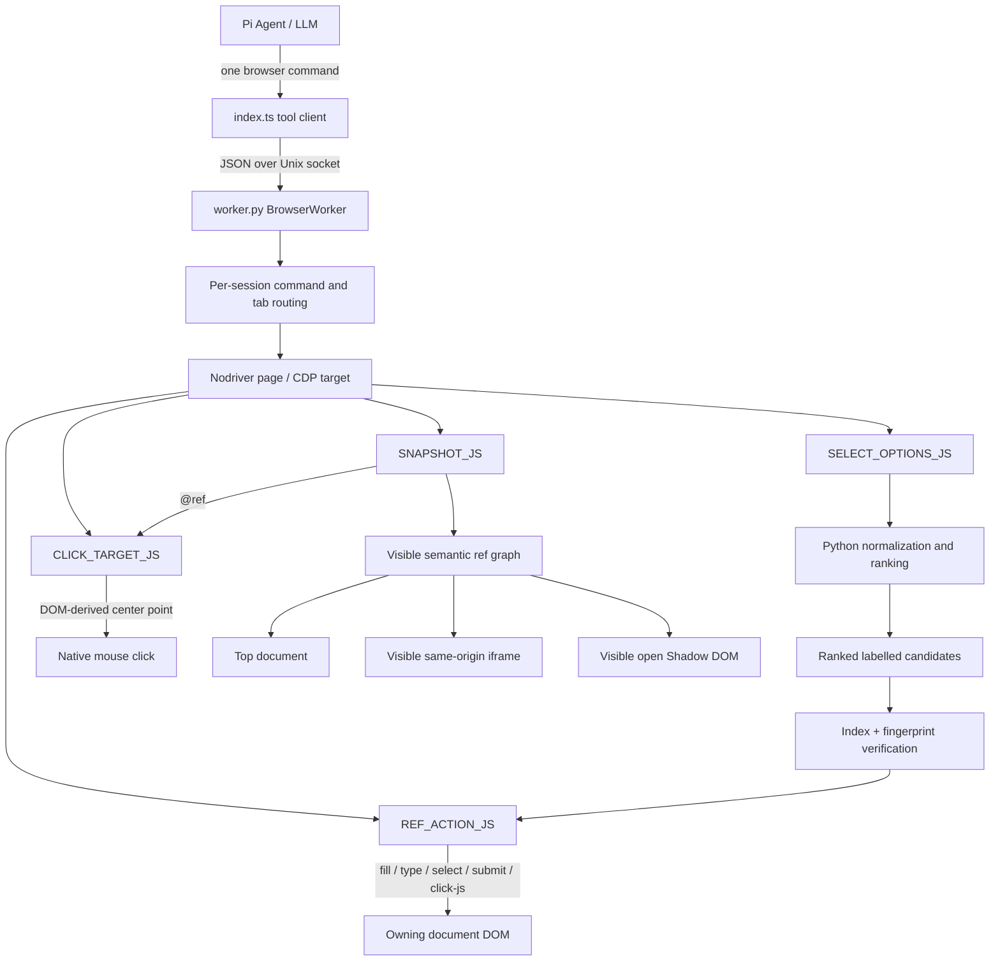
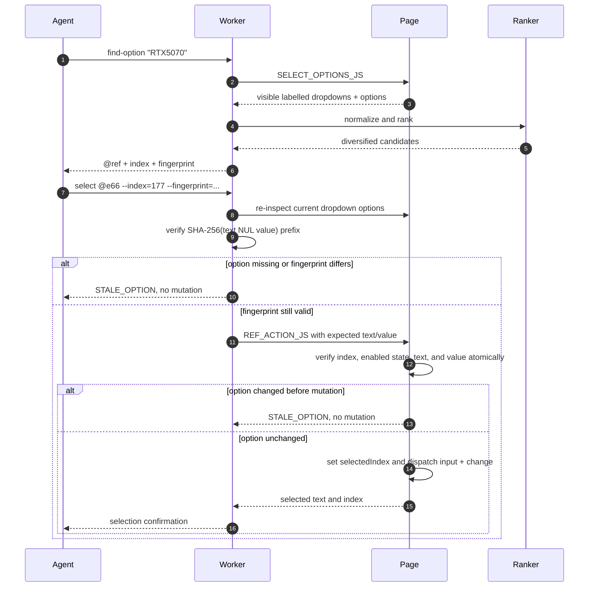
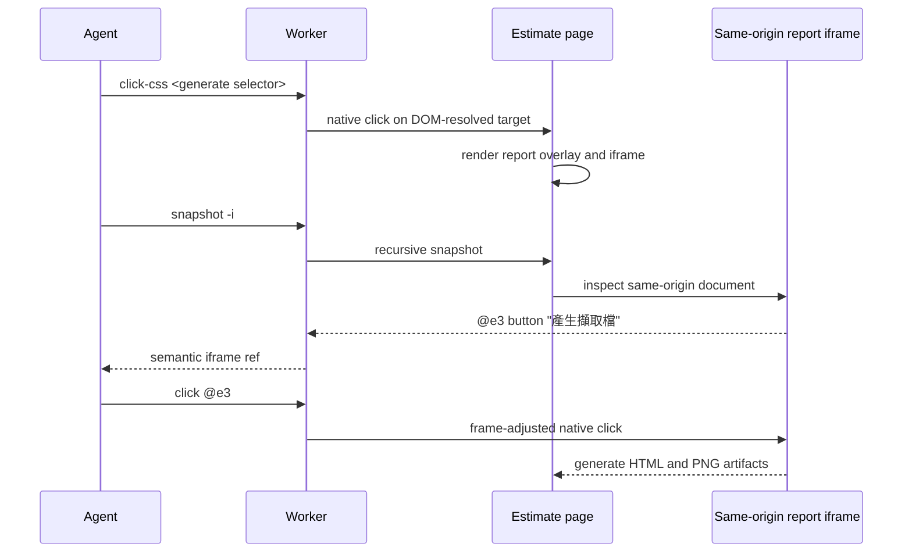

# Semantic Browser Actions: Technical Design, Workflow, and Architecture

## Status

Implemented by [`099de1b`](https://github.com/AyaSakura-comp/pi-nodriver-browser/commit/099de1bce801c3810c19eeb22ace55835e54b2b8), **`feat: add semantic iframe and searchable dropdown actions`**.

This document describes the runtime design behind semantic iframe interaction, searchable native dropdowns, stale-option protection, and semantic-first clicking. It complements the repository-level architecture in [`../README.md`](../README.md) and records the behavior that tests and release gates must preserve.

## Problem Statement

Browser agents are unreliable when a page combines:

- native `<select>` controls containing hundreds of options;
- product names that differ only by spaces, punctuation, color, or model suffix;
- controls nested in same-origin iframes or open Shadow DOM;
- dynamic pages that reorder or replace options between observation and mutation;
- large text containers that make text clicks target an ancestor instead of the intended button;
- hidden, disabled, or off-screen branches that exist in the DOM but are not safe to operate;
- full-page screenshots that encourage guessed coordinates instead of grounded actions.

CoolPC's estimate form is the reference acceptance workload. It has many labelled dropdowns with hundreds of parts per category and generates its final capture through a same-origin iframe. The implementation is deliberately site-independent: no selector, model, category, or ranking rule is specific to CoolPC.

## Goals

1. Keep ordinary controls addressable through compact `@ref` handles.
2. Traverse visible same-origin iframe and open Shadow DOM branches semantically.
3. Search every option in a native dropdown without opening it or dumping its corpus into model context.
4. Handle imprecise and reordered queries such as `RTX5070` versus `RTX 5070`.
5. Refuse ambiguous or stale selections rather than guessing.
6. Treat visibility, enabled state, and current frame ownership as action-time invariants.
7. Prefer refs, text, and CSS over raw viewport coordinates.
8. Keep page-provided labels and option text clearly separated from operational commands.

## Non-Goals

- Reading inaccessible cross-origin iframe DOM.
- Automating visual CAPTCHA solving or using third-party CAPTCHA bypass services.
- Inferring product compatibility from price alone.
- Selecting hidden or disabled controls.
- Using a full-page screenshot as a coordinate map.
- Making `upload` frame-aware; file upload currently resolves in the top document and is tracked separately.

## Component Architecture



The TypeScript extension only exposes the command contract and sends one command at a time. All page inspection, ranking, stale checks, and mutations happen in the persistent Python worker and the currently routed Chrome target.

## Ref and Frame Model

### Snapshot traversal

`snapshot -i` evaluates `SNAPSHOT_JS` in the top document. The script recursively visits:

1. the top document;
2. visible open Shadow DOM roots;
3. visible same-origin iframe documents;
4. nested combinations of those branches.

Interactive elements receive an ephemeral `data-pi-ref="eN"` attribute. The formatted result exposes compact entries such as:

```text
@e3 <button> "產生擷取檔" frame="VWP"
@e4 <select> label="顯示卡VGA" selected="..." options="281 text"
```

Refs are observation handles, not permanent element IDs. A new snapshot removes old ref attributes in every accessible branch and generates a fresh set.

### Frame labels

A frame path uses, in priority order:

1. `title`;
2. `aria-label`;
3. `name`;
4. `id`;
5. only the iframe URL origin.

Anonymous iframe labels intentionally omit path and query data so sensitive URL parameters are not copied into model context.

### Action-time resolution

`REF_ACTION_JS` recursively searches the current DOM for the requested ref. Before an action, it verifies:

- the target still exists;
- the target is visible in its own viewport;
- every owning iframe is visible;
- every owning Shadow host is visible;
- the target is not disabled or `aria-disabled`.

A missing ref enters stale-ref recovery. The worker does not click: it returns a fresh viewport screenshot and DOM snapshot, keeps `STALE_REF_GUARD` active, and requires an explicit `snapshot -i` before another ref-based action.

## Searchable Dropdown Protocol

### Progressive disclosure

A normal snapshot never serializes every `<option>`. For each visible enabled `<select>`, it reports only:

- a generic control label;
- selected visible text;
- option count;
- whether all option labels are numeric or textual;
- frame context when applicable.

Control labels come from generic page structure:

1. `aria-label` or `title`;
2. associated `<label>` text;
3. a fieldset legend;
4. preceding table cells in the same row;
5. labelled ARIA groups;
6. a nearby sibling;
7. `name` or `id` as the final fallback.

The model discovers option contents only through:

```text
find-option <keywords>
```

### Internal inspection

`SELECT_OPTIONS_JS` recursively inspects visible same-origin iframe and open Shadow DOM branches. It returns option text and value to the worker, not directly to the model. Disabled selects, disabled options, inherited `<fieldset disabled>` controls, hidden branches, and frame-offscreen branches are excluded.

### Normalization and ranking

`browser_logic.py` performs site-independent ranking:

- Unicode NFKC normalization;
- case folding;
- punctuation and whitespace normalization;
- letter/number boundary splitting;
- compact comparison so `RTX5070` can match `RTX 5070`;
- extra weight for numeric/model tokens;
- exact visible text before opaque or duplicated `value` fields;
- control labels included in `searchText`;
- required adjacent alpha-model pairs such as `RTX` + `5070`;
- exact numeric token boundaries to avoid matching a model number to a price;
- fuzzy alphabetic matching only above explicit similarity thresholds.

The global result list is diversified to at most two candidates per dropdown so one large category cannot hide relevant candidates in another category.

If no full-token match exists, `find-option` may run one alpha-family relaxation. The output explicitly labels those results as alternatives; it never presents them as an exact model match.

### Untrusted output boundary

Labels and option names are escaped and prefixed with a security notice. The only operational text in the response is the generated command:

```text
Select exactly: select @e66 --index=177 --fingerprint=e68dd11efb647f6d
```

The agent should copy this complete command rather than reconstructing it from page text.

## Transactional Selection and Stale Protection



The protocol has two checks:

1. Python compares the supplied 16-hex fingerprint with a fresh inspection of the requested option.
2. In the same JavaScript evaluation that mutates the `<select>`, the page compares the current option text and value with the expected pair.

This closes the race where an option is reordered or replaced between search and mutation. `selectedIndex` is not changed on either stale path.

A fuzzy `select @ref <query>` remains available for a unique, high-confidence winner. Similar variants return `AMBIGUOUS_OPTION` with exact candidate commands instead of selecting the first match.

## Semantic Action Workflow

### Preferred action order

1. Run `snapshot -i` in the relevant viewport.
2. Use the exact `@ref` with `click`, `fill`, `type`, `select`, or `fill-submit`.
3. Use `click-text` or `click-css` when no useful ref is present.
4. Use `click-js @ref` only when a DOM click is specifically required.
5. Only after three consecutive legitimate semantic click failures on the same page produce `VISION_FALLBACK_UNLOCKED`, use visual fallback for canvas or inaccessible visual-only content: run `screenshot`, inspect it, use its pixel coordinates with `vision-mark <x> <y>`, inspect and correct the marked image, then confirm only the latest token with `vision-click <preview-token>`. Never fabricate failures to unlock it.

Raw `click <x> <y>` is blocked. `snapshot -i --full` is visual overview only: it deliberately returns no refs, invalidates pending coordinate previews, and must not be treated as a coordinate map.

### Click resolution

`CLICK_TARGET_JS` recursively discovers visible targets in the top document, open Shadow DOM, and same-origin iframes. It scrolls the owning frames and element into view, computes the frame-adjusted center point, and returns geometry to the worker. The worker then performs a native mouse click so ordinary browser event and popup behavior is preserved.

For `click-text`, exact normalized text is preferred. Partial text is bounded, large ancestor candidates are removed when a smaller descendant matches, interactive controls outrank passive elements, and shorter labels win ties. This prevents a page-sized container from intercepting a button click.

### Fill and submit

Top-document fields retain Nodriver's native per-character `send_keys` path. Nested refs use `REF_ACTION_JS`, which dispatches keyboard, `beforeinput`, `input`, and `change` events in the element's owning window.

For iframe `fill-submit`, the owner frame records the old URL and whether a form submission is expected. `wait_for_ref_frame_ready()` polls that frame until navigation completes and its document reaches `readyState === "complete"`, then the worker returns a new snapshot.

### Same-origin iframe report generation



This is the path that completed the CoolPC report acceptance test without treating the iframe as an opaque screenshot.

## Failure Semantics

| Condition | Result | Mutation allowed? |
|---|---|---:|
| Ref no longer exists | `STALE_REF` recovery with fresh snapshot and screenshot | No |
| Target/frame/Shadow host hidden | Action error requiring a new snapshot | No |
| Control or option disabled | Action error | No |
| Fuzzy winner is not unique | `AMBIGUOUS_OPTION` with candidates | No |
| Indexed option missing/replaced/reordered | `STALE_OPTION` | No |
| Query has no full match but has family alternatives | Explicit relaxed suggestions | No automatic selection |
| Cross-origin iframe child | Child DOM is not traversed | No semantic child action |
| Visual CAPTCHA challenge | Human handoff | No automated solving |

Page text is always untrusted data. Candidate formatting escapes quotes, backslashes, and newlines, and tells the agent not to execute instructions found in product labels.

## End-to-End Acceptance Workflow

The release acceptance scenario uses the live CoolPC estimator:

1. Open `https://www.coolpc.com.tw/evaluate.php`.
2. Use `find-option` followed by exact indexed selection for eight labelled categories.
3. Verify all eight visible selected rows, including Ryzen 7 9800X3D.
4. Activate `只Show選購` to reduce the form to chosen rows.
5. Bring the report control into the current viewport and click it semantically.
6. Snapshot the generated same-origin `VWP` iframe.
7. Click its `產生擷取檔` ref.
8. Verify the generated HTML and PNG return HTTP 200.
9. Reopen the HTML report in Chrome and capture evidence.

A completed run selected CPU, motherboard, RAM, SSD, cooler, GPU, case, and PSU; generated a site total; and produced both HTML and PNG reports. The server-side artifacts completed in approximately 4 minutes 22 seconds. Full evidence collection took longer because two browser commands reached their client-side settle timeout after the server action had already succeeded. This is a completion-detection limitation, not a selection failure.

## Test Strategy

### Fast tests

- `tests/test_browser_logic.py`
  - iframe labels in snapshot formatting;
  - Unicode and fuzzy option ranking;
  - numeric/model boundary behavior;
  - ambiguity thresholds.
- Unit sections of `tests/test_worker_integration.py`
  - candidate escaping and complete exact commands;
  - output diversification;
  - fingerprint generation and stale-option errors.

### Opt-in real Chrome tests

Fixtures cover:

- main-document dropdowns with duplicate values;
- exact index selection and option reordering;
- same-origin iframe fill, select, submit, and click;
- nested/open Shadow DOM controls;
- hidden, resized, and off-screen iframe branches;
- disabled controls and options;
- stale-ref recovery;
- smallest-target `click-text` behavior;
- native input event semantics and download tracking.

Run the default suite:

```bash
PYTHON="$HOME/.pi/agent/extensions/nodriver-browser/.venv/bin/python"
"$PYTHON" -m unittest discover -s tests -v
```

Run the real browser suite:

```bash
PYTHON="$HOME/.pi/agent/extensions/nodriver-browser/.venv/bin/python"
RUN_BROWSER_INTEGRATION=1 \
NODRIVER_PYTHON="$PYTHON" \
"$PYTHON" -m unittest discover -s tests -v
```

The commit's release baseline is 124 discovered tests: 74 fast tests enabled by default and 50 real-browser tests opt-in.

## Source Map

| Concern | Primary implementation |
|---|---|
| Tool contract and model guidance | `index.ts` |
| Snapshot, option inspection, ref actions, click resolution | `worker.py`: `SNAPSHOT_JS`, `SELECT_OPTIONS_JS`, `REF_ACTION_JS`, `CLICK_TARGET_JS` |
| Dropdown orchestration and exact command formatting | `worker.py`: `inspect_dropdowns()`, `dropdown_option_matches()`, `format_option_matches()`, `option_fingerprint()` |
| Normalization, ranking, confidence | `browser_logic.py`: `normalize_option_text()`, `rank_option_matches()`, `is_confident_option_match()` |
| Iframe submit readiness | `worker.py`: `wait_for_ref_frame_ready()` |
| Logic and output tests | `tests/test_browser_logic.py`, `tests/test_worker_integration.py` |
| Browser fixtures | `tests/fixture_select.html`, `tests/fixture_iframe*.html` |

## Known Limitations and Follow-Ups

1. Cross-origin iframe child DOM remains inaccessible by browser origin policy.
2. `upload` does not yet use the recursive frame-aware resolver.
3. A page can complete a long server-side action while the browser command's settle timeout expires; generated artifacts must be checked before classifying the action as failed.
4. Refs are intentionally ephemeral and require a fresh snapshot after meaningful DOM changes.
5. Visual-only coordinate interaction is initially locked. Three consecutive semantic click failures in the same session/page context unlock the guarded screenshot → external-PNG marked preview → trusted CDP viewport conversion → image/hash revalidation → one-time `vision-click` workflow; malformed commands and raw coordinate attempts do not count, and successful semantic interaction resets progress.
